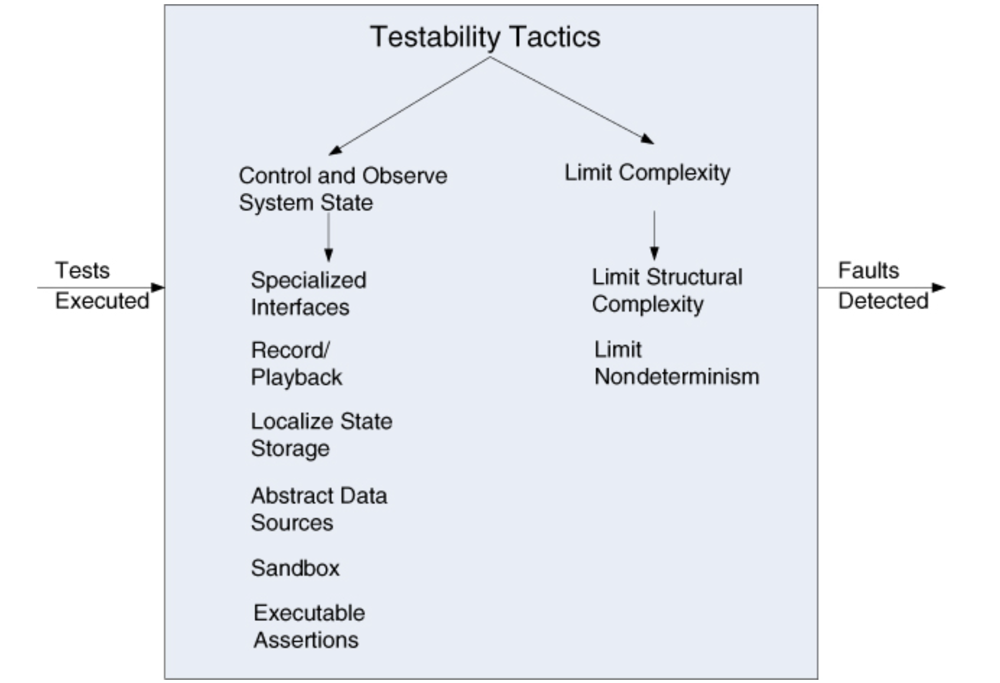

# Lecture 10: testability

## What is testability?

- Software testability refers to the ease with which software can be made to demonstrate its faults
  - Estimates indicate 30%-50% (in some cases, even more) of the cost of development goes to testing
  - If a software architect can reduce this cost, the payoff is large
- Testability is specifically about the probability that the software under test will fail on next execution
  - A system is testable if it "gives up" its faults easily
  - If a fault is present, we want it to fail during testing as soon as possible
- Calculating this probability is not easy, and other response measures for testability are used instead
  - Nothing can prove that their is no more bugs
  - Testing can reveal the presence of bugs, but never prove their absence
- A model for testing
  - Oracle: an agent (human or mechanical) that decides whether output is correct or not
  - Output: includes functionally produced value and derived measures of quality attributes
  - Internal state can be shown to oracle to decide if it is correct or entered an erroneous state
- Setting an examining internal state is an aspect of testing prominently featured in tactics for testability
  - A system is properly testable if it is possible to control each component's inputs and observe its outputs
- Testing is carried out by various developers, users, or quality assurance personnel
  - Portions of the system or the entire system may be tested
  - The response measures for testability deal with how effective the tests are in discovering faults and how long it takes to perform the tests to some desired level of coverage
  - Test cases can be written by the developers, the testing group, or the customer
  - The test case can be a portion of acceptance testing or can drive the development as they do in certain types of agile methodologies

## Testability general scenario

- Source of stimulus: a human running manual tests or an automated tester
  - Unit testers, integration testers, or system testers on the development organization side
  - Acceptance testers and end users on the customer side
- Stimulus: a set of test is executed due to the completion of a coding increment
  - Class layer or service
  - Completed integration of a subsystem
  - Complete implementation of the entire system
  - Delivery of the system to the customer
- Artifact: A unit of code, a subsystem, or the whole system being tested
- Environment: where tests are executed
  - At development time
  - At compile time
  - At deployment time
  - While system is running (in routine use)
  - Includes the test harness and test environment in use
- Response: system controlled to perform desired tests and results for selected tests can be observed
- Response measures: aimed at representing how easily a system under test "gives up" its faults
  - Effort involved in find a fault or a particular class of faults
  - Effort required to test a given percentage of statements
  - Length of the longest test chain
  - Effort to perform tests
  - Effort to actually find faults
  - Estimates of probability of finding additional faults
  - Length of time or amount of effort to prepare test environment

## Tactics for testability

### Control and observe system state

- Central to testability: makes no sense to control something if you can't observe it
  - Simplest form of control of observation is to provide a software component with input, let it do work, and observe its output
  - This category of testability tactics provides insights into software going beyond its inputs and outputs
- Tactics cause components to maintain state information
  - Allows testers to assign values to state
  - Makes that information accessible to testers on demand
  - State information can be
    - An operating state
    - Value of some key variable
    - Performance load
    - Intermediate process steps
    - Anything useful for recreating component behavior

**Specialized interfaces**

- Allows control or capture of variable values
- Can be used from a test harness or through normal execution

**Record/playback**

- The state that caused a fault is often difficult to recreate
- Recording state allows that state to be used to "play the system back" and re-create the fault
- Record/playback refers to both capturing information crossing an interface and using it as input for further testing

**Localize state storage**

- Starting a test with an arbitrary state is convenient if state is stored in a single place
- Becomes difficult, if not possible, if state is distributed or buried
- State can be fine-grained (to bit-level) or coarse-grained to represent broad abstractions or overall operation mode
  - Choice of granularity depends on how state will be used in testing
  - State storage can be externalized with a state machine (object) to track and report the current state

**Abstract data sources**

- Easily controlling test input data makes it easier to test
- Abstracting the interfaces lets you substitute test data more easily
- Architecture could be designed to point to a test database or even files of test data without having to change functional code

**Sandbox**

- Isolating an instance of a system from the real world
- Enables experimentation that is unconstrained and has no worry about undoing consequences
- A common form of sandboxing is to virtualize resources
  - Testing may involve interacting with resources whose behavior is outside the control of the system
  - Sandboxing can build a version of the resource whose behavior is under your control

**Executable assertions**

- Assertions are hand-coded and placed in desired locations to indicate when and where a program is in a fault state
  - Assertions check that data values satisfy specified constraints
  - Assertions are defined in terms of specific data declarations and must be placed where data values are referenced or modified
  - Assertions can be expressed and pre- and post-conditions for each method and class-level invariants

### Limit complexity

**Limit structural complexity**

- This tactic involves
  - Avoiding or resolving cyclic dependencies between components
  - Isolating and encapsulating dependencies
  - Reducing dependencies between components in general
- Having high cohesion, low coupling, and separations of concerns can also help with testability
  - Separation of concerns gives you controllability and observability
  - Controllability makes testing tractable
  - Some architectural styles lend themselves to testability

**Limit non-determinism**

- When it comes to testing, non-determinism is a very pernicious form of complex behavior
- Non-deterministic systems are harder to test than deterministic ones
- Tactic involves
  - Finding all the sources of non-determinism
  - Weed them out as much as possible
- Some sources on non-determinism are unavoidable

## A design checklist for testability

### Allocation of responsibilities

- Determine which system responsibilities are most critical and hence need to be the most thoroughly tested
- Ensure that additional system responsibilities have been allocated to do the following:
  - Execute the test suite and capture results (external test or self-test)
  - Capture (log) the activity that resulted in a fault *or* that resulted in unexpected (perhaps emergent) behavior that was not necessarily a fault
  - Control and observe relevant system state for testing
- Make sure the allocation of functionality provides high cohesion, low coupling, strong separation of concerns, and low structural complexity

### Coordination model

- Ensure the system's coordination and communication mechanisms:
  - Support the execution of a test suite and capture the results within a system or between systems
  - Support capturing activity that resulted in a fault within a system or between subsystems
  - Support injection and monitoring of state into the communication channels for use in testing, within a system or between systems
  - Do not introduce needless non-determinism

### Data model

- Determine the major data abstractions that must be tested to ensure the correct operations of the system
  - Ensure that it is possible to capture the values of instances of these data abstractions
  - Ensure that the values of instances of these data abstractions can be set when state is injected into the system, so that system state leading to a fault may be re-created
  - Ensure that the creation, initialization, persistence, manipulation, translation, and destruction of instances of these data abstractions can be exercised and captured

### Mapping among architectural elements

- Determine how to test the possible mappings of architectural elements (especially mappings of processes to processors, threads to processes, and modules to components) so that the desired test response is achieved and potential race conditions are identified
- In addition, determine whether it is possible to test for illegal mappings of architectural elements

### Resource management

- Ensure there are sufficient resources available to execute a test suite and capture the results.
- Ensure that your test environment is representative of (or better yet, identical to) the environment in which the system will run
- Ensure that the system provides means to do the following
  - Test resource limits
  - Capture detailed resource usage for analysis in the event of failure
  - Inject new resource limits into the system for the purposes of testing
  - Provide virtualized resources for testing

### Binding time

- Ensure that components that are bound later than compile time can be tested in the lat-bound context
- Ensure the late bindings can be captured in the event of a failure, so you can re-create the system's state leading to failure
- Ensure that the full range of binding possibilities can be tested 

### Choice of technology

- Determine what technologies are available to help achieve the testability scenarios that apply to your architecture
  - Are technologies available to help with regression testing, fault injection, recording and playback, and so on?
- Determine how testable the technologies are that you have chosen (or are considering choosing in the future) and ensure that your chosen technologies support the level of testing appropriate for your system

### Test data

- First challenge: create large, consistent, and useful test data sets
- Ways to create test data
  - Write a system to generate your test data
  - Capture a representative data set from a production environment (if it exists) and anonymize it as necessary

### Test automation

- Second challenge: test automation
  - Not possible to test large systems by hand because number of tests, system complexity, and result checks are high
  - Ideally, an automated framework could do this automatically
- If not budgeted in the project plan, test automated can become a complex thing. It should be scoped and planned like any other project deliverable
