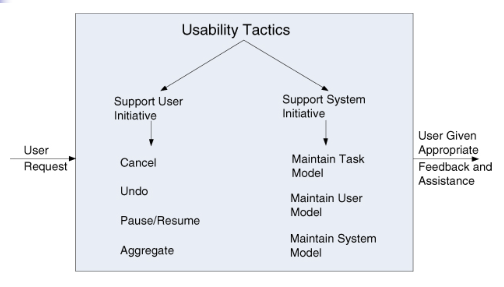

# Lecture 11: usability

## What is usability?

- Concerned with how easy it is for the user to accomplish a desired task and what kind of support the system provides
  - One of the cheapest and easiest ways to improve a system's quality
  - More precisely, the user's perception of quality
- Comprises of the following areas:
  - Learning system features: what can the system do to make the task of learning easier?
  - Using a system efficiently: what can the system do the make the user more efficient in its operation?
  - Minimizing the impact of errors: what can the system do so that a user error has minimal impact?
  - Adapting the system to user needs: how can the user (or system itself) adapt to make the user's task easier?
  - Increasing confidence and satisfaction: what does the system do to give the user confidence that the correct action is being taken?

## Usability general scenario

- Source of stimulus: the end user is *always* the source of stimulus for usability
- Stimulus: the end user wishes to
  - Use a system efficiently
  - Learn to use a system
  - Minimize the impact of errors
  - Adapt the system
  - Configure the system
- Environment: user's actions with which usability is a concern usually occur
  - At runtime
  - At system configuration time
- Artifact: the system or portion of the system with which the user is interacting
- Response: the system should
  - Provide the user with the features needed
  - Anticipate the user's needs
- Response measure: response is measure by one or more of the following
  - Task time
  - Number of errors
  - Number of tasks accomplished
  - User satisfaction
  - Gain of user knowledge
  - Ratio of successful operations
  - Amount of time or data lost when an error occurs

## Tactics for usability

- Research in human-computer interaction use the following terms
  - User initiative
  - System initiative
  - Mixed initiative
- They describe which of the human-computer pair takes the initiative in performing certain actions and how the interaction proceeds
- Usability scenarios can combine initiative for both perspectives
  - User issues a cancel command (user initiative)
  - System puts up a progress indicator (system initiative)
  - Canceling demonstrates a mixed initiative
- Achievement of usability and modifiability are connected
  - UI design process consists of generating and testing a UI design
  - Deficiencies in design are corrected and the process repeats
  - If UI has already been constructed, then system must be modified to conform to latest design
  - This connection has resulted in standard patterns to support UI design

### Separate the user interface

- Facilitate experimentation with the UI via the construction of rapid prototypes
  - Build a prototype (or several) and let real users experience the interface
  - Their feedback can pay enormous dividends
  - Design the software so that UI can be changed quickly
- Tactics for modifiability support this goal
  - UI generation tools
  - UI separation patterns (MVC)
- Many times, quality attributes conflict with each other
  - Usability and modifiability tend to go hand-in-hand
  - One of the best ways to make a system more "usable" is to make it "modifiable"
  - Not always the case, such as a business rule determining how input is validated
    - To realize validation, a server may need to be called
    - To get around performance penalty, validation rules can be duplicated in client and server, but makes evolution difficult

### Support user initiative

- Usability is enhanced by giving user feedback as to what the system is doing
- Allows users to make appropriate responses
- These tactics support the user in correcting errors or being more efficient
- Architects design for user initiative by enumerating and allocating responsibilities to respond to the user command

**Cancel**

- When user issues a cancel command, system must be listening for it
  - Responsibility to have a constant listener that is not blocked by actions of whatever is being canceled
- Command being canceled must be terminated
- Any resources being used by the cancelled command must be freed
- Collaborating components must also be informed of the cancellation to take appropriate action

**Undo**

- To support undo, the system must maintain a sufficient amount of information about state so that an earlier state can be restored at the user's request
  - A form of state snapshots
  - A set of reversible operations
- Not all operations are easily reversible
- Some operations cannot be undone

**Pause/Resume**

- When initiating a long-running operation, it is often useful to be able to pause and resume the operation
- Pausing long-running operations requires the ability to temporarily free resources so that they may be reallocated to other tasks

**Aggregate**

- Performing repetitive operations or operations that affect a large number of objects in the same manner is tiresome
- Providing the ability to group lower-level objects and apply the operation to that group takes away drudgery
- Can also reduce potential for mistakes from doing the same operation repeatedly

### Support system initiative

- When a system takes initiative it relies on
  - A model of the user
  - The task being undertaken
  - The system state itself
- These tactics identify the models the system uses to predict
  - Its own behavior
  - The user's intentions
- Encapsulating this information makes it easier to be tailored or modified
- Tailoring and modification can be either dynamically based on past user behavior or offline during development

**Maintain task model**

- Used to determine context so system has an idea of what the user is attempting and provide assistance
- Knowing sentences start with capital letters will allow the application to correct lower-case letters in that position

**Maintain user model**

- A model that represents
  - A user's knowledge of the system
  - A user's behavior in terms of expected response time
  - Other aspects specific to a user of class of users
- Maintaining a user model allows the system to
  - Pace mouse selection so that not all of the document is selected when scrolling
  - Control the amount of assistance and suggestions automatically provided to a user
- A special case of this tactic is commonly found in user interface customization where the user explicitly modifies the system's user model

**Maintain system model**

- System maintains an explicit model of itself
- Used to determine expected system behavior so appropriate feedback can be given to the user
- Commonly manifested as a progress bar that predicts time needed to complete the current activity

## A design checklist for usability

### Allocation of responsibilities

- Ensure that additional system responsibilities have been allocated, as needed, to assist the user in the following
  - Learning how to use the system
  - Efficiently achieving the task at hand
  - Adapting and configuring the system
  - Recovering from user and system errors

### Coordination model

- Determine whether the properties of system elements' coordination affect how
  - A user learns to use the system
  - Achieves goals or completes tasks
  - Adapts and configures the system
  - Recovers from user and system errors
  - Gains increased confidence and satisfaction
- For example, can the system respond to mouse events and give semantic feedback in real-time? Can long-running events be cancelled in a reasonable amount of time

### Data model

- Determine the major data abstractions that are involved with user-perceivable behavior
- Ensure these major data abstractions, their operations, and their properties have been designed to assist the user in:
  - Achieving the task at hand
  - Adapting and configuring the system
  - Recovering from user and system errors
  - Learning how to use the system
  - Increasing satisfaction and user confidence
- For example, data abstractions should be designed to support *undo* and *cancel* operations
  - Transaction granularity should not be so great that cancelling or undoing an operation takes an excessively long time

### Mapping among architectural elements

- Determine what mapping among architectural elements is visible to the end user
- For those that are visible, determine how this affects the ways in which, or the ease with which the user
  - Will learn to use the system
  - Achieve the task at hand
  - Adapt and configure the system
  - Recover from user and system errors
  - Increase confidence and satisfaction

### Resource management

- Determine how the user can adapt and configure the system's use of resources
- Ensure that resource limitations under all user-controlled configurations will not make users less likely to achieve their tasks
- For example, attempt to avoid configurations that would result in excessively long response times
- Ensure that the level of resources will not affect users' ability to
  - Learn how to use the system
  - Decrease their level of confidence and satisfaction with the system

### Binding time

- Determine which binding time decision should be under user control and ensure that users can make decisions that aid in usability
- For example, if the user can choose, at runtime, ensure such choices do not adversely affect usability
  - The system's configuration
  - Its communication protocols
  - Its functionality via plug-ins

### Choice of technology

- Ensure the chosen technologies help to achieve usability scenarios that apply to your system
- For example, do these technologies aid in
  - Creation of online help
  - Production of training materials
  - Collection of user feedback
- How usable are any of your chosen technologies?
- Ensure the chosen technologies do not adversely affect the usability of the system
