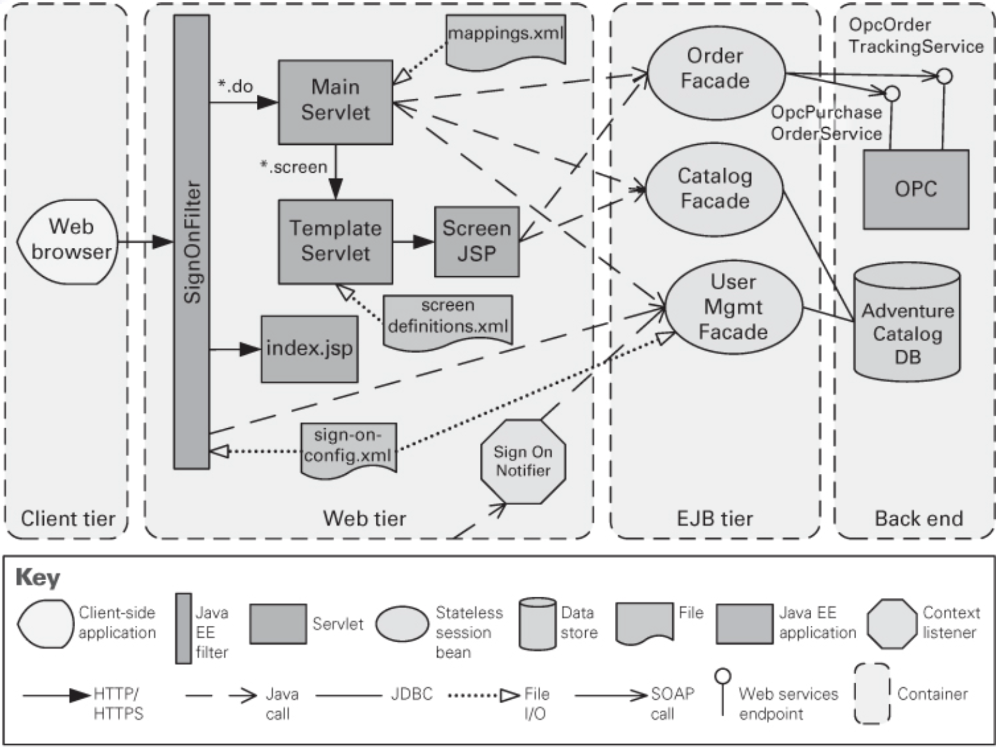

# Lecture 13: architectural tactics and patterns

## Architectural patterns

- Architectural patterns and tactics are ways to capture proven good design structures and permit reuse
  - A package of design decisions repeatedly found in practice
  - Has known properties that enable reuse
  - Describes a class of architectures
- Patterns are discovered, not invented
  - One discovers a pattern by describing their shared characteristics
  - The discoverer understands how characteristics lead to different behaviors and responses to environmental conditions
  - There will never be a complete list of patterns
- Patterns package tactics
  - Tactics are simpler than patterns
  - Typically use a single structure or computational mechanism
  - Are the building blocks of design from which patterns are created
  - Tactics are to atoms as patterns are to molecules
- Architectural patterns are documented by establishing a relationship between
  - Context: a recurring, common situation that gives rise to a problem
  - Problem: the issue arising from the context, including any quality attributes that must be met
  - Solution: a successful architectural resolution to the problem, describing static relationships among elements or runtime behavior of and interaction between elements
- A solution for a pattern is determined and described by
  - A set of element types
  - A set of interaction mechanisms or connectors
  - A topological layout of the components
  - A set of semantic constraints covering topology, element behavior, and interaction mechanisms
  - Makes clear what quality attributes are provided by static and runtime configurations of elements

## Overview of the patterns catalog

- Applying a pattern is not an all-or-nothing proposition
  - Architects may choose to violate pattern definitions if there is a good design trade off to be had
  - For example, layered pattern expressly forbids lower layers from using upper layers
  - Exception may be granted if their is a performance benefit
- Patterns can be categorized by the dominant type of element
  - Module patterns show modules
  - C&C patterns show components and connectors
  - Allocation patterns show a combination of software and non-software elements
  - Most published patterns are C&C patterns, but others exists as well


### Module patterns

#### Layered pattern

**Specification**

- Context: all complex systems require independent development and evolution
- Problem: system needs to be segmented such that modules can be developed and evolved separately with little interaction
- Solution: achieve this separation of concerns by dividing the software into units called layers

**Layers**

Layers are created to interact according to a strict ordering relation

- If $\left(A, B\right)$ is in this relation, layer A is allowed to use any public facilities provided in layer B
- Some cases might allow modules to use non-adjacent layers, whereas normally only next-lower-layer uses are allowed
- Non-adjacent layer usage is called layer bridging, which may hinder portability/modifiability goals in there are lots
- Upward usages are strictly forbidden in this pattern

**Constraints**

- Every piece of software is allocated to exactly one layer
- There are at least 2 layers (but usually 3 or more)
- The *allowed-to-use* relations should not be circular

**Weaknesses**

- The addition of layers add up-front cost and complexity to a system
- Layers contribute a performance penalty


#### Other module patterns

- Designers in a particular domain often publish "standard" module decompositions
- If put into a "context-problem-solution" form, they constitute as a module decomposition pattern
- In the object-oriented realm, published class/object design solution form object-oriented patterns

### Component-and-connector patterns

#### Shared-data (repository) pattern

**Specification**

- Context: various computational components need to share and manipulate large amounts of data
- Problem: how can systems store and manipulate persistent data that is accessed by multiple independent components?
- Solution: dominate the exchange of persistent data between multiple data accessors with at least one shared-data store

**Constraints**

- Data accessors interact with the data-store(s)

**Weaknesses**

- The shared-data store may be a performance bottleneck
- The shared-data store may be a single point of failure
- Producers and consumers of data may be tightly coupled


#### Client-server pattern

**Specification**

- Context: there are shared resources and services that a large number of distributed clients want to access
- Problem: how can we improve scalability and availability by centralizing control of shared resources while distributing resources themselves across multiple physical servers
- Solution: clients interact by requesting services of servers

**Constraints**

- Clients are connected through request/reply connectors
- Server components can be clients to other servers
- Specializations may impose limits on
  - Number of attachments to a given port
  - Allowed relation among servers
- Components may be arranged in tiers, which are logical groupings of related functionality or functionality that will share a host computing environment

**Weaknesses**

- Servers can be a performance bottleneck
- Servers can be a single point of failure
- Decisions about where to locate functionality are often complex and costly to change after a system has been built


#### Broker pattern

**Specification**

- Context: many systems are constructed as distributed collections of services where worry about interoperability and availability are a high concern
- Problem: how do we construct system such that users do not need to know about service locations/providers and make it easy to change binding dynamically?
- Solution: the broker pattern separates users of a service from providers and inserts an intermediary to
  - Forward a client's request to the appropriate service provider
  - Service result is communicated to the broker and broker returns it to the requesting client

**Brokers**

- Can choose replacements dynamically
- Broker is the only component aware of this change
- Client remains ignorant to identity, location, and characteristics of the service provider

**Constraints**

- Client can only attach to the broker
- Server can only attach to a broker

**Weaknesses**

- Adds a layer of indirection (and latency) between clients and servers (and may be a bottleneck)
- Broker can be a single point of failure
- Adds up-front complexity
- Brokers may be targets for security attacks
- May be difficult to test


#### Model-View-Controller (MVC) pattern

**Specification**

- Context: UI is the most modified portion of an application, making it important to keep modification separate from the rest of the system
- Problem: how can UI functionality be kept separate from application functionality?
- Solution: separate the application into three kinds of components
  - a model to contain application data
  - a view to display underlying data and interacts with the user
  - a controller to mediate between the model and the view and manages notification of state changes

**Constraints**

- There must be at least one instance of model, view, and controller
- The model component shouldn't interact with the controller

**Weaknesses**

- Complexity may not be worth it for simple UIs
- Abstractions may not be good fits for some UI toolkits


#### Pipe and filter pattern

**Specification**

- Context: many systems require transforming of streams of discrete data items, from input to output
- Problem: such systems need to be divided into reusable, loosely coupled components with generic interaction mechanisms
- Solution: Data arrives at a filter's input port, is transformed, and passed via its output port(s) through a pipe to the next filter

**Constraints**

- Pipes connect filter output ports to filter input ports
- Connected filters must agree on the type of data being passed along the connecting pipe
- Specializations of the pattern may restrict the association of components to an acyclic graph or a linear sequence
- Other specializations may prescribe the components have certain named ports, such as `stdin`, `stdout`, and `stderr` of UNIX filters

**Weaknesses**

- Typically not a good choice for interactive systems
- Having large numbers of independent filters can add substantial amounts of computational overhead
- May not be appropriate for long-running computations


#### Peer-to-peer (P2P) pattern

**Specification**

- Context: distributed computational entities, each considered equally important in terms of interaction, provides its own resources, and must collaborate to provide a service to a distributed community of users
- Problem: how can a set of "equal" distributed computational entities be connected to each other
- Solution: connect components directly as peers; any component can interact with any other component by requesting its services

**Constraints**

- Number of allowable attachments to any given user
- Number of hops used for searching for a peer
- Which peers know about which other peers
- Some P2P networks are organized with star topologies, in which peers only connect to supernodes

**Weaknesses**

- Managing security, data consistency, data/service availability, backup, and recovery are all more complex
- Small P2P systems may not be able to consistently achieve quality goals such as performance and availability


#### Service oriented architecture (SOA) pattern

**Specification**

- Context: a number of services are offered by providers and consumed by consumer
- Problem: how can we support interoperability of distributed components and locate them to combine them in to meaningful coalitions while achieving reasonable performance, security, and availability?
- Solution: describes a collection of distributed components the provide/consume a service

**Constraints**

- Service consumers are connected to service providers, but intermediary components may be used

**Weaknesses**

- SOA-based systems are complex to build
- You don't control the evolution of independent services
- There is a performance overhead associated with the middleware, and services may be performance bottlenecks, and typically do not provide performance guarantees


#### Publish subscribe pattern

**Specification**

- Context: a number of independent producers and consumers must interact, and the nature of the components is not fixed
- Problem: how can we create an integration mechanism that supports the ability to transmit messages from producers to consumers in such a way that they are unaware of each other's existence
- Solution: components interact via announced messages or events, where the event bus ensures all subscribed components receive messages of interest

**Constraints**

- All components are connected to an event distributor
- Published ports are attached to announce roles and subscribe ports are attached to listen roles
- Constraints may restrict which component can listen to which events, whether a component can listen to its own events, and how many publish-subscribe connectors can exists within a system
- A component may be both a publisher and a subscriber, by having ports of both types

**Weaknesses**

- Typically increases latency and has a negative effect on scalability and predictability of message delivery time
- Less control over ordering of messages, and delivery of messages is not guaranteed


### Allocation patterns

#### Map-Reduce pattern

**Specification**

- Context: businesses have a pressing need to quickly analyze enormous volumes of data they generate or access (at the petabyte scale)
- Problem: how can we efficiently perform a distributed and parallel sort of a large data set and provide simple means for analysis to be done?
- Solution: the map-reduce pattern uses three parts
  - Specialized infrastructure to allocate software to hardware nodes
  - Two programmer coded functions, namely `map` and `reduce`

**Programmer functions**

```lisp
(map(lambda (x) (* x x)) '(1 2 3 4))
=> (1 4 9 16)
(sum + 0 '(1 4 9 16))
=> 30
```

**Constraints**

- Data to be analyzed must exist as a set of files
- The map functions are stateless and do not communicate with each other
- The only communication between the map instances and the reduce instances is the data emitted from the map instances as `<key, value>` parts

**Weaknesses**

- If you do not have large data sets, the overhead of map-reduce is not justified
- If you cannot divide your data set into similar sized subsets, the advantages of parallelism are lost
- Operations that require multiple reduces are complex to orchestrate


#### Multi-tier pattern

**Specification**

- Context: distributed deployment need to distribute a system's infrastructure into distinct subsets
- Problem: how can we split the system into a number of computationally independent execution structures connected by some communications media?
- Solution: the execution structures are organized as a set of logical groupings of components

**Constraints**

- A software components belongs to exactly one tier

**Weaknesses**

- Substantial up-front cost and complexity



## Relationship between tactics and patterns

### Patterns comprise tactics

- Patterns consist of several different tactics
  - Chosen tactics may all serve a common purpose
  - Often chosen to promote different quality attributes

### Using tactics to augment patterns

- A pattern is a solution to a class of problems in a general context
- When applied, its context becomes very specific
  - Patterns exist to achieve certain quality attributes, we must compare the ones they promote (and diminish)
  - Other quality attributes the pattern affects is important to our application
- To illustrate, lets improve the broker patterns weaknesses
  - Availability: liveness of servers and brokers needs to be monitored and a repair mechanisms provided
  - Performance: load balancing can help ensure a broker is not overwhelmed
  - Testability: exception detection can help serve as means of detecting faults
  - Security: load balancing can provide replicas should one broker be the target of an attack

## Using tactics together

- Tactics are design primitives aimed at managing a single quality attribute response
  - Every tactic has a main effect as well as side effects
  - Seems like improving one quality attribute endangers another
  - Using tactics profitably means gauging whether the trade-off is acceptable
- The design problem is **recursive**
  - Applying successive tactics is like moving through a game space
  - Good architects see the consequences of the move (tactic they apply)
  - Very good architect are able to see several steps ahead
