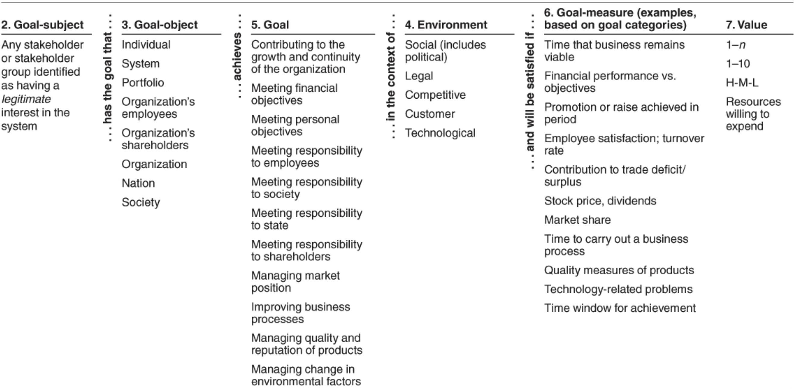

# Lecture 14: architecture and requirements

- Architectures exist to build systems that satisfy requirements
  - Not all requirements are created equal
  - Some have a more profound effect on architecture than others
  - An architecturally significant requirements (ASR) is one that
    - Has a profound effect on the architecture
    - Resulting architecture would be dramatically different in its absence
  - ASRs often (but not always) take the form of quality attribute requirements
    - Each pattern or tactic used in an architecture changes it
    - Is a result of the need to meet quality attribute requirements
- Architects have to identify ASRs by doing a  significant bit or work to uncover candidate ASRs
  - Competent architects know to start talking to the important stakeholders
  - They gather information needed to produce the architecture that will respond to the project's needs
  - This chapter provides systematic means for
    - Identifying the ASRs
    - Finding other factor that will shape the architecture

## Gathering ASRs from requirements documents

- An obvious place to look for candidate ASRs
  - We are looking for requirements, and they should be in requirements documents
  - Not usually the case that the information in requirements documents is useful

### Don't get your hopes up

- Many project don't create or maintain requirements documents that software engineering classes prescribe
- The way requirements are specified does not provide much help in nailing down quality attributes
- However, no architect should sit and wait until requirements are "finished"
  - Architecture begins while the requirements are still in flux
  - The QA requirements are quite likely to bu up in the air when the architect starts work
- Even when exist and are stable, requirements documents fail architects in two ways
  - 1) Rarely see adequate capture of quality attribute requirements
  - 2) Much of what is useful (observables in the system being specified) is not in the best requirements documents
- Developmental qualities are also out of scope
  - Rare to see a requirements document that describes teaming assumptions
  - In acquisition context, requirements documents represent interests of the acquirer not the developer
  - Stakeholder, the technical environment, and the organization itself all play a role in influencing architecture

### Sniffing out ASRs from a requirements document

- Although requirements won't tell the whole story, they are an important source of ASRs
  - Won't be conveniently labeled as such
  - Architect will have to perform a bit o f excavation and archaeology to ferret them out

| Design Decision Category | Look for Requirements Addressing... |
| ------------------------ | ----------------------------------- |
| Allocation of Responsibilities | Planned evolution of responsibilities, user roels, system modes, major processing steps, commercial packages |
| Coordination model | Properties of the coordination (timeliness, currency, completeness, correctness, and consistency), names of external elements, protocols, sensors or actuators, middleware, network configurations and any evolution requirements |
| Data model | Processing steps, information flows, major domain entities, access rights, persistence, evolution requirements |
| Management of resources | Time, concurrency, memory footprint, scheduling, multiple users, multiple activities, devices, energy useage, soft resources (buffers and queues) and any scalability requirements of the resources above |
| Mapping among architectual elements | Plans for teaming, processors, families of processors, evolution of processors, network configurations |
| Binding time decisions | Extension of or flexibility of functionality, regional distinctions, language distinctions protability, calibrations, configurations |
| Choice of technology | Named technologies, changes to technologies (planned or unplanned) |

## Gathering ASRs by interviewing stakeholders

- Interviewing relevant stakeholders is the surest way to learn what they know and need
  - Critical information should be captured in a systematic, clear, and repeatable way
  - One such method to obtain this information is the Quality Attribute Workshop (QAW)
- Result of stakeholder interviews should be
  - A list of architectural drivers
  - A set of QA scenarios that stakeholders (as a group) prioritizes
- This information can be used to:
  - Refine system and software requirements
  - Understand and clarify the system's architectural drivers
  - Provide rationale for why the architect subsequently made certain design decisions
  - Guide the development of prototypes and simulations
  - Influence the order in which the architecture is developed

### The quality attribute workshop (QAW)

- The Quality Attribute Workshop (QAW) is a facilitated, stakeholder-focused method to generate, prioritize, and refine quality attribute scenarios before the software architecture is completed
  - Focuses on system-level concerns and specifically the role that software will play in the system
  - Keenly dependent on the participation of system stakeholders

**Step 1: QAW presentation and introductions**

- Facilitators describe the motivation for the workshop and explain each step of the method
- Everyone introduces themselves, briefly stating:
  - Their background
  - Their role in the organization
  - Their relationship to the system being built

**Step 2: business/mission presentation**

- The stakeholder representing business concerns (typically a manager or management representative) spends about an hour presenting
  - The system's business context
  - Broad functional requirements
  - Constraints
  - Known quality attribute requirements
- Quality attributes will be refined in later steps an will be derived largely from business/mission needs presented in this step

**Step 3: architectural plan presentation**

- Detailed system or software architecture might not exist, so present something that describes some of the system's technical details
  - Broad system descriptions
  - Context drawings
- Architect presents the system architectural plan as it stands
- This lets stakeholders know the current architectural thinking, to the extent that it exists

**Step 4: identification of architectural drivers**

- Facilitators share their list of key architectural drivers that they assembled during steps 2 and 3
- Ask stakeholders of clarifications, additions, deletions, and corrections
- Idea is to reach a consensus on a distilled list of architectural drivers that includes
  - Overall requirements
  - Business drivers
  - Constraints
  - Quality attributes

**Step 5: scenario brainstorming**

- Each stakeholder expresses a scenario representing his/her concerns with respect to the system
- Facilitators ensure that each scenario has an explicit stimulus and response
- Facilitators ensure that at least one representative scenario exists for each architectural driver listed in the previous step

**Step 6: scenario consolidation**

- Similar scenarios are consolidated where reasonable
- Facilitators ask stakeholders to identify those scenarios that are very similar in content
- Scenarios that are similar are merged, as long as the people who proposed them agree and feel that the scenarios will not be diluted in the process
  - Consolidation help to prevent votes from being spread across several scenarios that are expressing the same concern
  - Consolidating almost-alike scenarios assures that the underlying concern will get all of the votes it is due

**Step 7: scenario prioritization**

- Prioritization of the scenarios is accomplished by allocating each stakeholder a number of votes equal to 30% of the total number of scenarios generated after consolidation
- Stakeholders can allocate any number of their votes to any scenario or combination of scenarios
- Votes are counted and the scenarios are prioritized accordingly

**Step 8: scenario refinement**

- After the prioritization, top scenarios are refined and elaborated
- Facilitators help the stakeholders put the scenarios in the 6-part scenario form
- As scenarios are refined, issues surrounding their satisfaction will emerge
- These are also recorded
- This step lasts as long as time and resources allow

## Gathering ASRs by understanding the business goals

- Business goals are the reason for building a system
  - No organization builds a system without a reason
  - Organization leaders want ot further the mission and ambitions of their organization and themselves
- There are 3 possible relationships between business goals and an architecture
  - 1) Business goals often lead to quality attribute requirements
  - 2) Business goals may directly affect the architecture without precipitating a quality attribute requirement at all
  - 3) No influence at all
- Architects often become aware of an organization's business and business goals via osmosis (working, listenning, talking, and soaking up the goal)
  - Osmosis is not without its benefits, but more systematic ways are possible

### A categorization of business goals

- Business goals are worth capturing explicitly
  - They often imply ASRs that would otherwise go undetected until it is too late or too expensive to address them
  - Capturing business goals is well served by having a set of candidate business goals handy to use as conversation starters
- Research in business goals has led us to adopt the categories listed below
  - 1) Contributing to the growth and continuity of the organization
  - 2) Meeting financial objectives
  - 3) Meeting personal objectives
  - 4) Meeting responsibility to employees
  - 5) Meeting responsibility to society
  - 6) Meeting responsibility to state
  - 7) Meeting responsibility to shareholders
  - 8) Managing market position
  - 9) Improving business processes
  - 10) Managing the quality and reputation of products
  - 11) Managing change in environmental factors

### Expressing business goals

- A scenario makes a convenient, uniform, and clarifying way to express business goals
  - Ensures all business goals are expressed clearly, in a consistent fashion
  - Contains sufficient information to enable their shared understanding by relevant stakeholders
- A business goal scenario template has 7 parts; they all relate the system under development, the identity of which is implicit
  - 1) Goal source: people or written artifacts providing the goal
  - 2) Goal subject: stakeholders who own the goal and wish it to be true
  - 3) Goal object: entities to which the goal applies
  - 4) Environment: the context for this goal
  - 5) Goal: any business goal articulated by the goal source
  - 6) Goal measure: a testable measurement to determine how one would know if the goal has been achieved (usually includes a time component)
  - 7) Pedigree and value: tells the degree of confidence the person who stated the goal has in it and the goal's volatility and value
- Elements 2-6 can be combined into a sentence that reads:

```plaintext
For the system being developed, <goal-subject> desires that <goal-object> achieve <goal> in the context of  <environment> and will be satisfied if <goal-measure>.
```

### A general scenario for business goals



### Capturing business goals

- Business goals are worth capturing because the can hold the key to discovering ASRs that emerge in no other context
- One method to elicit and document business goals is the pedigreed attribute elicitation method (PALM)
  - The word "pedigree" measn that the business goal has a clear derivation or background
  - PALM uses the standard list of business goals and the business goal scenario format
- PALM can bu used to 
  - Sniff out missing requirements early in the life cycle
  - Discover and carry along additional information about existing requirements
  - Examine particularly difficult quality attribute requirements to see if they can be relaxed

**Step 1: PALM overview presentation**

- Overview of PALM, problem it solves, its steps, and its expected outcomes

**Step 2: business drivers by project management**

- Briefing of business drivers by project management
- Normally a lengthy discussion that allows participants to ask question s about the business goals as presented by project management

**Step 3: architecture drivers presentation**

- Briefing by the architect on the driving business and quality attribute requirements: ASRs

**Step 4: business goals elicitation**

- Using the standard business goal categories to guide discussion, capture the set of important business goals for this system
- Business goals are elaborated and expressed as scenarios
- They are consolidated to eliminate almost-alike business goals
- Participants then prioritize the resulting set to identify the most important goals

**Step 5: identification of potential quality attributes from business goals**

- For each important business goal scenario, participants describe a quality attribute that would help achieve it
- If the QA is not already a requirement, this is recorded as a finding

**Step 6: assignment of pedigree to existing quality attribute drivers**

- For each architectural driver named in step 3, identify which business goals it is there to support
- If none, that  is recorded as a finding
- Otherwise, establish its pedigree by asking for the source of the quantitative part

**Step 7: exercise conclusion**

- Review of results, next steps and participant feedback

## Capturing ASRs in a utility tree

- Helpful to record ASRs in one place so the list can be reviewed, references, used to justify design decisions, and revisited over time
- Architects can use a construct called a utility tree for all these purposes
  - Utility is an expression of the overall "goodness" of the system
  - We then elaborate this rood node "utility", by listing the major quality attributes that the system is require to exhibit
- Once the ASRs are recorded and placed in the utility tree, you can now evaluate them against the two criteria
  - The business value of the candidate ASR
  - The architectural impact of including it
- For business value
  - High designates a *must-have* requirement
  - Medium is for a requirement that is important, but would not lead to project failure were it omitted
  - Low describes a nice requirement to have, but not something worth much effort
- For architectural impact
  - High means that meeting this ASR will profoundly affect the architecture
  - Medium means that meeting this ASR will somewhat affect the architecture
  - Low means that meeting this candidate ASR will have little effect on the architecture

## Tying the methods together

> How should you employ requirements documents, stakeholder interviews, quality attribute workshops, PALM and utility trees? It depends

- Blending all methods together:
  - PALM is an excellent "subroutine call" from QAW for the step that asks about business goals
  - A quality attribute utility tree makes an excellent repository for the scenarios that are workshop's output
- Unlikely that a project will have the time and resources to support this do-it-all approach
  - Better to pick the approach that fills the biggest gap in your existing requirements
