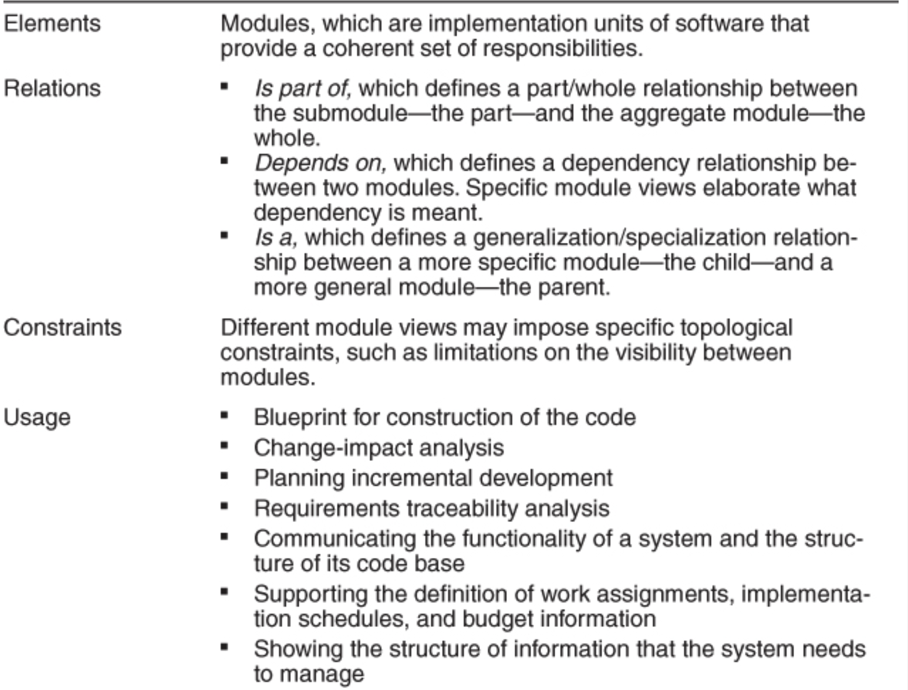
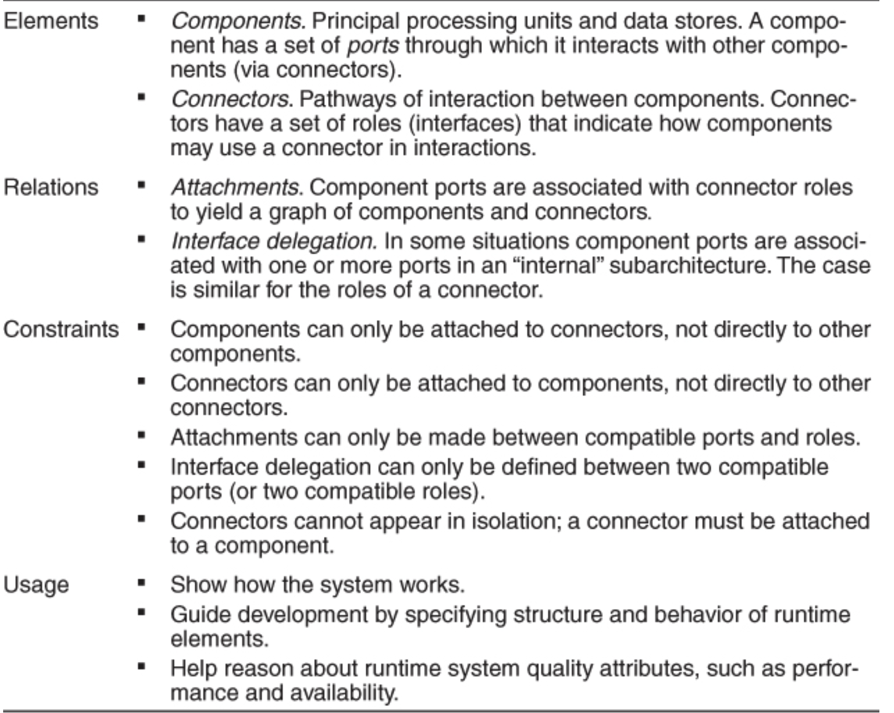
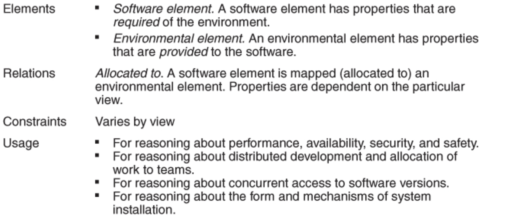
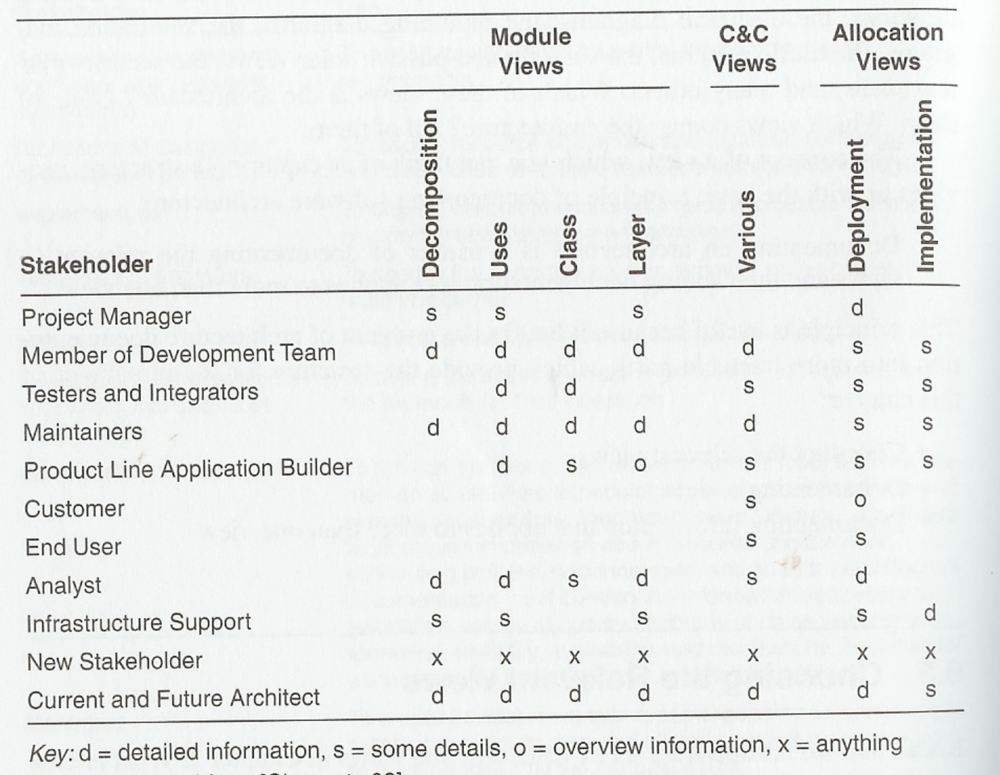

# Lecture 16: documenting software architectures

- Even the best architectures will be essentially useless if the people who need to use it
  - Do not know what it is
  - Cannot understand it well enough to use, build, or modify it
  - Misunderstand it and apply it incorrectly
- Creating an architecture isn't enough
  - Must be communicated properly to let stakeholders use it
  - Describe it enough enough detail, without ambiguity, so that others can find and update needed information
- The best architects produce good documentation because
  - It is essential to producing a high quality product with as little rework as possible
  - See immediate stakeholders (devs, testers, analysts) as the most intimately involved in this undertaking
- Architects see documentation as delivering value to themselves
  - Serves as the receptacle to hold the result of major design decisions are they are made
  - Well thought out documentation scheme can make design process go more smoothly and systematically
  - Helps architects reason about the design and communicate it while architecting is in progress

## Uses and audiences for architecture documentation

- Architecture documentation has 3 uses
  - 1) Serves as a means of education
  - 2) Serves as a primary vehicle for communication among stakeholders
  - 3) Serves as the basis for system analysis and construction
- When planning and reviewing documentation, ensure support for all the relevant needs
- Many different kinds of people will have a vested interest in an architecture document
  - Hope and expect that the architecture will help them do their respective jobs
  - Understanding their uses of architecture documentation is essential as those uses determine the important information to capture

## Notations for architecture documentation

- Notations for documenting views differ considerably in their degree of formality
  - Informal notations: semantics of the description are characterized in natural language and cannot be formally analyzed
  - Semiformal notations: views are expressed in a standardized notation that prescribes graphical elements and rules of construction, but does not provide a complete semantic treatment of the meaning
  - Formal notations: views are described in a notation that has a precise semantics and formal analysis of both syntax and semantics is possible
- Determining which notation to use involves making several trade-offs
  - More formal notations take more time and effort to create and understand
  - Effort is repaid in reduced ambiguity and more opportunities for analysis
- Regardless of formality, different notations are better (or worse) for expressing different kinds of information

## Views

- A software architecture is a complex entity that cannot be described in a simple one-dimensional fashion
- A view represents a set of system elements and relations among them (not all of them, but those of a particular type)
  - A layered view would show elements of type "layer" (the system's decomposition into layers and relations among those layers)
  - Would not show the system's services, clients, servers, data models, or any other type of element
- Views let us divide the multidimensional entity of software architecture into a number of (we hope) interesting and manageable representations of the system
  - Documenting architecture is a matter of documenting the relevant views and then adding documentation that applies to more than one view
  - What are the relevant view?
    - Depends entirely on your goals
    - Select the view that assist documentation in serving its intended purposes
- Different views expose different quality attributes to different degrees
  - The quality attributes that are of most concern to you and other stakeholders will affect the choice of views
  - A layered view lets you reason about your system's portability
  - A deployment view lets you reason about your system's performance and reliability
- Different views support different goals and uses
  - We do not advocate for a particular view or collection of views
  - Select the views based on the uses you expect to make of the documentation
  - Different views will highlight different system elements and relations
  - How many views to represent is the result of a cost/benefit decision (do benefits of maintaining a view outweigh its costs?)
- Views may be driven by the need to document a particular pattern in your design
  - Some patterns are composed of modules, others of components and connectors, and others will have deployment considerations
  - Module views, component-and-connector views, and allocation views are the appropriate mechanisms for representing these considerations

### Module views

- A module is an implementation unit that provides a coherent set of responsibilities 
  - Might take the form of a class, a collection of classes, a layer, an aspect, any other decomposition of the implementation unit
  - Examples of module views include decomposition, uses and layers
- Every module has a collection of properties assigned to it
  - Properties are intended to express the important information associated with the module as well as constraints on the module
  - Sample properties include responsibilities, visibility information, and revision history
  - Relations that modules have to one another include *is part of*, *depends on*, and *is a*
  - Properties of modules that guide implementation or are input to analysis should be recorded as part of the supporting documentation for a module view
  - The list of properties (of modules) may vary, but is likely to include:
    - Name
    - Visibility of interfaces
    - Implementation information
    - Test information
    - Management information
    - Implementation constraints
    - Revision history
- The way a system's software is decomposed into manageable units is one of the important forms of system structure
  - This determines a source code is decomposed into units
  - What kinds of assumptions each unit can make about services provided by other units
  - How those units are aggregated into larger ensembles
  - Also includes global data structures that impact or are impacted by multiple units
  - Module structures determine how changes to one part of a system might affect other parts and hence ability to support modifiability, portability, and reuse
  - Unlikely that documentation of any software architecture can be complete without at least one module view

- Because modules partition the system, it is possible to determine how the functional requirements of a system are supported by module responsibilities
  - Dependencies among modules or layers provide a good basis for change-impact analysis
  - Modules are typically modified as a result of problem reports or change requests
  - Impact analysis requires a certain degree of design completeness and integrity of the module description
- Module views can explain the system's functionality to someone not familiar with it
  - Various levels of granularity of the module decomposition provide a top-down presentation of the system responsibilities
  - Up-to-date views are helpful in explaining the structure of the code base to a new developer on the team
  - Can guide learning processes and simplify/regularize system maintenance
- It is difficult to use module views to make inferences about runtime behavior
  - These views are just a static partition of the functions of the software
  - A module view is not typically used for analysis of performance, reliability, and many other runtime qualities
  - For those, we rely on component-and-connector and allocation views
- Module views are commonly mapped to component-and-connector views
  - Implementation units shown in module views have a mapping to components that execute at runtime
  - Sometimes the mapping is quite straightforward, even 1:1 for small and simple applications
  - More often, a single module will be replicated as part of many runtime components and a given component could map to several modules
  - Module views provide the software elements that are mapped to the diverse non-software elements of the system environment in the various allocation views

### Component-and-connector views

- Component-and-connector views show elements that have some runtime presence
  - This includes processes, objects, clients, servers, and data stores
  - Elements are termed *components*
  - The pathways of interaction (such as communication links and protocols, information flows, and access to shared storage) are represented as *connectors*
- Components have interfaces called ports
  - A port defines a point of potential interaction of a component with its environment
  - A port usually has an explicit type, which defines the kind of behavior that can take place
    - A component may have many ports of the same type, each forming a different input or output channel at runtime
    - Ports differ from interfaces of modules, whose interfaces are never replicated
    - Ports can be annotated with a number of range of numbers to indicate replication
    - A component's ports should be explicitly documented, showing them in the diagram and defining them in the diagram's supporting documentation
- A component in a C&C view may represent a complex subsystem, which itself can be described as a C&C sub-architecture
  - This sub-architecture can be depicted graphically when it is not too complex
  - Often, it is documented separately
  - A component's sub-architecture may employ a different pattern than the one in which the component appears
- Connectors are the other kind of element in C&C views
  - They represent much more complex forms of interaction
  - They have roles, which are its interfaces, defining the ways in which the connector may be used by components to carry out interaction
  - Like component ports, connector roles differ from module interfaces in that they can be replicated
  - Like components, complex connectors may be decomposed into collections of components and connectors that describe the architectural sub-structure of those connectors
  - Connectors need not be binary
    - They do not need to have *exactly* 2 roles
    - Even if the connector is ultimately implemented using binary connectors, it can be useful to adopt n-ary connector representations in a C&C view
  - Connectors embody a protocol of interaction
    - When 2 or more components interact, they must obey conventions about order of interactions, locus of control, and handling of error conditions and timeouts
    - The protocol of interaction should be documented
- The primary relation within a C&C view is attachment
  - Attachments indicate which connectors are attached to which components, defining a system as a graph of components and connectors
  - An attachment is denoted by associating (attaching) a component's port to a connector's role
  - A valid attachment is one in which the ports and roles are compatible with each other, under the semantic constraints defined in the view
- An element (component or connector) of a C&C view will have various associated properties
  - Every element should have a name and type
  - Additional properties depend of the type of component of connector
  - Define values for the properties that support the intended analysis for the particular C&C view
- C&C views are commonly used to show the developers and other stakeholders how the system works
  - One can "animate" or trace through a C&C view, showing an end-to-end thread of activity
  - C&C views are also used to reason about runtime system quality attributes, such as performance and availability

- Box and line drawing can represent C&C views
  - Informal notations limit the semantics that can be conveyed
  - Following simple guidelines can lend rigor and depth to the descriptions
- As a primary guideline:
  - Assign each component type and each connector type a separate visual form (symbol) and list each of the types in a key
  - UML components are a good semantic match to C&C components because they permit intuitive documentation of important information
  - Can also distinguish between component types and component instances, which helps with defining view-specific component types
  - UML ports are a good semantic match to C&C ports
    - Can be decorated with multiplicity
    - Number of ports on component instances is typically bound to a specific number

### Allocation views

- Allocation views describe the mapping of software units to elements of an environment in which it is developed in or it executes on
  - Environment might be the hardware, the OS, the file systems supporting development/deployment or the development organization
  - Views consist of software elements and environmental elements
    - Software elements come from module or C&C views
    - Environmental elements may be processors, a disk farm, a file or folder, or a group of developers

- The relation in an allocation view is *allocated to*
  - Usually talk about allocation views in terms of a mapping from software elements to environmental elements
  - The reverse mapping can also be relevant and interesting
  - A single software element can be allocated to multiple environmental elements, and multiple software elements can be allocated to a single environmental element
  - If allocations change over time, either during development or execution of the system, then the architecture is said to be dynamic with respect to that allocation
- Software elements and environmental elements have properties in allocation views
  - The usual goal of an allocation view is to compare the properties required by the software element with the properties provided by the environmental element to determine whether the allocation will succeed or not
  - For example, to ensure a component's required response time, it must be provided with a sufficiently fast processor
- Allocation views can depcit static or dynamic views
  - A static view depicts a fixed allocation of resources in an environment
  - A dynamic view depicts the conditions and the triggers for which allocation of resources changes according to loading
    - Load-balancing system: dynamic allocation mechanism
    - Work assignment structure: dynamic allocation of work

### Quality views

- Module, C&C, and allocation vies are all *structural* views
  - They primarily show the structures that the architect has engineered into the architecture to satsify functional and quality attribute requirements
  - These views are excellent for guiding and constraining downstream developers, whose primary job it is to implement those structures
- In systems where a certain quality attributes or some other kind of stakeholder concerns are particularly important, a structural view may not be the best way to present an architectural solution
  - The solution may be spread across multiple structures that are inconvenient to combine
  - A quality view can be tailored for specific stakeholders or to address specific concerns
  - These quality views are formed by extracting the relevant pieces of structural views and packaging them together
- Here are some examples of quality views
  - Security view: show all of the architectural measure taken to provide security
  - Communications view: helpful for systems that are globally dispersed and heterogeneous
  - Exception or error handling view: illuminate and draw attention to error reporting and resolution mechanisms
  - Reliability view: models reliability mechanisms such as replication and switch-overs
  - Performance view: includes aspects of the architecture useful for inferring the system's performance

## Choosing the views

- At a minimum, expect at least 1 module and 1 C&C view (large system may need an allocation view)
- Beyond this rule of thumb, these steps can guide you in choosing your views

### Step 1: build a stakeholder/view table

- Enumerate stakeholders down the rows of this table
- Enumerate views that apply to your system along the columns
- Fill each cell of the table to indicate how much information the stakeholder requires from the view
  - None
  - Overview only
  - Moderate detail
  - High detail
- The candidate view list consist of those view for which some stakeholder has a vested interest

### Step 2: Combine views

- Candidate list is likely to yield an impractical number of views
- This step winnows the list to a manageable size
  - Look for marginal views (only require an overview or serve very few stakeholders)
  - Combine each marginal view with another view that has a stronger constituency

### Step 3: Prioritize and stage

- You should have the minimum set of views needed to serve your stakeholder community
- Decide which views to do first
  - Decomposition views are helpful to release early on
  - Do not need to satisfy all information needs of stakeholder, only enough to let stakeholders do their job
  - Check with stakeholder if partial information is enough to deliver product on-time and within budget
  - Don't have to complete one view to start another, breadth-first approaches can be the best option for progress

## Combining views

- All views in an architecture
  - Exist to achieve the same common purpose
  - Have a strong association with each other
  - Can be more convenient to show this association in a single combined view
- A combined view
  - Contains elements and relations that come from two or more other views
  - Can be useful as long as they are not overloaded with too many mappings
- Merging views can be done by
  - Creating an overlay that combines the information that would be separated into two views
  - Works well if the coupling between the two views is tight
  - Structure described by combined view may even be easier to understand than the two views
- The following views typically combine naturally
  - Various C&C views
  - Deployment view with either SOA or communicating processes views
  - Decomposition views of any work assignment, implementation, uses, or layered views

## Building the documentation package

### Documenting a view

**The primary presentation**

- Shows the elements and relations of the view
- Should contain the information you wish to convey about the system
  - Should include primary  elements and relations
  - May not include all of them in certain circumstances
- Presentation is most often graphical
  - Make sure to include a key to explain notation
  - Occasionally presentation may be textual, such as a table or list
- Regardless of format, it should present a terse summary of the most important information in the view

**The element catalog**

- Details at least those elements present in the primary presentation
  - If a diagram in primary presentation shows 3 elements, those 3 elements
  - Elements not depicted in primary presentation should be explained here
- Specific parts of the catalog include the following
  - Elements and their properties
  - Relations and their properties
  - Element interfaces
  - Element behavior

**Context diagram**

- Shows how the system or portion of the system depicted in this view relates to its environment
- Purpose of a context diagram is to depict the scope of a view
  - Context means an environment with which the part of the system interacts
  - Entities in the environment human, computers, or other physical objects

**Variability guide**

- Shows how to exercise any variation points that are part of the architecture show in this view

**Rationale**

- Explains why the design reflected in the view came to be
- Goal is to explain *why* design is as it is and to provide a convincing argument for why it is sound
- Choice of pattern in this view should justified
  - Describe the architectural problem
  - How the chosen pattern solves it
  - Rationale for choosing it over another

### Documenting information beyond views

- Can be divided into 2 parts
  - 1) Overview of the architecture documentation
  - 2) Information about the architecture
- Documentation beyond views consists of the following
  - Document control information
  - Documentation roadmap
  - How a view is documented
  - System overview
  - Mapping between views
  - Rationale
  - Directory

### Online documentation, hypertext, and wikis

- A document can be structured as linked web pages
  - Web-oriented documents typically consist of short pages (can fit on one screen) with deeper structure
  - One page provides overview information and has links to more detailed information
  - Can be easier to use for people who just need overview information
  - Can be more difficult for people looking for detailed description
  - Finding information in a multi-page web-based document can be more complex than a single text-based document without a search engine
- Using readily available tools, it is possible to create a shared document that stakeholders can contribute to
  - Host organization needs to decide what permissions it give various stakeholders (tool should support permissions)
  - All stakeholders should be able to comment on architecture documentation

### Follow a release strategy

- Project development plan should specify the process to keep important documentation current
- Architect should issue releases of documentation to support project milestones

### Documenting patterns

- Architect can (and do) use patterns as a starting point for their design
  - Pattern may be published in existing catalogs
  - May be in an organization's repository of standard designs
  - Created specifically for the problem
- They provide a generic and complete solution approach that will need to be refined and instantiated
  - Record the fact that the pattern is being used
  - Say why this solution approach was chosen
  - If chosen approach comes from a pattern, show the problem at hand fits the context of the pattern
  - Using patterns involves making successive design decisions that manifest as an architecture
    - Results in instantiated elements and relations among them
    - Can take a snapshot of the documentation at each stage

## Documenting behavior

- Documenting architecture requires behavior documentation that
  - Complements structural views by describing how architecture elements interact with each other
  - Can be done with trace-oriented languages or comprehensive languages
- Traces are a sequence of activities or interactions that describe the system's response to a specific stimulus
  - Describes the sequence of activities or interactions between structural elements
  - Although it is possible to comprehensively describe all possible traces, it is not intended
  - Notations for documenting traces include
    - Use cases
    - Sequence diagrams
    - Communication diagrams
    - Activity diagrams
- Comprehensive models do shoe complete behavior of structural elements
  - Possible to infer all possible paths from initial state to final state
  - State machine formalism represents behavior of architecture elements as each state is an abstraction of all possible histories that could lead to that state

## Architecture documentation and quality attributes

- Any major design approach will have quality attributes associated with it
  - Explaining choice of approach includes discussion of satisfaction of quality attributes and trade-offs incurred
  - This is called the rationale
- Individual architectural elements often have quality attribute bounds assigned to them
  - Consumers of services need to know how fast, secure, or reliable these services are
  - Quality attribute bounds are defined in interface documentation or some service-level agreement
  - Or may by recorded as properties that elements exist
- Quality attributes impart a language of things to look for
  - Security involves security levels
  - Performance brings resource management
  - Availability conjures uptime measurements
- Architecture documentation contains mappings to requirements that show how a requirement is satisfied
  - Should see the places where the requirement is satisfied
- Every quality attribute requirement will have a constituency of stakeholder who want to know if it will be satisfied
  - Documentation introduction should tell where to find it
  - This section is called the documentation roadmap

## Documenting architectures that change faster than you can document them

- Changes may occur faster than the documentation cycle
  - Should **not** hold things up until new documentation is released
  - Document what is true about all versions of your system
  - Document the ways the architecture is allowed to change

## Documenting architecture in an agile development project

- If information isn't needed, don't document
- All documentation should have an intended use and audience in mind
- Documentation is not a monolithic activity that holds up progress until it is complete
- Don't worry about producing an architectural design document; produce just enough to allow you to code
