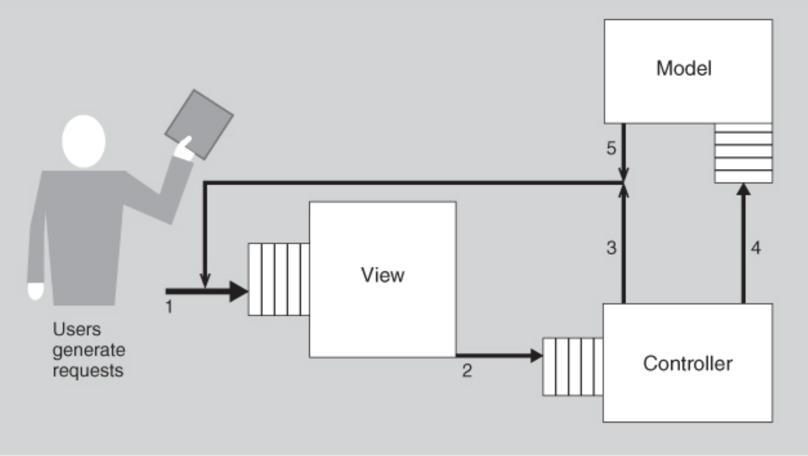
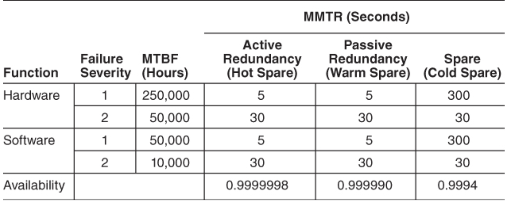
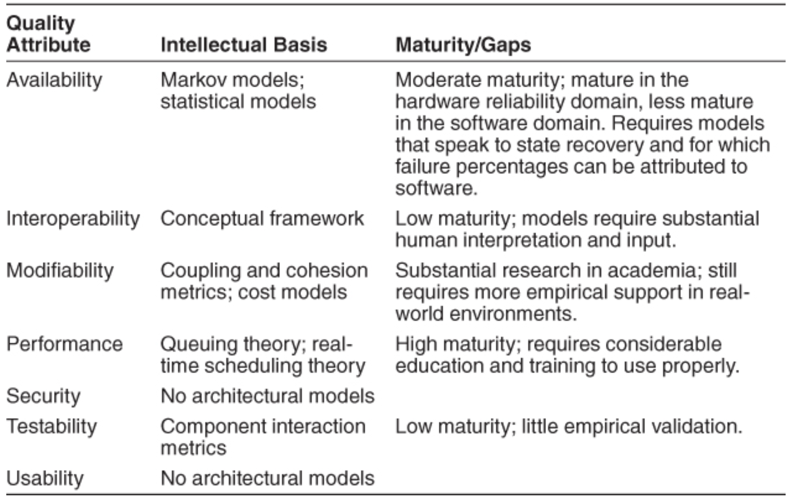

# Lecture 17: quality attribute modeling and analysis

- Analysis of an architecture enables early prediction of a system's qualities
  - See how the system or systems will perform with respect to their quality attribute goals
  - Can be done before a single line of source code is written
- Methods for analysis depend on which quality attributes will be analyzed
  - Some are well understood and have strongly validated analytic modeling techniques
  - Some can be analyzed with thorough checklists
  - Others are analyzed with thought experiments

## Modeling architectures to enable quality attribute analysis

> Some quality attribute, notably performance and availability have well-understood and validated analytic models

### Analyzing performance

- Models have parameters, which can be set to predict values about the entity being modeled
  - Can be used to derive tactics for the quality attribute associated with the model
  - Consider the parameters for a queueing model for performance
    - The arrival of events
    - The chosen queueing discipline
    - The chosen scheduling algorithm
    - The service time for events
    - The network topology
    - The network bandwidth
    - The routing algorithm chosen
  - To apply this model in an analytical fashion, say we've previous made the design decision to use model-view-controller
- MVC says nothing about its deployment
  - There is no specification on how the view, model, or controller are assigned to processes and processors
  - Until deployment occurs, nothing can be said about how an MVC-based implementation will perform
  - With the existing queueing model, the problem becomes mapping allocation and coordination decision onto this model

- Each component has an input queue to process incoming requests
  - Request outside the system arrive at the view
  - View processes these requests and sends some transformation of the requests to the controller
  - Some actions of the controller are returned to the view
  - Other actions are sent to the model
  - Model performs its activities and sends information back to the view
- To analyze this model, a number of items need to be known or estimated
  - Frequency of arrivals from outside the system
  - Queueing discipline used at the view queue
  - Time to process a message within the view
  - Number and size of messages view sends to controller
  - Queueing discipline used at the controller queue
  - Time to process a message within the controller
  - Number and size of messages controller sends back to view
  - Bandwidth of network used for messages from the controller to the view
  - Number and size of messages controller sends to model
  - Queueing discipline used at model queue
  - Time to process a message within the model
  - Number and size of messages model sends to view
  - Bandwidth of network connecting model and view
- Given all these, latency for the system can be estimated
  - For situations where no closed-form solutions exist, estimation can be obtained through simulation
  - This is the cost side of performing a queueing analysis
  - The benefit is the estimate for latency and answers to "what if" questions

### Analyzing availability

- Requires determining the failure rate and recovery time
  - Availability can be expressed as: $\frac{\text{MTBF}}{\text{MTBF} + \text{MTTR}}$
  - MTBF: mean time between failures
  - MTTR: mean time to repair
- To model for availability, suppose we increase availability by using the broker pattern and applying redundancy tactics
  - Each tactic introduces a backup copy of a component that takes over in case the primary fails
  - In this case, a broker replica is employed as a redundant spare
  - A fault manager process utilizes the heartbeat tactic to coordinate the transition from the failed broker process to the redundant spare

### The analytic model space

- There is a growing number of analytic models for some aspects of quality attributes
- One quest of software engineering is
  - Have a sufficient number of analytic models for a sufficiently large number of quality attributes
  - Enable prediction of the behavior of a designed system

## Quality attribute checklists

- Purpose and types of checklists
  - Specific quality attributes (safety, security, usability)
  - Domain-specific checklists (financial industry, industrial processes)
  - Focused on specific aspects of a single attribute (e.g., usability's "cancel")
- Application of checklists for certification/regulation and compliance audits (example: Payment Card Industry)
- Process components and technical components in security checklists
- Challenges and suggestions for developing analytic models for quality attributes
- Basis set of quality attributes for creating unified analytic models:
  - Time
  - Dependencies among structural elements
  - Access mechanisms and their implications on attributes like usability, security, interoperability
- Development and refinement of quality attribute checklists by domain experts and specialists
- Checklist items as requirements that should be prioritized and justified if unmet

## Thought experiments and back-of-the-envelope analysis

- Introduction and context of thought experiments and informal analysis
- Differences between formal analytic models/checklists and informal thought experiments
- Steps to conducting thought experiments:
  - Sequence diagram analysis and potential issues identification
  - Quality attribute-oriented questioning at each step
- Follow-up questions for identified issues (detection, prevention, recovery, acceptability)
- Cost/benefit analysis of addressing hypothesized problems
- Techniques to avoid analysis paralysis (time-boxing, cost-based time allocation, prioritization)
- Example scenario using whiteboard sketches for thought experiments on performance and availability

## Experiments, simulations, and prototypes

- Need and role of practical experiments, simulations, and prototypes
- Addressing limitations of purely analytic and top-down architectural approaches
- Use cases for simulations and prototypes in resolving tradeoffs and uncertainties
- Example: Web-conferencing system—questions addressed through practical experimentation
- Infrastructure requirements for effective experimentation and simulation:
  - Client simulators
  - Instrumentation and measurement tools for performance and scalability analysis

## Analysis at different stages of the life cycle

- Appropriate analysis methods vary depending on the development stage
- Relationship between analysis cost, confidence, and project life cycle stages
- Importance and urgency of the quality attribute goals
- Budget and schedule considerations influencing analysis method selection
