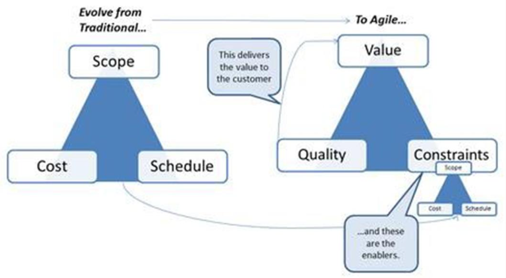

# Lecture 2: the agile revolution

## Agile business objectives

### Why agile?

- Focus should be on "quick delivery of product" but not at the expense of low quality
- Low rework
- High customer satisfaction driven approach
- Reduce anticipation

### Objectives

1) Continuous innovation
  - Strive to deliver value to customer
  - Create a product that meets today's customer requirements
2) Product adaptability
  - Focus on delivering future customer requirements
3) Improved time-to-market
  - Follow an iterative, feature-based process
  - Get valuable software to market faster
4) People and process adaptability
  - Team must be comfortable with change
  - Both in business and team
5) Reliable results
  - Focus of delivering a valuable result

## Agility defined

> Agility is the ability to both create and respond to change in order to profit in a turbulent business environment.
> Agility is the ability to balance flexibility and stability

### Manifesto for Agile Software Development

- Individuals and interactions > processes and tools
- Working software > comprehensive documentation
- Customer collaboration > contract negotiation
- Responding to change > following a plan

> That is, while there is value on the items on the right, we value items on the left more

### The Declaration of Independence

> Agile and adaptive approaches for linking **people, projects and value.**
> We are a community of project **leaders** that are highly successful at delivering results. To achieve these results:

- We increase return on investment by **making continuous flow of value** our focus.
- We deliver reliable results by engaging customers in frequent **interactions and shared ownership**
- We expect **uncertainty and manage for it** through iterations, anticipation, and adaptation
- We unleash **creativity and innovation** be recognizing that **individuals** are the ultimate source of value, and creating an environment where they can make a difference
- We boost performance through **group accountability for results** and shared responsibility for team effectiveness
- We improve effectiveness and reliability through situationally specific **strategies, processes and practices**

## Agile leadership values

- Traditional managers focus on following a plan with minimal change
- Agile leaders focus on adapting successfully to inevitable changes

**Iron triangle of project management**

- Consists of scope schedule and cost
- Scope is often the primary driver

## The APM framework

- The APM framework is supported by recommended practices that guide the successful completion of work efforts. The focus is on creating an agile and adaptive culture
- The APM delivery approach, within a four-layer enterprise agile framework, consists of five phases

**The phases**

- *Envision*: creating a clear business or product vision
- *Speculate*: making hypotheses about the product specifications and developing a release plan
- *Explore*: iterative implementation of features and stories
- *Adapt*: adjusting based on feedback adaptive actions are taken for the next iteration
- *Close*: learn and adapt

## Agile performance measures

**Positive impacts of agile development**

- Reduced defect levels
- Increased productivity
- Shorter delivery cycle
- Bigger market share and profit

**Wastes of software development**

- Partially done work
- Extra features
- Lost knowledge
- Handoffs
- Task switching
- Delays
- Defects

> Only 1/5 of the stuff we build is used often or always; 2/3 of it is rarely or never used

