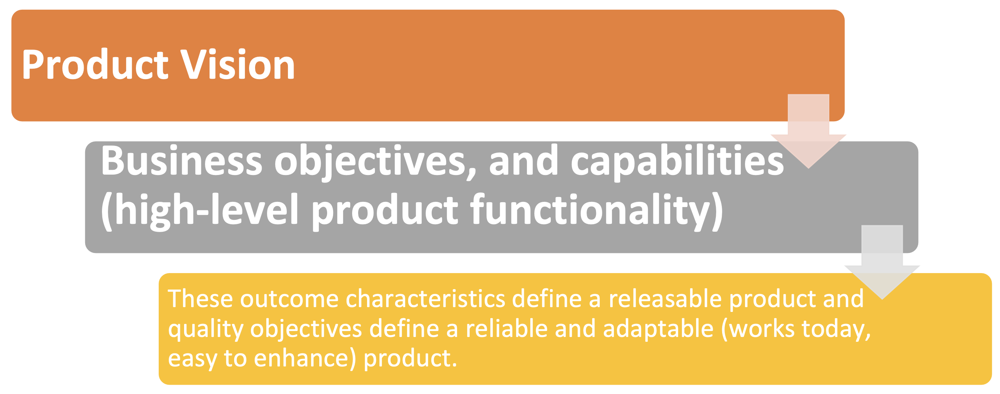

# Lecture 3: value over constraints

## Continuous flow of customer value

- The formula for success is simple: deliver today, adapt tomorrow
- Focus on innovation, rather than efficiency and optimization
- Concentrate on execution
- Adopt lean thinking

### Value indicators

- Project leaders can focus on value in several ways
  - Value determination by working with product owners
  - Value prioritization by managing a backlog
  - Value creation by following iterative development

### Innovation vs. optimization

**Innovation**

- Creating *new* products
- Creating *new* business models and processes
- Creating *new* performance initiatives

**Optimization**

- Making minor enhancements to *existing* ones

### Execution

**Planning and control biased model**

- Plans are viewed as correct
- Control focuses on fixing mistakes and explaining discrepancies
- Learning something new is not cause to legitimately alter the plan

**Execution biased model**

- Concentrate on value adding activities
- Favor those that assist the team in delivering results
- Activities that ensure compliances are not as valuable

### Lean thinking

- Concept comes from the automotive industry's lean manufacturing
  - 80% of the time is spent on adding value
- Handling delivery vs. compliance
  - Analyze project activities to maximize time spent on delivery
  - Analyze their own activities to determine whether they are contributing to delivery or compliance

> Too much structure can kill initiative and innovation

## Iterative, feature-based delivery

- Focusing on delivery adds value, but focusing on planning and control tends to add overhead
- Control has historically centered on correction rather than learning
- With execution in focus
  - Concentrate on value adding activities
  - Don't do an activity merely to remain compliant

### Technical excellence

- Project leaders need to promote and support technical excellence and balance it with other project goals
- Technical excellence is crucial in software development for delivering customer value and managing *technical debt*
- Project leaders need a technical background to make informed technical decisions and maintain the balance between technical excellence and perfection
- Project leaders must champion technical excellence to drive long-term product success and be knowledgeable enough to converse with technical experts

### Simplicity

- Keeping things simple reduces costs and therefore adds value
- Idea is central to eliminating waste: to make a process more agile, do more with less

### Generative rules

- A minimal set of practices
- Doesn't prescribe everything
- Teams generate other necessary supporting practices to tailor and adapt

### Barely sufficient methodology

- Lack of quickness results in competitive disadvantage, whereas hurrying causes mistakes/rework
- Balance: hurries to design a feature without adequate review or test; defects slow the project

### Delivery versus compliance

- Two distinct, but related, aspect of project management
- Agile approach emphasizes
  - Delivery over compliance
  - Priorities the delivery of value to the customer over adhering to strict processes and regulations
- Agile teams focus on
  - Delivering a minimum viable product (MVP)
  - Quickly refining the product based on user feedback
- Agile teams still need to consider compliance requirements and make sure they meet any necessary standards and regulations

### Back to value proposition

- Traditional project management methods focus on
  - Adhering to plans for scope, schedule, and cost
  - Often leads teams to deliver lower value
- Focusing on value allows teams (both now and in the future) to align themselves with organizational goals more effectively
