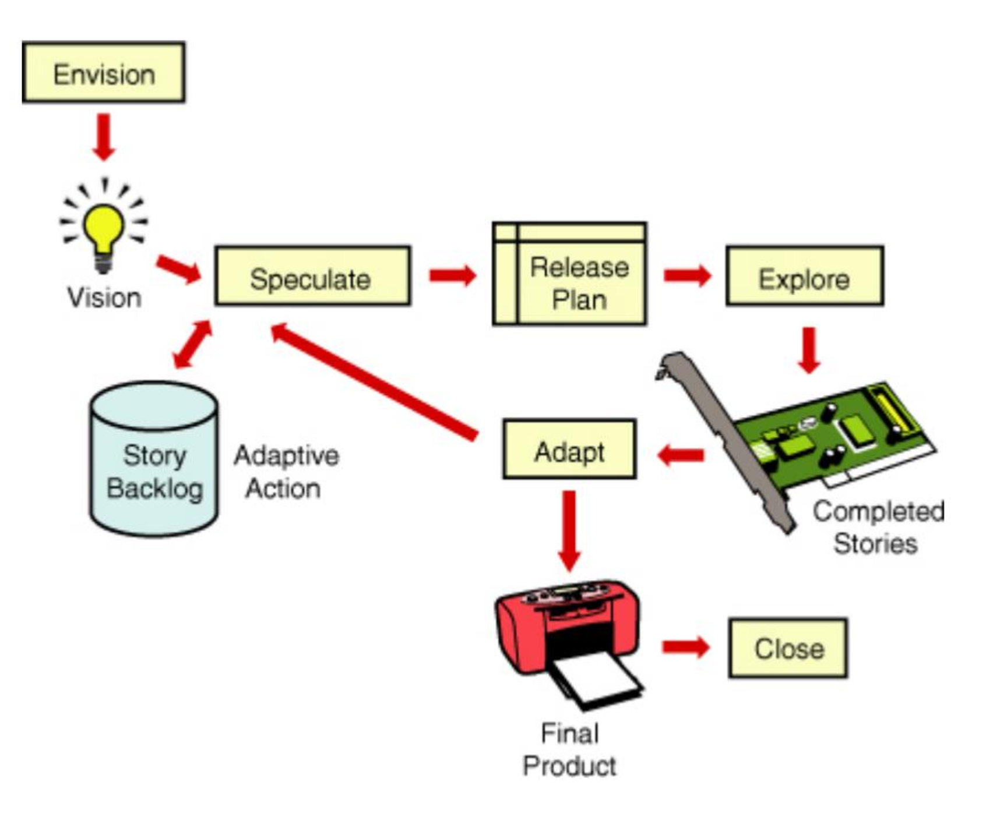

# Lecture 6: an agile project management model

## An agile enterprise framework

- Agile development is *adjusting to changing* situations
- *Balance* between flexibility and structure
- Common *framework*, common *guidelines*, a few standard *practices*, and a set of common *values*
- Needs effective leadership and agile experience

### Portfolio governance layer

**Problem**

- Lots of projects are related to an organization
- Some are agile, some are not
- Executives want to know the value of the project
- Executives want to know the ROI (return on investment)

**Solution**

- Introduce a governance layer
- Monitor the progress of projects

### Project management layer

**General assumptions**

- Project management involves stakeholders
- Project development involves the development/core team

**Solution**

- Need an overall focus of the product
- Involves
  - Risk analysis
  - Developing a product cycle for both team and the product
  - Developing a release plan for the product
  - Managing stakeholders as well as suppliers outside the team

### Iteration management layer

- Focus on planning and execution
- Both project management and interaction management can have the same of different leaders
- Concentrate on external and internal management activities

### Technical practices layer

- Although other three layers are substantial, core activities are technical
- Thus importance is given to agile methodologies in implementing
  - Continuous integration
  - Automations
  - Software practices
  - Pair programming
- Should be easily implementable in other technical sectors

## An agile delivery framework

- *Envision*: determine the product vision and project objectives and constraints, the project community, and how the team will work together
- *Speculate*: develop a capability and/or feature based release plan to deliver on the vision
- *Explore*: plan and deliver running tested stories in a short iteration, constantly seeking to reduce the risk and uncertainty of the project
- *Adapt*: review the delivered results, the current situation, and the team's performance, and adapt as necessary
- *Close*: conclude the project, pass along key learnings, and celebrate

| Traditional Project Management Phases | Agile Project Management Phases |
| ------------------------------------- | ------------------------------- |
| Initiate | Envision |
| Plan | Speculate |
| Design, Build, and Test | Explore |
| ??? | Adapt |

### Envision phase

- Create a vision for product teams that covers:
  - WHAT: the product the team will deliver
  - WHO: the people involved (customers, product managers, team members and stakeholders)
  - HOW: envision the collaboration process

### Speculate phase

- Gather initial broad requirements
- Define workload
- Create iterative and feature-based plan
- Incorporate risk management strategies
- Estimate costs and other required information

### Explore phase

Deliver the products stories by completing three critical activities

1) Delivering planned stories by managing workload and using appropriate technical practices and risk mitigation strategies
2) Creating and collaborative, self-organizing project community
3) Managing interactions between customers, product management and other stakeholders

### Adapt phase

- Results are reviewed by customers, technical people and from process performance and project status perspectives
- The analysis looks at actual vs planned and more importantly actual vs revised outlook on project
- The results of this phase are fed into re-planning, this is an effort to help the next iteration
