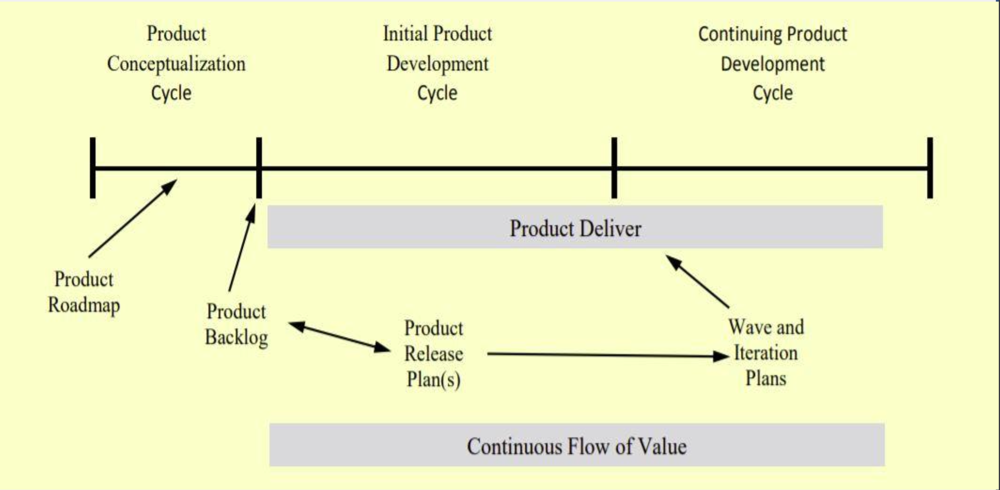

# Lecture 9: advance release planning

## Release planning

- Done to ensure the product is moving in the right direction and connects the project strategy and tactics
- Release is a version of a product
- Release planning is a process which determines
  - The desired outcome of one or more releases
  - Increasing the probability of achieving that outcome

### Multi-level planning

- Done with strict consideration of the product structure and its hierarchy
- Has 4 levels which are used as per the requirement of the project (estimation and commitment)
- The granularity for such complex business software applications could business
  - Business area
  - Capability
  - Feature
  - Story
- These 4 levels can be used all together at once or as separately to plan a project, depending on size

**Capabilities**

- A complete and valuable product function; unlike stories, which only deliver a piece of functionality to the customer
- Bridges the gap between the needs of the business to what the system requires to behave for the customers
- Always ambiguity about a function (complete or partial) which makes its difficult to distinguish capabilities and stories
- Most efficient way of differentiating all the levels in planning is by *size*
- Commonly, each level is 3 times longer than the times of the lower level

| Level | Time |
| ----- | ---- |
| Story | 3 - 9 days |
| Feature | 9 -27 days |
| Capability | 27 - 81 days |

### Product planning structure

- Product planning structure is divided into 4 phases of completion naming
  - Iteration plan: daily work plan required by development team
  - Wave plan: spans several iterations and is performed on a story level; represents a partial deployment release
  - Release plan: expected result is the complete deployable product
  - Product roadmap: represents multiple releases map of the product's evolution

| Characteristic | Release | Wave | Iteration |
| -------------- | ------- | ---- | --------- |
| Timeframe | Long-range (6+ months) | Medium range (~3 months) | Short-range (1-4 weeks) |
| Level of detail | Capbility | Story | Story/task |
| Commitment type | Project feasibility | Capability commitment | Story commitment |
| Deplyment | Final release to customer | Possible interim relapse to | Customer review process |

### Creating a product backlog and roadmap

- As capabilities are converted to stories, the backlog starts to grow over time
- The descriptive knowledge or information improves for every backlog item

**System change requests**

- Added for legacy applications (applications evolving with time) to evaluate:
  - Maintenance requests
  - Small enhancements
  - Persistent defects
  - Technical debt reduction

## Product life cycle

- The product life cycle is a timeline which is responsible for
  - Product deployment
  - Delivery over the time before its release
- The timeline is part of 3 different phases
  - 1) Product conceptualization cycle
  - 2) Initial product development cycle
  - 3) Continuing product development cycle



- The diagram above represents the product life cycle in each of the phases
  - Product conceptualization leads toward chartering a session with help of vision, scope, boundaries, and release planning activities
  - Other two phases are upon the product deployment/delivery with generating release, first wave, and first iteration plans
- New stories are identified in the process and the backlog lists of items is updated accordingly

### Value point analysis

- Stories being the chunks of functionality for the project, and estimates being the story points of the projects, both and considered data values
- Value points try to convert this data to cost
  - They indicate a serious quantitively approach to value
  - Helps assist teams in making priority decisions during release, wave, and iteration
  - Also assists teams in negotiating depth of the story functionality (is 3 value point story worth 18 story points?)

**Determining value points**

- Development team estimates the effort at some level to design and develop a full release plan
- Two key parts to value points determination
  - Role: by product team, which is headed by the product manager
  - Timing: can be done just-in-time (JIT)
- There are two methods to produce useful and relevant value point estimates
  - 1) Limit estimates to short series of numbers
  - 2)  Allocate the total value points based on percentages to capabilities

```python
# Capability point values
values = (1, 2, 3, 5)
# Five capabilities with points (capability[0] is the capability point value for the first capability)
capability = [2, 3, 3, 5, 1]
# Convert to percentages of total point value
percentages = list(map(
  lambda value: (value / sum(capability)) * 100,
  capability
)) # [14, 21, 21, 36, 8] (not expected output, but should be around this)

# now assign the value points to the stories in each capability
# The total value for each capability should have the above outcome distribution
```

**Story cards with value points**

- During any iteration planning
  - If stories are present with low value-point but high story point => assess whether the low value story is worth the estimated work
  - Can be easily identified and assessed with the help of story cards

**Non-customer facing stories**

- Stories which directly do not interface with the customers are termed as non-customer facing stories
  - Technical stories (infrastructure, debt reduction)
  - Refactoring stories
- Priority setting for these stories is generally an issue
  - Product teams do not usually understand these stories
  - Collaboration and trust of the complete team is required with a prerequisite of agile development process understanding

### Planing themes and priorities

- To establish the required focus to the business value of the project, the project needs both the overall vision and the short-term themes to implement those visions
- Themes are useful for iterations in smaller projects and waves in complex projects
- Termes are further classified in different types for serving different business requirements
  - Business function groups: a grouping of all the capabilities, stories, or features to serve the business needs
  - Business process flow: the sequence of functions to produce a result for business roles
  - Risk mitigation: it is more valuable sometimes then business value
  - Deployment plan: suggests scheduling all the project features in one capability to make product rich in area of deployment

### Increasing productivity

There are two ways or methods to increase the productivity of the plan

1) DO BETTER: by improving the flow of output per input count
2) DO LESS: identify the features with least priority and action on it

## Risk analysis and mitigation

Core risks which dominate any software project are

- Inherent schedule flows: misestimation of product size and time
- Employment turnover: losing the key person from a project
- Specification breakdown: failure to agree upon the specifications of the project
- Requirement inflation: lack of joint efforts to add requirements
- Poor productivity: poor morale, poor work environment, etc

### Planning and scanning

- To avoid uncertainty from any agile based project, we combine aspect of anticipation and adaptation
- For proper project planning, both adaptation and anticipation must carry equal importance and efforts
- Scanning is done to reduce the occurred uncertainty from the software project
- Can be either experimenting, monitoring, or any other form

### Work-in process vs throughput

- Many projects on people which drive them to perform multi-tasking which sometimes leads to failure of delivery of the project
- Most optimal method to overcome this problem is by calculating the work-in process to the throughput which leads to outcomes like
  - Reducing number of projects
  - Adequate staffing
  - Dedicated staff to projects

### Emerging practices

- With the emerging trends and industries, many different practices have emerged which strategize the agile process in a uniform manner to increase the productivity or the throughput with providing an efficient work environment
  - Kanban
  - Consolidated development
  - Hyper development and release
