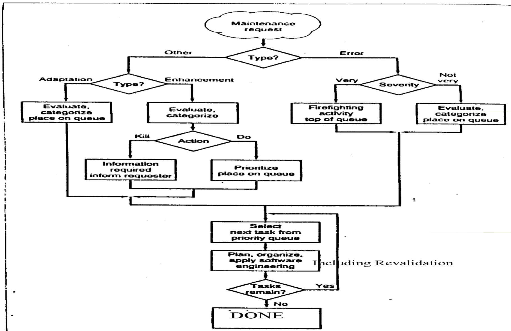

# Lecture 1: concepts in maintenance

## History of computing/software engineering

### Early years of computing

**Electronic numeric integrator and computer (ENIAC)**

- 18,000 vacuum tubes
- Weighed 30 tons
- Took 1,500 square feet of space
- Consumed 150 kW
- Could only perform basic functions
  - add/subtract/multiply/divide
  - only 5000 adds/second or 1000 subtracts/second

**First compilers**

- 1952: the A0 compiler created by Grace Hopper for simple natural language
- 1958: the first compiler for the ALGOL programming language

**Semi Automated Ground Environment (SAGE)**

- Detect ICBMs from Russia
- Costed $250 million
- Required 1000 people to operate
- Consisted of over 1 million assembly instructions

**Problems and solutions of this computing era**

- Problems:
  - Flexibility: requirements change
  - People: skills vary (off the street organizational structures)
  - Coding does not start until specification is finished
  - Integration of many codes/modules/groups
- Solutions:
  - Early specification is a must
  - Early system integration plan gives precise interface among users
  - Early test planning
  - Lean staffing in the beginning
  - Have project plans and reviews

### Middle years

**The manned space program**

- Apollo project employed 300-600 people
- Costed taxpayers over $1 billion 
- Required more than 1 million lines of Fortran and assembly

**SABRE by UAL/AAL**

- Costed over $200 million to develop
- Consisted of more then 1 million instruction and 400 modules
- Required 16 releases and a 40% rewrite before a stable program emerged

### Foundations of software engineering

- Process models provide a view to software development, operation, and maintenance
- Methods provide the technical how-to for a software lifecycle model
- Tools provide support for realization of methods in a semi or fully automatic manner

**Definition of software engineering**

- From IEEE: the application of systematic and disciplined, quantifiable approach to the development, operation and maintenance of software
- From Schach: a discipline whose aim is the production of fault-free software that satisfies user's needs and is delivered *on time* and *within budget*

**Software lifecycle**

1) Requirements analysis
2) Specification
3) Preliminary architectural design
4) Detailed design
5) Implementation
6) Testing (validation)
7) Operation
8) Maintenance
9) Retire (kill it)

**Management issues**

- Hiring/firing programmers
- Interface of the people
- Education of the people
- Predicting cost
- Predicting time
- Technology transfer
- Process improvement

### Late years

**Inherent problems of software**

- Complexity
- Conformity
- Changeability
- Invisibility

**Accidental problems**

- Solved using new technologies
- High-level languages
- Development environment and IDEs

**Possible silver bullets**

- No: Proofs, AI, expert systems and automatic programming
- Yes: Buy, prototyping, education of good engineers, incremental development

**OO technology**

- Development method using UML
- UML is a notation for software development

## Maintenance problem

- Maintenance is very expensive
- Can take up to 90% of the software development costs
- Often unaccounted for in time and cost estimates
- Disregarding by executive who 
  - Face increasing demand for new end-user applications
  - Push back work to maintain existing programs as it increases

**What is maintenance?**

- Refers to changes made after the software is delivered to customers
- Maintainability is the ease with which maintenance can be carried out
- Evolution is the process of continuous change from a lower, simpler or worse to a higher, more complex and better state

**Motivation of maintenance**

- To provide continuity of service
- To support mandatory upgrades
- To support user requests for improvement
- To facilitate future maintenance work

> Maintenance engineers require a far wider range of skills than just programming. Among other things, they need comprehension skills and wide ranging analytical power

**Reasons for expense and time consumption**

- No SE technology has been used
- No/little documentation (difficult to understand)
- Not assessing the impact of change
- Given little thought during development

**Possible solutions**

- Build in the maintainability when constructed
  - Use SE technology to develop -> more documentation
  - Think about maintainability when developing
- Use tools for maintenance
- More basic research about maintenance

## Types of maintenance

- Perfective (50-55%): adding new capabilities and also making general enhancements
  - Adding/changing requirements
  - Adding online help features
  - Enhancing the performance
  - Improve the terminal dialog to make it user friendly
  - Improve the GUI
- Adaptive (20-25%): modifying software to properly interface with changing processing environment
  - Implementation of a new database
  - Work with a new OS
  - Work on new hardware
  - Work on a new platform
- Corrective (20%): includes the diagnosis and correction of defects of an existing system
  - Program failures/aborts
  - Producing results that do not match specification
  - Specification does not match with the system
  - Misleading user manual
  - Major sources of defects
    - Logic (25%)
    - Interface (15%)
    - I/O (15%)
    - Computational (15%)
    - Data manipulation (15%)
    - Database (10%)
    - Other (5%)
- Preventive (5%): improves the future maintainability to provide a better base for future enhancements
  - Upgrading documentation
  - Restructuring poorly designed code
    - Improving readability
    - Removing complex logic

## Performing the maintenance

### Flow of events based on type

### Revalidation

**Inspection**

- Focus on 3 questions
  - Does the proposed change do what it supposed to do
  - Does the proposed change do this without side-effects
  - Does the proposed change follow standards
- Roles needed to perform an inspection
  - Moderator (lead person)
  - Author (creator of change)
  - Scribe (recorder)
  - Reviewer (inspector)
  - Reader
- Persons needed to perform an inspection
  - One person to moderate and record inspection events
  - One person to read off the contents under inspection (typically also the creator)
  - One person to review the changes

**Regression tests**

- Repeating of tests to show that software's behavior is unchanged except as required by the change of the requirement
- Differences compared to regular tests
  - Availability of a test plan
  - Scope of tests
  - Completion time is less
- Types of regression testing
  - Progressive: specification changed, adaptive and perfective, fewer tests are reused
  - Corrective: specification not changed, minor modifications

## Concepts in maintenance

### Software configuration management

- Involves the development and application of procedures and standards for managing and evolving system
- Needed for
  - Controlling change
  - Access the impact analysis
  - Manage versions and revisions
  - Assure quality of changes
- Activities include
  - Identify the change
  - Control the change
  - Ensure the changes are properly implemented
  - Report the change

### Reverse engineering

- A technique to abstract higher levels of abstractions from source code
- Goals and benefits of RE
  - Allows a software system to be understood in terms of what it does
  - Helps with understanding the target system to benefit maintenance
    - Use to see how additional requirements fit
    - benefits future maintenance
    - Provide better understanding into parts of the program to be corrected
  - Software reuse
  - Creation of semantically equivalent representation with same relative level of abstraction
  - Extract higher level abstractions from source code
  - Extract higher level abstraction beyond the design
