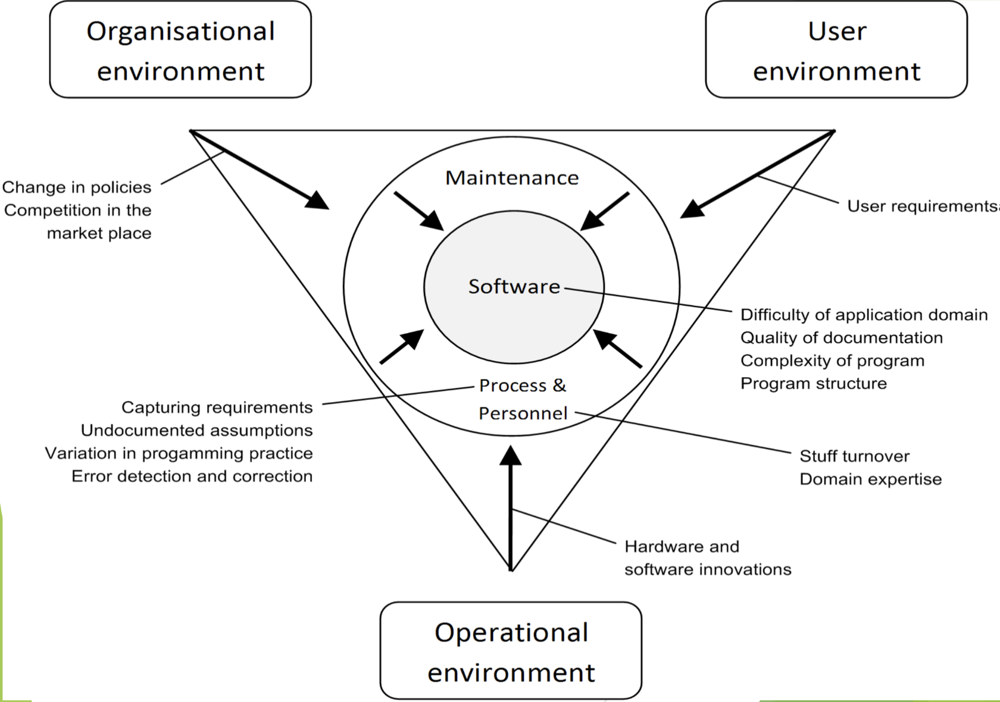

# Lecture 2: the maintenance framework

## Definitions

- **Framework**: a set of ideas, conditions or assumptions that determine how some things are perceived, understood, and approached
  - A software maintenance framework is a set of ideas, conditions or assumptions that determine how software maintenance is perceived, understood, and approached
- **Environment**: the totality of conditions and influences which act from outside upon entity
  - An operational environment is all hardware and software that influences the software in any way
  - A non-operational environment is all the non-software/hardware that influences software (like an organization)
- **Maintenance process**: any activity carried out or an action taken, either by machine or maintenance personnel during software maintenance
- **Information gap**: the discrepancy between the body of knowledge that system users/maintainers possess and the body of knowledge that are needed to have in order to satisfy a request for change (maintenance)

## Factors in software maintenance framework

- The source for the maintenance challenge
- Interactions between these components are driving forces behind the needs for software change

### Factor 1: the user

- Any individual that uses the software
- No regards to their involvement in the software development or maintenance

### Factor 2: the environment

- Operational environment changes like hardware or software innovations
- Non-operational environment changes like policy changes or market competition

### Factor 3: the maintenance process

- The most important part of the software maintenance framework
- It covers
  - Capturing the change requirement: the process of finding out what changes are required
  - Variation in programming practice: differences in approaches used for writing and maintaining the software
  - Paradigm shifts: refers to the alteration in the way we develop and maintain software
  - Error detection and correction: the earlier an error is detected and corrected, the lower the cost (up to several hundred fold)
- "Dead" paradigms for "living" systems: the difficulties to accommodate the changing needs of the users and their organizations once the system has been delivered to users
- "Fixed Point Theorem": leads to the development of "dead" systems, which are systems designed to meet the needs of users at one time and not designed to adapt to changes

### Factor 4: the software product

- Software products are seldom static but continuously subject to change
- The aspect of such challenge include
  - **Maturity and difficulty of the application domain**: the more mature an application domain, the easier the change
  - **Quality of documentation**: the better the documentation, the easier the change (lack of up-to-date documentation is one major problem)
  - **Malleability of the program**: "soft" nature of software products makes it more vulnerable to undesirable change
  - **Inherent quality**: tendency for the system to decay as more changes are undertaken
 
### Factor 5: the maintenance personnel

- **Staff turnover**: maintainers are *not* the original developers due to turnover
- **Domain expertise**: lack of domain expertise can make the changes difficult
- **Working practice**: the way the changes are carried out

## Relationship between the maintenance factors

