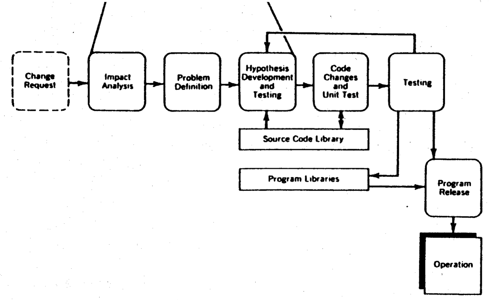
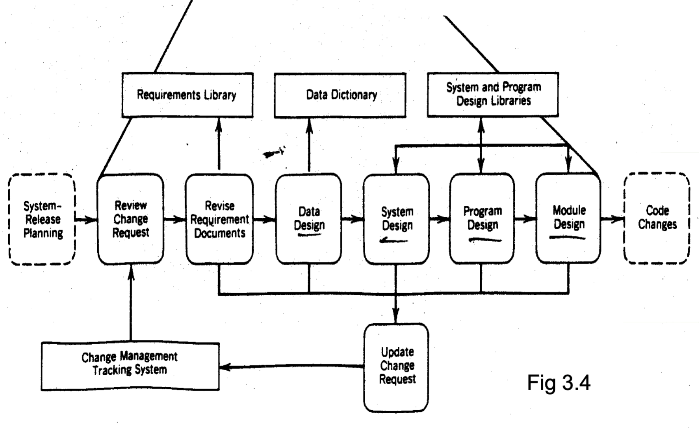
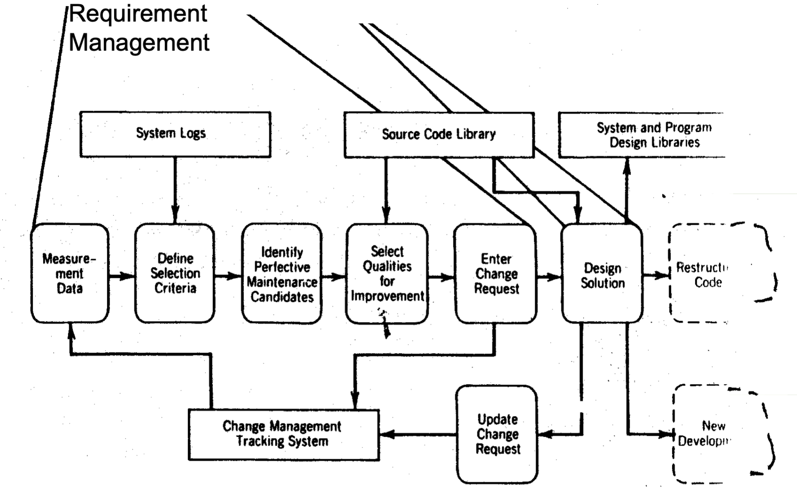
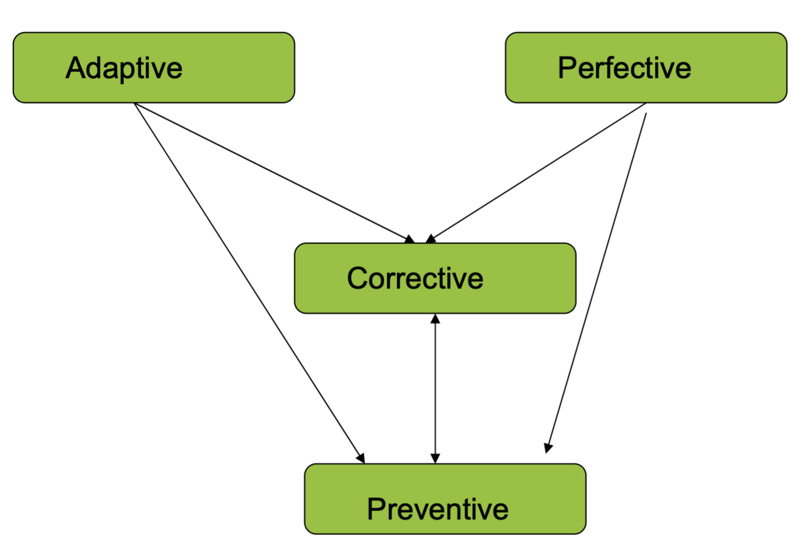

# Lecture 3: fundamentals of software change

## Classification/categorization of change

**Why categorize?**

- Some changes require a faster response than others
- Understanding nature of changes allows for effective prioritization of change requests
- Different changes may require different approaches (resource allocations or timelines)

**Different prioritizations**


### Corrective change

> Modifications initiated by defects in the software

**Logic**

- Taking the wrong action following a decision

```
IF A > B THEN
  MAX = B // Wrong, we just checked that A is greather than B so B cannot be the max
```

- Wrong decision

```
IF DAY = 31 THEN // Wrong, not all months end with 31
  DO END OF MONTH
```

- Looping too many or too few times

```
WHILE angle < 90 DO // Will not execute when angle = 90 (too few?)
  ...

WHILE angle <= 90 // Will continue to execute when angle = 90 (too many?)
  ...
```

**Computational**

- Incorrect data (`FedTax = GrossPay * StateTaxRate`)
- Incorrect operators (using `+` when `*` was needed)

**Interface**

- Data passed from one module to another gets
  - Converted
  - Truncated
  - Mutated

**Data manipulation**

- Receiving fields are shorter than sending fields
- Data fields not initialized before using them

**I/O**

- Working in input/output buffers
- Data not read into or written from static working storage

**Database**

- Database is updated incorrectly
- Database is corrupted by hardware problems
- Database is restored from wrong backup copy

**Other**

- Transmission problems
- System software problems

**Emergency corrective maintenance workflow**



**Scheduled corrective maintenance workflow**


### Adaptive change

> Change driven by the need to accommodate the modifications in the environment (operating and non-operating) of the software system



### Perfective change

> Describes changes undertaken to expand the requirements

- Expansion refers to enhancing the existing system (like functionality or computational efficiency)
- Typically, software grows in size with successive enhancements



### Preventative change

> Changes done to address problems of deteriorating structure

- Typically undertaken to prevent malfunction or improve maintainability of the software
- Not all candidates will be selected
- Each one evaluated and put into a `TODO` queue

## Relationships between changes



- Changes done to software are usually released incrementally
- Major enhancements are typically planned, announced, and released
- Minor changes are made at that time

## On-going support

- **Effective communication**: maintenance is customer intensive and having good customer relations increases satisfaction
- **Training of users**: important to equip users with sufficient knowledge and skills to use the changed system
- **Provide business information**: various types of timely and accurate information to enable them to make strategic business decisions

## Eight Lehman's "laws"

> Describes principals common to "large", "live" software systems

| System type | Meaning | Example program |
| ----------- | ------- | --------------- |
| E-type | Actively used and *embedded* in a real world domain | Software to predict economic function |
| S-type | Formally defined and can be derived from a *specification* | Matrix multiplication |
| P-type | Requirements based on an approximate solution to a *problem*, but real-world remains stable | Chess program |

**Law 1 (1974) Continuing Change**

E-type systems must be continually adapted else they become progressively less satisfactory to use

**Law 2 (1974) Increasing Complexity**

As an E-type system evolves, its complexity increases unless work is done to maintain or reduce it

**Law 3 (1974) Self Regulation**

Global E-type systems (systems developed in wider organizational context) evolution process are self-regulating

**Law 4 (1978) Conservation of Organizational Stability**

Unless feedback mechanisms are appropriately adjusted, average effective global activity rate in an evolving E-type system tends to remain constant over product lifetime (mythical man month) regardless of resources dedicated

**Law 5 (1978) Conservation of Familiarity**

In general, the incremental growth and long-term growth rate of E-type systems tend to decline

**Law 6 (1991) Continuing Growth**

The functional capability of E-type systems must be continually increased to maintain user satisfaction over the system lifetime

**Law 7 (1996) Declining Quality**

Unless rigorously adapted to take into account changes in the operational environment, the quality of E-type systems will appear to be declining

**Law 8 (1996) Feedback System**

E-type evolution processes are multi-level, multi-loop, multi-agent feedback systems
