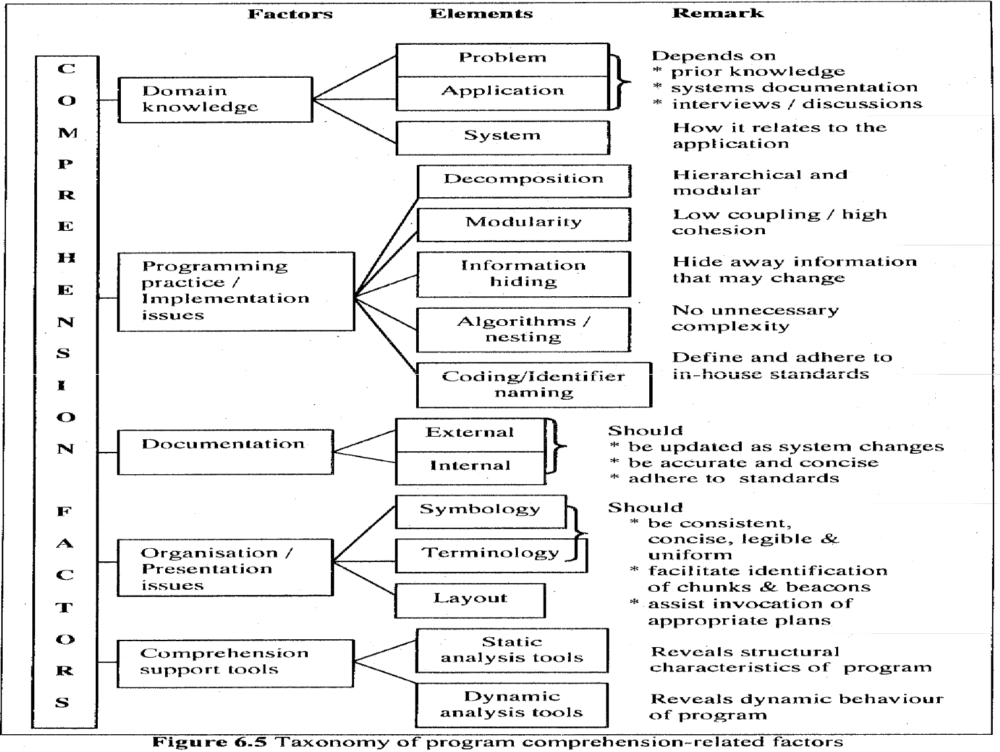

# Lecture 8: program understanding

## Introduction

- Must understand a program to change it
- Lack of understanding makes meaningful changes difficult
- Understanding a program can take a significant amount of time
- Maintenance activities involve understanding
  - The source code
  - The conditions under which it was developed
- Understanding a program involves these three steps
  - 1) Read about the program (requirements, design, talk with original developer)
  - 2) Read the source code (global view to understand impact of changes and local view to focus on a specific part of the system)
  - 3) Run the program (see the dynamic behavior of the program)

## Areas of comprehension

> More than just reading source code

- Personnel and their comprehension needs: no clear cut, but principles in comprehension are
- Managers: need to have decision support knowledge
- Analysts: problem domain, product-environment, and cause-effect relations
- Designers: architectural and detailed design
- Programmers: execution effect, causes-effect, and product-environment relations

### Problem domain

- The problem areas the software performs tasks (health care, finance, etc.)
- Understanding domains helps estimate resources and guide choice of methodologies, tools, and personnel

### Execution effect

- Need to understand how a program behaves and what it is supposed to do
  - Whether a change did achieve the desired effect or not
- Maintainer needs to understand what output is expected for a given input
- Understanding control flow and data flow is greatly beneficial

### Cause-and-effect relation

- Is the causal relationship between parts of the software that interact with each other
- Necessary to establish the scope of the change (impact analysis)
  - Predicts the potential ripple effects
  - Traces data and control flow

### Product-environment relation

- Is the connection between the software and the elements of operating environment
  - Hardware/software
  - Operating system
- How the environment change will affect the software

### Decision-support features

- Attributes of software that can guide the maintenance personnel in technical and managerial decision making process

## Comprehension obstacles

### Quality is bad including bad/missing documentation

- Maintainer needs access to requirements and design specification
- Other documentation can also aid in comprehension
- Missing documentation makes comprehension difficult

### Code is not necessarily maintained by the original author

- Maintainer must understand the mindset of the original author
- Contains an extra step in understanding constraints of the development

### Code is developed under different environments and contexts

- Context is not always obvious from the source code (hardware/software/process/resources)
- Things that are obvious now, may not have been obvious then

### Insufficient domain knowledge

- Maintainers must understand the problem the program is trying to solve
- Many maintainers lack this domain knowledge when maintaining a system

### Insufficient programming skills

- Programmers become experts in a particular application domain or with a particular programming language
- Studies have shown that experts perform better
  - The more experienced a programmer, the easier and quicker it is to understand a program
- Five traits of expert programmers
  - Knowledge in hierarchical information structure
    - Expert can apply experience and background knowledge
    - Expert has already gone through the process of writing code
    - Have a conceptual belief of the structure
    - Can anticipate the structure ahead of time
  - Knowledge in mapped layers
    - Can map high level goals to low level implementation
    - Maintainer can close the gap between functionality and implementation
  - Knowledge in pattern recognition
    - Patterns are formed by structures resembling frames
    - Experts had more difficult in understanding program which are not structured in ways corresponding to frames proving that pattern recognition is important
  - Knowledge in well-connected information
    - Modules often communicate with each other
    - Modules may not be in one central area, making connection difficult to understand
    - Experts pay attention to these interfaces in understanding how they interact
  - Knowledge in embedded in program text
    - Experts consider finding information in a program
    - Can remember where they had seen it to reference it
    - Can reference material seen earlier

### Programming practice/implementation issues

- Not good style or standards implemented
- Poor naming style hurts program understanding
- Comments should provide information that maintainer can help to form the hypothesis and refinement

### Complexity

- One of the main factors that affect program comprehension is complexity
- Reduce complexity by dividing programs into smaller and addressable units called modules
- Structured programming breaks logic down into 3 components: iteration, sequence, selection

### Program exists written under obsolete methodologies

- Unstructured
- Unreadable
- Lack off guidelines and standards

## Comprehension process model

- Models have been developed to facilitate program comprehension
- They help us understand how to approach a program to understand it

### Top-down model

- Reconstruct the problem domain, the program domain and the mapping of these domains
  - Provides a bird-eye view of a system
  - Begins with abstraction and ends with details
  - Start from a black-box view, progresses towards a white-box view
- Reconstruction in a TOP-DOWN process involving creation, confirmation, and refinement of hypothesis on what a program does and how it does it
- The information required for hypothesis generation and refinement is known as beacons or indicators

**Strengths**

- Maintainer can understand the system as a whole from the beginning
- With a high level understanding, details may become easier to understand
- Ripple effects could be understood quicker

**Weaknesses**

- Takes longer to understand the system and make a change

### Bottom-up model

- Start with whit-box (implementation) and head towards black-box (high level functionality)
- Understand details first and head towards a bird-eye view
- Look for patterns in code and group into higher level structures (chunking)

**Strengths**

- Provides quicker way to fix a defect
- Maintainer can focus on small section of code
- Relates well to human memory concepts

**Weaknesses**

- Cannot immediately see how the change will affect the rest of the system
- Too much source code to review

### Opportunistic model

- Combination of top-down and bottom-up
- Not simultaneously
- Enables more flexibility

## Comprehension supporting concepts/tools

- Organization tools
  - Tools to organize and present source code in a more legible and understandable way
- Program slicing
- Data flow analysis
- Visualization tools

## Summary of comprehension factors

