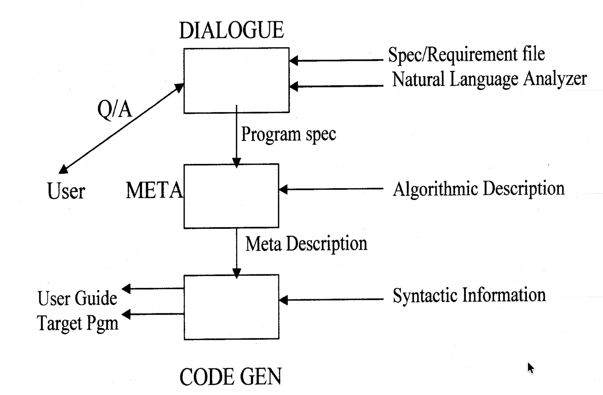
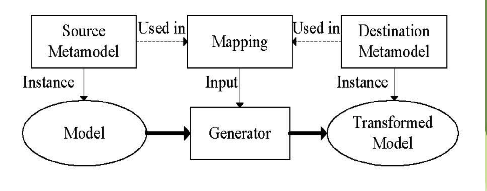
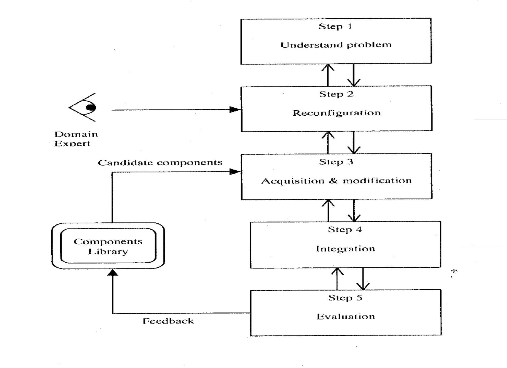
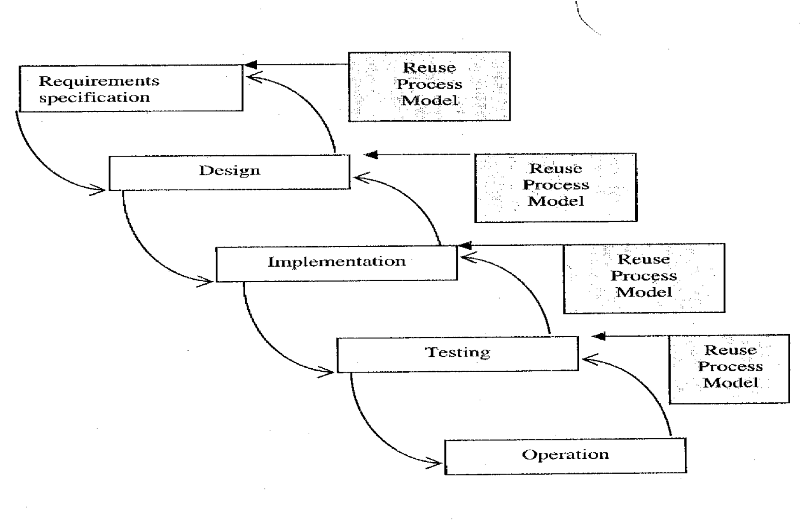

# Lecture 10: reuse and reusability

## Objectives and benefits of reuse

**Objectives**

- To increase productivity
  - Reduce time and effort by not having to develop software from scratch
  - Increase maintenance efficiency with reused components
- To increase the quality
  - Reusable components are well tested
  - Known to satisfy the user's needs
  - Tend to have fewer residual errors
- To facilitate code portability
  - Using national or international standards
  - Transferring across different OS or machines becomes easier

**Benefits**

- Improve maintainability
  - Reusable components tend to exhibit generality
  - Already have high cohesion and low coupling
  - Implemented with consistent style and follow language standards
- Reduce maintenance time and effort
  - Reusable components are typically a manageable size
  - Makes them easier to read, understand, and modify
- Greatest benefit seen during perfective maintenance (adding additional features is easier)

## Targets for reuse

**What can be reused**

- Process: application of a given methodology to different problems
- Personnel knowledge: knowledge that they acquire in similar problem and application area
- Product: using artifacts that were the products arising from similar products
  - Data: Sharing information between application programs
  - Requirements: elements of SRS can be reused
  - Design: reuse of AD and DD of a product (great potential, but not widely used)\
  - Program: reuse of program code that can be integrated into a software system without or with little adaptation

**Levels of reused**

- Application system reuse: whole system may be reused
- Subsystem reuse: major subsystem of an application may be reused
- Model and object reuse: component of a system reflecting a collection of functions reused
- Function reuse: a single function may be reused

> Last 2 reuse levels are the most common

## Factors that impact reuse

- Reuse library: maintaining large library of components can be expensive
- Program languages: use of more than one representation of information (representation of design information in a form that does not promote reuse)
- Programming languages hinders the reuse
- Reuse-maintenance cycle: managing large number of components can represent another problem
- Initial capital outlay: initial set-up and managing cost
- Not invented here factor: tendency to avoid components not developed in-house
- Commercial interest: commercial interest prevents wide availability of reusable components
- Education: not properly educated in the benefits of reuse
- Poor project coordination: poor coordination between projects may lead to creation of duplicate components
- Legal issues: patent violation, liability of faulty reusable components

## Composition based reuse

In this approach, components are *atomic building blocks* that can be assembled to compose the target system

- Black-box reuse: reuse without modification
- White-box reuse: reused after modification

Mechanisms "glue" these components together

- Unix pipes: connect the output of one program to be used as the input of another program using re-direction
- Inheritance in OOP: create additional components quickly

### Domain analysis

- A process where information using in developing and maintaining software is identified, captured, and organized with the purpose of making it reusable
- Two categories of components that can be reused are
  - Horizontal reuse: reuse of components in a variety of domains
  - Vertical reuse: reuse of components within a given domain
- Domain analysis is used to identify common problems in vertical reuse
  - Done by studying the needs and requirements of a collection of applications from a given domain

### Components engineering

**Characteristics of reusable components**

- Generality: potential use of a component for a wide spectrum of application of problem domains (too much tends to have lower pay-off)
- Cohesion vs. coupling: shows internal strength of a module against the strength of interconnection between modules
- Interaction: too much direct interaction with user should be avoided to reduce the impact on the front end of system (rather use utility functions)
- Uniformity and standardization: use of standards across different levels of software increases the reusability
- Data and control abstraction: data abstraction includes abstract data types, encapsulation, and inheritance while control abstraction embraces modules and iterators
- Interoperability: will increase the reusability by allowing systems to take advantage of remote services

**Reusability metrics**

1) Volume (Halstead's)

- Computed as $V = (N_{1} + N_{2}) * \log_{2}(n_{1} + n_{2})$
  - $N_{1}$ is the total number of operands
  - $N_{2}$ is the total number of operators
  - $n_{1}$ is the total number of *distinct* operands
  - $n_{2}$ is the total number of *distinct* operators
- Volume too large means components is error prone and of lower quality
- Volume too low means components is too small and impractical

2) Cyclomatic complexity

- Computed as $C = P+1 = e - n + 2$
  - $e$ is the number of edges in the control flow graph
  - $n$ is the number of nodes in the control flow graph
- Low complexity could indicate component is too small and may not be worth it
- High complexity could mean component is too complex, has poor quality, or has low understandability

3) Regularity

- Computed as $R = \frac{n_{1} * \log_{2}(n_{1}) + n_{2} * \log_{2}(n_{2})}{N_{1} + N_{2}}
- Variables have same meaning as in measuring volume
- The numerator measures estimated length
- The denominator measures actual length
- The quotient measures readability and the non-redundancy of a component's implementation

**Example program**

Let's consider the following C program

```C
int main() {
  int a, b, c, avg;
  scanf("%d %d %d", &a, &b, &c);
  avg = (a + b + c) / 3;
  printf("avg = %d", avg);
}
```

- Unique operators are: `main, (), {}, int, scanf, &, = , +, /, printf`
- Unique operands are: `a, b, c, avg, "%d %d %d", 3, "avg = %d"`
- Volume
  - $n_{1} = 7$
  - $n_{2} = 10$
  - $N_{1} = 16$
  - $N_{2} = 15$
  - $V = (16 + 15) * \log_{2}(7 + 10) = 127$
- Complexity
  - A single linear block function
  - $CC = 1$
- Regularity
  - Variables reused from volume computation
  - $R = \frac{7 * \log_{2}(7) + 10 * \log_{2}(10)}{16 + 15} = \frac{52.6}{31} = 1.7$

| Metric | Min Desired Value | Max Desired Value |
| ------ | ----------------- | ----------------- |
| Volume (function) | 20 | 1000 |
| Volume (file) | 100 | 8000 |
| Complexity | 5.00 | 15.00 |
| Regularity | 0.70 | 1.30 |

## Generation based reuse

In this approach, reusable components are program that generate target systems

- Utilizes application generators to generate application programs
- Generates a 3rd GL with usually an order of magnitude lower

### Dialog-based



- Dialog module
  - Interacts with user to obtain a complete and consistent specification of the problem
  - Dialogue manager analyzes the user's responses and the sophistication of the response varies (from y/n to more expressive)
  - Robust: under no circumstance a user input should cause run-time error
  - Helpful: must provide sufficient information at each/any step
  - Backtracking: must be able to return to the previous step if needed
- Meta (intermediate) module
  - Utilizes the algorithmic description and creates a meta program in a meta language
  - Independent from machine/environment (like intermediate code)
  - Also optimizes and simplifies the meta program
- Code generation module
  - Given a meta program and the syntactic information, create a user's guide and the target program

### Non dialog-based



- Products are developed using an approach where *high-level specifications* are converted through a number of stages into an operational program
- Step-wise refinement: involves continuously refining the high-level spec by adding more detail
- Linguistic transformation: in this approach, the transformation is taking in multiples stages and in each stage the system is represented in an intermediate language until the final implementation is a programming language is obtained

## Reuse process model

### Generic reuse model

1) Understand the problem and identify a solution structure based on predefined components available
2) The solution structure is reconfigures (modified) to maximize the potential use at current or in the future stages
3) Prepare the components ready for integration => involves acquiring, modifying and/or instantiating them (may involve developing new components)
4) Integration of components
5) Evaluate the components (predefined or newly developed) and update the component library



### Accommodating a reuse process model

Include the reuse with an existing software engineering process model (reuse process in each step)


