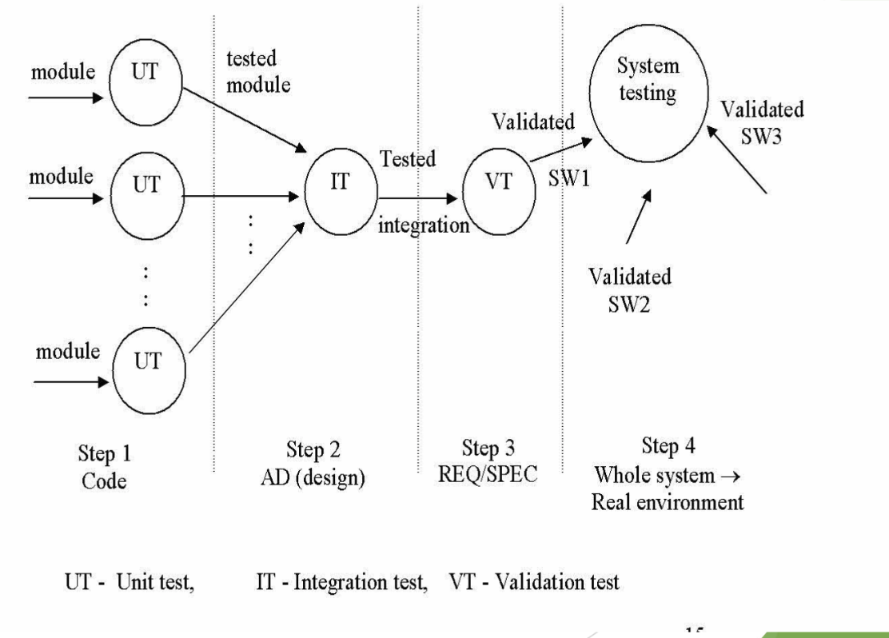
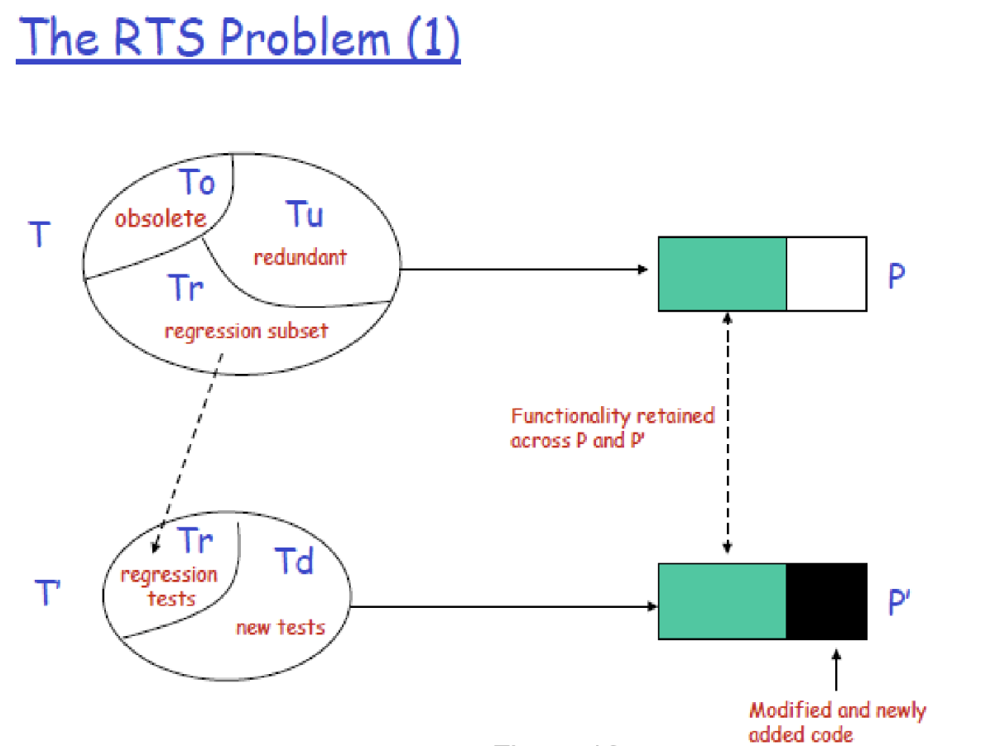

# Lecture 11: testing

## Testing steps in functional modeling

- Exhaustive testing is not possible (cannot test all possible values for data)
- Test cases should be designed to meet specific criteria
  - Basis path testing
  - Loop test
  - Equivalence partitioning
  - Boundary value analysis
  - Orthogonal test

### Step 1: unit (module) testing

**Black box test**

- Testing the functionality of a module based on the input and observing the output
  - Equivalence partitioning: divide the input into classes of data and prepare one test case per class
  - Boundary value analysis: similar to equivalence partitioning, but chooses values at the boundaries
  - Orthogonal testing: choose values that are orthogonal

**White box test**

- Testing the "inside" of a module
  - Basis path testing: based on the logical complexity (i.e. cyclomatic complexity) or a component
  - Loop test: loop elements (simple, nested, or dependent loops)

**Linearly independent path test**

- Flow graph
  - Representation of the code in a graph
  - Nodes made be sequenced together to show execution path
  - Nodes may have paths leading to multiple destination to show decisions
  - Nodes may have paths leading back to itself to show iteration
- Linearly independent paths
  - Defined as a path through the program from the start node until the end node that introduces at least one new set of processing statements or a new condition
  - Must move along at least one edge that has not been traversed before by a previous path
  - All linearly independent paths constitutes the *basis set*
- Cyclomatic complexity
  - Provides a quantitative measure of the logical complexity of a program
  - Defines the number of independent paths in the basis set
  - Provides an upper bound for the number of tests that must be conducted to ensure all statements have been executed at least once
  - Can be computed in 3 ways
    - 1) The number of regions
    - 2) $V(G) = E - N + 2$ where $E$ is the number of edges and $N$ is the number of nodes in flow graph $G$
    - 3) $V(G) =  P + 1$ where $P$ is the number of predicate nodes in flow graph $G$
- Basis path testing steps
  - 1) Find the flow graph of the module
  - 2) Determine the cyclomatic complexity
  - 3) Determine the linearly independent paths
  - 4) Prepare test cases such that each test case will force execution of each linearly independent path

### Step 2: integration testing

- Test combined components
- Three methods of integration
  - 1) Top-down: integrate the components top-to-bottom, one component at a time, and test the newly integrated components
  - 2) Bottom-up: integrate components from the bottom, usually a cluster of components are integrated and test driver is written fro the integrated components
  - 3) Sandwich: mix of both

**Top down**

- Control is the test driver and stubs are built for all subordinate modules
- Replace the stubs with real modules one at a time
- Conduct the test as each module is introduced (no need to build another new test driver module)

**Bottom up**

- Few modules are combined into builds (cluster) that perform a specific function
- Write a driver to test this function
- The drivers are removed and clusters are combined upward along in the program structure

### Step 3: validation testing

- Test of the software against the requirements using black-box methods
- Alpha/beta tests
  - Alpha on the developer's side
  - Beta on the user's side

### Step 4: system testing

- Not testing functional requirement but series of test where the primary purpose is to fully exercise the entire software in real conditions
- Recovery test: create test cases where system fails and correct recovery is achieved
- Security test: create test cases to test security
- Stress test: test cases demand abnormal request for resources
- Performance test: run time performance of the integrated system

## Testing steps in object-oriented modeling

- Step 1: model review of the object-oriented analysis and design models
- Step 2: unit test once the code is written testing begins by testing "in the small" with class testing
- Step 3: integration test as classes are integrated to become subsystems class collaboration problems are investigated using thread-based test, use-based test, or cluster test
- Step 4: validation testing

### Model review

- The analysis and design models cannot be tested because they are not executable
- The syntax correctness of the analysis and design models can check for proper use of motation and modeling conventions
- The semantic correctness of the analysis and design models are assessed based on their conformance to the real world problem domain (as determined by domain experts)

### Unit testing

- Class testing test components that are classes and their behaviors (not modules)
- Random testing: requires large numbers data permutation and combinations and can be inefficient
- Partition testing: reduces the number of test cases required to test a class
  - Input and outputs are categorized and test cases are designed based on category 
- Object-oriented fault-based testing designs test cases that have high likelihood of uncovering defects

### Integration testing

- Classes are integrated into the architecture regression tests suite
- Tests are run to uncover communication and collaboration errors between objects
- Typically trying to find defects in the client rather than the server
- Thread-based testing: tests one thread at a time (set of classes required to respond to one input or event)
- Use-based testing: tests independent/client classes (those that use vary through server classes) first then tests dependent/server classes (those that use these independent classes) until entire system is tested
- Cluster testing: set of collaborating classes (identified from CRC card model) is exercised using test cases designed to uncover collaboration errors

### Validation testing

- Testing strategy where the system as a whole is tested to uncover requirement errors, uses conventional black box testing methods, including scenario-based testing
- Using the user tasks described in the use-cases and building the test cases from the tasks and their variants
- Uncovers errors that occur when any actor interacts with the software
- Concentrates on what the user does, not what the product does
- You can get a higher return on your effort by spending more time on reviewing the user-cases as they are created, than spending more time on use-case testing

## Regression testing

> Regression testing refers to the portion of the test cycle in which a program is tested to ensure that changes do not affect features that are not supposed to be affected

- Corrective regression testing is triggered by corrections made to the previous version
- Progressive regression testing is triggered by new features added to the previous version
- Develop-test-release cycle
  - Version 1
    - Develop product $P$
    - Test product $P$
    - Release product $P$
  - Version 2
    - Modify product $P$ into product $P'$
    - Test product $P'$ for new functionality
    - Perform regression testing on $P'$ to ensure that the code carried over from $P$ behaves correctly
    - Release product $P'$

