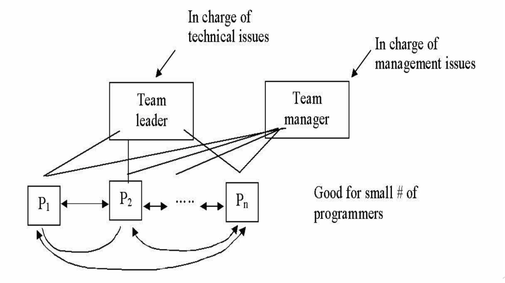
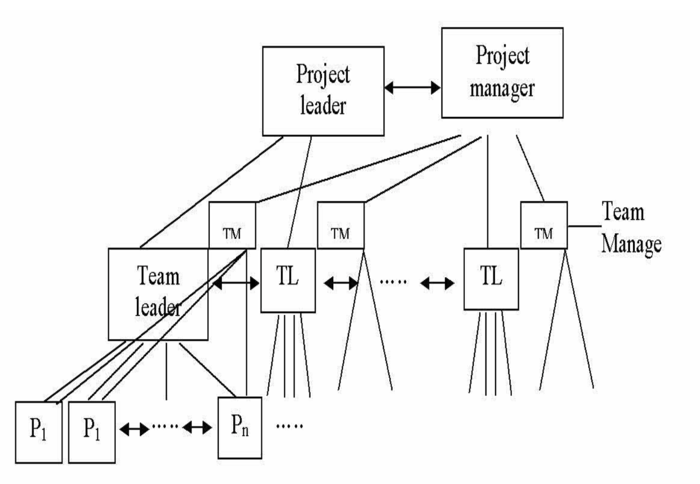

# Lecture 12: management and organizational issues

## Management responsibilities

- Management ensures that the software under maintenance is of
  - A satisfactory quality
  - That desired changes are effected with minimum possible delay
  - At the least possible cost
- Deals with personnel management aspects in terms of
  - Achieving required qualities
  - Team dynamics
  - Improving the productivity
  - Provision of adequate training and education

## Enhancing maintenance activities

**Choosing the right people**

- Most important factor in increasing the productivity
- Skills will vary
- Some people will be more productive than others
- Team synergies can align for better productivity

**Motivating the maintenance personnel**

- Rewards: make maintenance personnel feel valued and rewarded for their work
- Recognition: give proper acknowledgement
- Supervision: give appropriate supervision to inexperienced personnel and support from senior members
- Assignment pattern: rotate from maintenance task to development task
- Career structure: provided effective maintenance career structure equivalent to that of the development

**Have effective communication**

- Important for management to keep personnel informed of the procedure, tasks, etc.
- Provide adequate resources:
  - To view in terms of tools (software and hardware) and working environment
  - Management must be made aware of new developments of such
- Have proper domain knowledge
  - Adequate knowledge of the maintenance process
  - Particularly, the cost implications in various stages of maintenance

## Personnel education and training

### Objectives

- To raise the level of awareness/knowledge
  - Management must be aware of the specific needs of maintenance environment 
  - Maintenance programmers must be aware that maintenance is not just a peripheral activity, but is at the heart of an organization
    - To help inexperienced staff (newly hired)
    - To improve the image of maintenance (clear understanding of what maintenance is)
- To enhance the recognition
  - Management needs to recognize that maintenance is a vital and valuable activity

### Strategies

- Provide university education
  - Software maintenance should be a fully fledged course or to be integrated within software engineering courses
  - Tuition pay
  - Promotions/salary increases
- Attend conferences and workshops
  - Sponsored by recognized organizations (IEEE, ACM, etc.)
  - Provides hands-on experience in real situations
  - Subscription to maintenance oriented literatures (journal of software maintenance)

## Maintenance teams

### Weinberg team (democratic)

- All members have the same power and responsibility
- Egoless environment
- Everybody communicates with everybody

**Advantages**

- Direct communication
- Same power/responsibility gives a sense of ownership (more interesting)
- More likely to admit mistakes means faults are easier to discover which leads to better quality

**Disadvantages**

- Communication structure is not clear
- Emotionally bound (if one person leaves, all may go)
- Good for small groups (fewer than 10) and brainstorming

### Chief programmer (IBM)

- Chief: in charge of the project, has the power/responsibility in technical and management
- Backup programmer: equal knowledge/power/responsibility as the chief
- Program secretary: secretarial work

**Advantages**

- Communication structure is clear
- Each person has a clear function
- No communication needed to others
- Backup is available
- Productivity improvement of >30% observed

**Disadvantages**

- Hard to find a chief programmer
- More difficult to find a backup
- Good for small number of people
- However, no other group was able to replicate results

### XP team (agile)

Typically each team consists of a programmer and a tester (pair programming)

**Advantages**

- Does not test own code
- Knowledge not lost if one leaves
- Less experienced programmer can learn from other member
- Group ownership of the code

**Disadvantages**

- Relatively small number

### Hybrid models

- Small number (team leader and team manager)

- Medium to large people

- Task length can divide into two team types
  - Temporary: created informally and exists to perform a specific task
  - Permanent: created formally and consists of a leader, co-leader, user liaison, administrators, and programmers

## Organization mode

### Combined development and maintenance

- Fixed ownership mode
  - Each member of the team is assigned the ownership of a module
  - Require owner of the module to be responsible for its changes
- Change ownership mode
  - Each person is responsible for one or more changes (no matter what modules are affected)
  - Each person is responsible for analysis, specification, design, and implementation and testing of change
- Work-type mode
  - There is division of work based on the work type (analysis, specification, design, etc.)
  - Each team has clearly defined responsibilities and roles
- Application type mode
  - Division is based on the application area

### Separate maintenance department

- Based on the need to maintain a large number of system portfolios
- Increases business needs of keeping software system operational at all times
