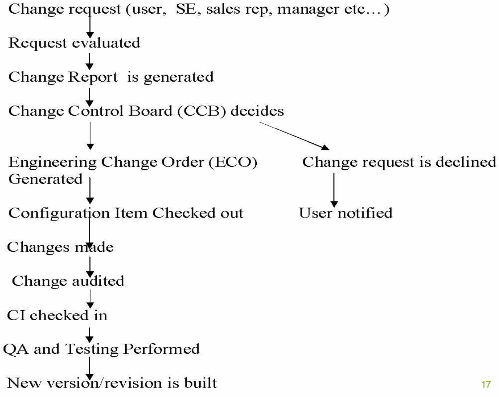

# Lecture 13: configuration management

## Configuration identification

- Uniquely identify different product artifacts and versions
- Allows **definition of release configuration items**
- **Can sort and select** by criticality, functionality, supportability, complexity, risk, quality, performance
- Simplifies the process of establishing **configuration baselines** and release controls
  - Give a *reference point* that allows *objective reviews* and *development progress* which require establishing functional, allocated, development, and product baselines

**Functional baselines**

- Contains initial documentation
- Outlines the verifications needed to prove their functionality
- System specification (technical features of system)
- Legal contracts

**Allocated baselines**

- Interface requirements
- Interface attributes
- Lower-level functional attributes
- Design constraints

**Developmental baselines**

- Requirements
  - Software requirements specification
  - Interface requirements specification
- Design
  - Top-level design documents
- Developmental artifacts
  - Source code
  - Executable binaries
  - No releasable content

**Product baselines**

- Design: final software design requirements
- Developmental artifacts: final source code and executables
- Documentation: user and maintenance manuals
- Testing: test plans and procedures
- Contains "releasable components"/working product

## Change control

- Change control ensures that changes to a system are made in a *controlled way such that their effects can be predicted*
- Can involve the following activities
  - Selection from the priority list
  - Reproduction of the problem
  - Analysis of code
  - Incorporation of change
  - Design of changes and test
  - Quality assurance

**Defining changes**

- Documentation changes
  - Changes in requirements specification
  - Changes in vision, scope, or goals
- Changes can modify requirements
- Document should remain updated

**Management of change control**

- A change request form is typically used to consider such a change
- Change control board (CCB) decides whether change should be made
- Implementation of change: ramification of making a change must be assessed
- Verifying the quality: a version of system should not be released until it has satisfied the quality control

**Change control board**

- Authority for approving/rejecting change requests
- Evaluated on certain features
  - System impact
  - Affect on resources
  - Effect on schedule
- CCB leader duties
  - Usually project manager
  - Establishes baselines
  - Approve/reject changes
  - Draft configuration documentation

## Status accounting

- Provides information
  - Configuration requests
  - Configuration documentation
  - Developmental baseline documents (SRS, vision/scope, interface requirements)
  - Product configuration information
  - Useful for stakeholders to identify schedule/budget concerns
- Control
  - Documentation control, structuring of requirements
  - Tracking of changes, version control, etc.

## Configuration audits

- Validate documentation
- Verify consistency
- Quality control of change control board (CCB)
  - Verify adequate control
  - Adequate baselines

## Configuration management process

**Version control**

- During the process of software evolution, many object are produced (files, documents, source code, diagrams, etc)
- A version control system keeps track of all changes made to objects and can also support parallel development by allowing branching of versions

**Building**

- Software must be built and rebuilt from objects of which they are made
- These objects will evolve and change and the management of building the system must ensure that correct product can be produced reliably

**Environment management**

- The means by which the file system is managed
- Takes account of need both to share objects and to keep objects apart from each other
- Maintainer must be able to make changes to objects without having effects on the whole system before completion but also it must be possible to test the result of the change upon the whole system

## Documentation

**Roles of software documentation**

- To facilitate program comprehension
- To act as a guide to user
  - Provide an initial and accurate description of what the system can do
  - Provide the user with how to install the system and to customize to individual needs
  - Provide the technical info on how to handle malfunctions
- To complement the system
  - Documentation forms an integral and essential part of the entire software system

**Categories of software documentation**

- User documentation: contains description of functions of system without reference to how these functions are implemented
- System documentation: includes all facets of the system, including analysis, design, etc.

**Scheme of classification**

- User manual: describes what the system does without necessarily going into the details of how it does
- Operator manual: describes how to use the system as well as giving instructions on how to recover from faults
- Maintenance manual: also contains details of functional specification, design, source code, test data and results

**Producing and maintaining quality documentation**

- Cost of maintaining a software system is proportional to the effectiveness of the documentation which describes the system functionality as well as the logic used to accomplish its tasks
- Writing style: adhere to guidelines for clear and understandable text (split into manageable chunks)
- Document standards: adhere to standard cover sheets, fonts, styles, numbering schemes
- Quality assessment: putting the document through a quality assessment process
- Documentation techniques
  - Put a procedure in place to update the documents
  - Use of good design methodology can reduce the low-level documentation
  - Use of documentation supporting tools

## Tools

- Automated tools have become critical part of the success of maintenance
- Tools allow maintenance personnel to keep track of objects (source files, binary files, and documentation) that have been modified during the lifecycle
- Automated build tools (cmake)
- Source control management tools (Git and GitHub)
