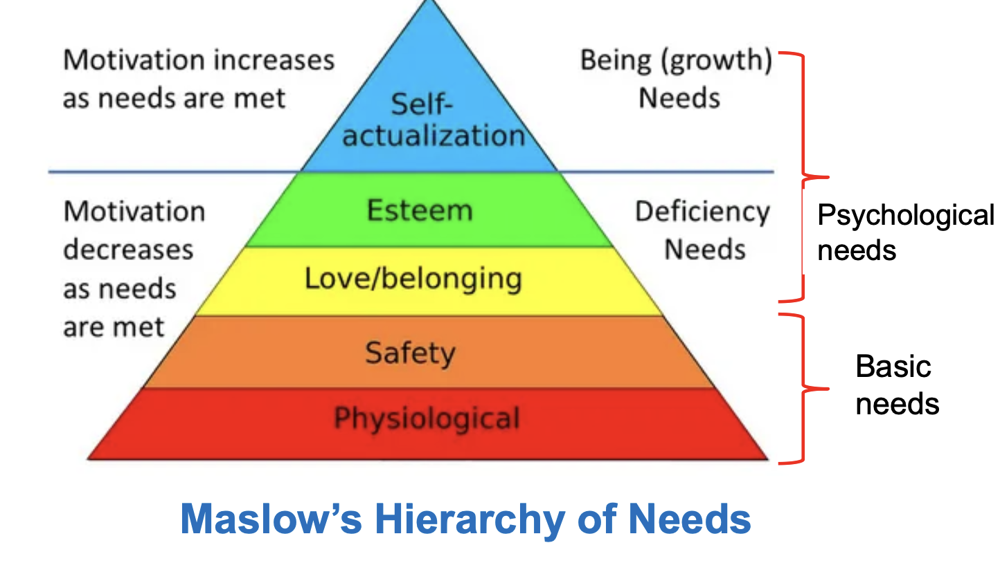
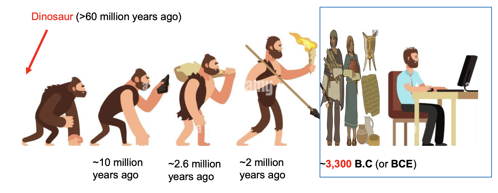
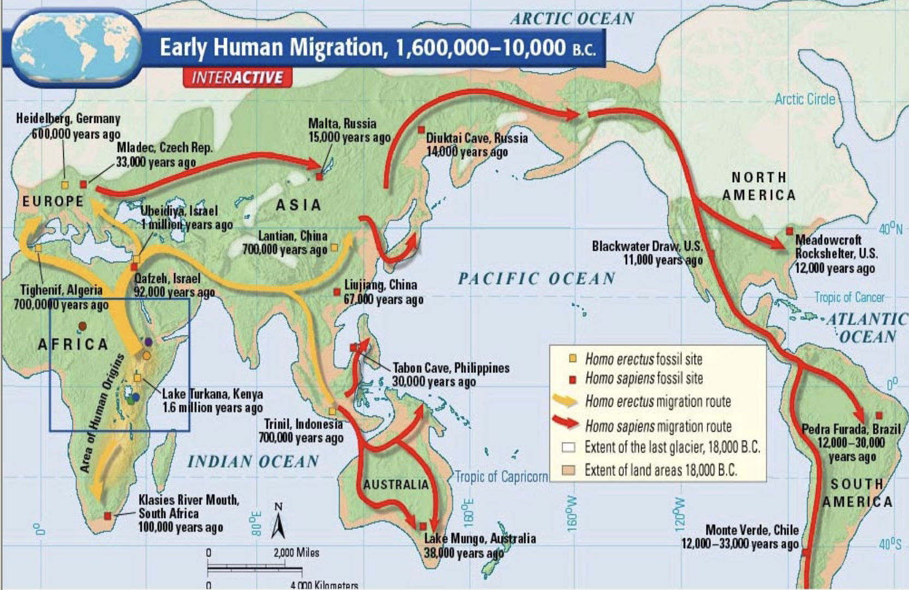
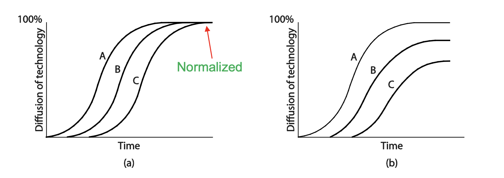
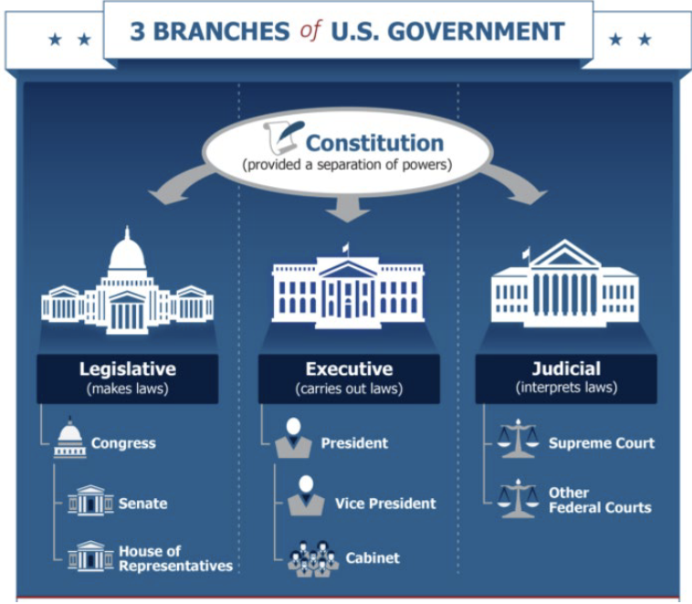

# Lecture 1: an introduction to humanities

## Humans and society

### Who are we?

- Biological needs
  - Self-centered
  - Human nature dictated by
    - DNA
    - Survival of the fittest
    - Evolution
  - Both a positive and negative side of human nature
- Beyond biological nature: self-actualization

### What is society?

- Beneficial for individuals to live in one
  - An association of people under a system of rules sharing the common value
  - Common value is agreed quality regarded as intrinsically good in a society
  - People's interactions ensue politics
- Politics are activities associated with governance of an organization
  - Governance is about who establishes the system of rules and makes decision for the society
  - Political system is the system of politics and government
  - International relations are international politics and players that shape the world

### What defines common values?

**Key elements**

- Biological human nature
  - Essential basic needs for survival (physiological and safety needs)
  - Achievement, confidence, feeling pride and superior (esteem)
- Philosophical and religious beliefs (self-actualization)
  - Independence, creativity, free-will
  - Peace, justice, morality, ideal society, religious beliefs (basis of a value system)

**History of humanity**

- Humans have gone through an evolutionary process of civilization
- History tells us that biological human nature outweighs philosophical and religious beliefs too often

### What is civilization?

> Civilization is the stage of advanced cultural, technological, and social development and organization

1. Advanced cities (society with complex social relationships)
2. Effective and lasting government (to manage complex social relations)
3. Record keeping (to keep track of taxes and others to efficiently manage)
  - Records are written by winners
  - No records, no histories
4. Compelling religious beliefs or philosophy (to establish or shape their culture)
5. Advanced culture and technologies (to push major changes in a society)

### Disciplines of humanity

**The humanities field**

- Various aspects of civilization, human society, and culture
- Many modern humanity subjects have grown to big an branched out
  - History and anthropology
  - Languages, literature, and art
  - Philosophy
  - Religion
  - Social science
  - Politics
  - Laws
  - Economics
- Common methods for humanity studies
  - Differs from empirical or scientific approaches used in science and engineering fields
  - Most are historical, speculative, and critical
  - Lately have become more and more scientific

**Why study the humanities**

- The world is interconnected
  - Transportation
  - Internet
  - Language
- To better understand the world
  - Diverse culture and value systems shared among different societies
  - People's thought process and behaviors
  - Social, economical, and political issues and conflicts
- A global view of an issue and impact of a change
  - International relations
  - What's going on in the world
- Focus on the following from an evolutionary perspective toward an ideal society
  - Civilization, world history, and international relations (briefly)
  - Major philosophies
  - Major religions
  - Value systems

**How to better study the humanities**

- Understand the culture and geographical feature are strongly related
- Understand the cause and effect of an historical event
- Understand the people's beliefs that establish a culture and influence their behaviors toward social and political issues *at that time*
- Do not judge them by modern standards
  - Our time is future to them, no one knows the future
- Most historical records are written by winners
  - Why a speculative perspective toward historical events is needed

## Civilization

### For physiological and safety needs

**History of humanity**

From *Chimpanzee* to *Homo sapiens*

**Early human migration**

- ~10 million years ago
- First in Africa
- Only extant human specie out of may others (by genetic measurement from fossils)

**Stone age**

- Old stone age
  - Technologies made of stone, bone or wood
  - Lifestyle is mostly nomad
  - End of ice age (~19,000 years ago without average 7.8 degree Celsius)
- New stone age
  - Technologies made from polished stone, grew crops, and made pottery
  - Lifestyle is farming and ranching
  - The neolithic revolution
    - Rising temperatures
    - Discovery seeds to grow into crops and plant crops
    - Domestication of animals

**Neolithic revolution**

- Steady and rich food supply
  - Population boom leads to increased food demand
  - Desire for a larger land (slash-and-burn farming for larger farm fields)
- Complex society
  - Cities emerge from village or towns
  - Advanced technologies emerge
    - Irrigation systems
    - Ox-drawn plows
    - Specialized workers with new skills (scribe, potter)
  - Economic changes expand trade and market
  - Government uses writing systems to keep records, taxes, and laws to maintain order
  - Social changes
    - Soaring populations develop complex social relationships and social classes
    - Culture of burial and protecting the weak, organized religions
- Beginning of modern civilization (followed by bronze and iron ages)
  - The major inventions for modern civilization
  - Tools, fire, farming, domestication, languages, writing systems, burial, organized religions, protecting the weak, cities
  - All developed in stone age

### For belonging, love, and esteem needs

**Cradles of major civilization**

- Maya: emerged around 2,600 BC in the Yucatan Peninsula in central Mexico
- Inca: emerged around 1,438 AD in the Andes Mountain in Peru
- Egypt: emerged around 6,000-3,000 BC in the Nile valley
- Mesopotamia: emerged 13,000-2,000 BC in the areas of Tigris and Euphrates (current Iraq, Turkey)
  - Huge cultural diffusion through trade and wars due to limited resources and no natural barriers
- Indus Valley: emerged around 2,500 BC in the Indus Valley in India
- Yellow River: emerged around 2,500 BC in the Yellow River in China

**Historically significant empires**

| Empire                | Duration               | Key Characteristics |
|----------------------|------------------------|---------------------|
| Persian empire       | 550–333 BC             | Mesopotamia region, conflict with Greek city-states |
| Alexander empire     | 336–323 BC             | Large empire for a short period, Hellenism |
| Maurya empire        | 268–232 BC             | Ashoka supported Buddhism |
| Han dynasty          | 206–220 BC             | Silk Road, active trade with Europe, intellectual and artistic life flourished |
| Roman empire         | 27 BC–1453 AD          | Most areas of Europe, influenced European culture |
| Umayyad Caliphate    | 661–750 AD             | Golden Age of Arab and Islam |
| Khmer empire         | 802–1431 AD            | Southeast Asia region |
| Mongol empire        | 1206–1368 AD           | Largest continuous land empire from Asia to Europe |
| Ottoman empire       | 1299–1922 AD           | Successor of the Byzantine empire, controlled major trade routes |
| Spanish empire       | 1492–1976 AD           | Exploration outside Europe, Christianity, "the sun never sets" empire |
| Qing dynasty         | 1644–1912 AD           | Nurhaci, 2nd largest land empire after the Mongols in Northern and Central Asia |
| Russian empire       | 1721–1917              | After Mongol rule, ended by communist revolution, Soviet Union led to Cold War |
| French empire        | 1804–1870              | After French Revolution, Napoleon |
| British empire       | 1858–1960              | Largest territory, another "the sun never sets" empire |
| Empire of Japan      | 1868–1947              | After Meiji Restoration, ended after the war against the U.S. |
| American imperialism | Pax Americana (present)| World peace maintained by the U.S. |

**Desire for higher values**

- Wars and imperialism
  - Causes of wars
    - Human nature for survival (of the fittest) fighting for resources
    - Hegemony for power and control (nationalism, superiority, imperialism)
    - Religious beliefs
    - Political idealism
  - Consequences of wars
    - Resource waste
    - People get killed
    - Depression and unhappiness
- Positive and negative effects of civilization
  - Negative: social unrest, revolts and wars
  - Positive: improvement in quality of life
    - Meeting the basic needs of Maslow's hierarchy
    - Technological advancements
- People seek for higher values
  - What is truth?
  - What is the purpose of life?
  - What is the way of life?
  - What is the ideal society?

**Models of technological diffusion**

- Figures illustrates the rate at which a new technology is assimilated
  - Group A: highest socioeconomic status
  - Group B: middle socioeconomic status
  - Group C: lowest socioeconomic status
- Normalization model
  - Group A adopts first, then Group B, finally Group C
  - Eventually A use = B use = C use
- Stratification model
  - Group A adopts first, then Group B, finally Group C
  - Still A use > B use > C use forever

### For self-actualization needs, seeking for higher values

#### Important studies

**Philosophy**

- What is it?
  - Means "Love of Wisdom" in Greek
  - Used to be the study of fundamental and intellectual questions
    - Life
    - Existence (reality)
    - Mind
    - Knowledge
    - Reason
    - Morality
    - Values
  - Historically the study encompassed any body of knowledge
    - Metaphysical philosophy (ultimate knowledge)
      - Ontology (study of reality, existence, being, and classification of being)
      - Epistemology (study of knowledge)
    - Natural philosophy (natural science)
    - Moral philosophy (ethics)
- Modern philosophy
  - Logic and reasoning
  - Ancient philosophy
  - Modern philosophy
  - Ethics
  - Metaphysics
  - Epistemology (study of knowledge)
- Philosophical methods
  - Questioning (requires thinking)
  - Critical discussion (thesis and antithesis)
  - Rational argument and systematic presentation (using logical reasoning process based on the information to acquire knowledge, understand, and reach a conclusion)

**Ontology**

- Truth and fact
  - Truth is the property of being, beliefs, thoughts, or propositions in accord with fact or reality
  - May also include fact and belief
  - A fact is something that is indisputable, proven based on empirical research or measures
- Ontology is the study of reality, existence, being, classification of being => fact and truth as knowledge
- Four schools of ontology

| Ontology | Realism | Internal Realism | Relativism | Nominalism |
| -------- | ------- | ---------------- | ---------- | ---------- |
| Summary | The world is 'real', and science proceeds by examining and observing it | The world is real, but is almost impossible to examine directly | Scientific laws are basically created by people to fit their view of reality | Reality is entirly created by people, and there is no external 'truth' |
| Truth | There is a single truth | Truth exists, but is obscure | There are many truths | There is no truth |
| Facts | Facts exist, and can be revealed through experiments | Facts are concrete, but cannot always be revealed | Facts depend on the viewpoint of the observer | Facts are all human creations |

**Epistemology**

- What is it?
  - A study of the origin of knowledge
    - Deals with the best way of investigating the word and its reality
    - How we come to know the world
    - What is knowledge, how it is acquired, and how we know what we know
  - Different schools of epistemology
    - Positivists believe we can study the world through objective observation 
      - Reality is consistent and independent of perception
      - Tend to rely on quantitative approach
    - Social constructionists believe that reality does not exist itself
      - Reality is created by people
      - Focus on feeling, beliefs, and thoughts of the individuals
      - Tend to rely on qualitative approach
- Ontology and epistemology
  - Ontology deals with what exists
  - Epistemology deals with how we come to know what exists
  - They are intertwined
- Views on ontology and epistemology
  - Realists tend to take a positivists epistemology
    - Study usually starts with a hypotheses and proceeds with conducting an experiments
    - That will prove or disprove it to confirm the theory of their study
  - Relativists tend to take a social constructionists epistemology
    - Study usually start with questions as to how and why
    - Conduct case studies and surveys to which they triangulate and compare

**Religion**

> A religion is a system of the sacred, belief and practice

- Karl Marx's view on religion (1818 - 1883)
  - Religion is the opium of people
  - Teaches people to accept their life as it is, no matter how bad or postpone the rewards of happiness for an anterlife
  - Justifies the inequality of power and wealth
- Durkheim's theory of religion (1858 - 1917)
  - Religion is not only about relief but also about regular rituals and ceremonies
  - Predicted that the influence of religion would decrease as our society keeps modernizing and incorporating scientific thinking
  - Promoted civic religion instead of traditional religion
- Max Weber's view of religion (1864 - 1920)
  - The truth claims of religious movement are irrelevant for the scientific study
  - Religion has a strong social component
- Eliade's homo religious (1907 - 1986)
  - Human nature seeking for permanence from change (holiness and truth)
  - Questions to know everything and influenced by local culture

#### Greek philosophy

- Ancient Egypt and Mesopotamia civilization
  - Egypt culture and religion
  - Greek culture and philosophy, peaked during the wars
- Persian empire
  - Persian culture and religion
- Greco-Persian war
  - Greeks win the wars
  - Greece becomes Athens centric
- Peloponnesian War
  - Conflict between Athens and Spartan for 40 years
  - Spartan (Peloponnesian league) won the war, but weakens the whole of Greece
- Macedonian empire
  - Alexander's belief
  - Hellenism: mixed and culture and civilization in eastern and western regions
- Roman empire
  - Influenced most Europe, Northern Africa, and Western Asia

**Socrates**

- About the guy
  - Very little known about him
  - Criticized democracy for possibility of corruption in politics and people's ignorance due to knowledge, mob influence
  - Died for impiety, not accepting the gods of Athens and corrupting the young, but he logically denied it
- Views on truth
  - Truth is general and absolute
  - Criticizing Pythagoras (truth is relative, uncertain, need experience)
- Ways of life
  - Know thyself
    - Acknowledges he knows nothing noble while most people do not know that they do not
    - Pursued question-and-answer style of examination on a topic to arrive a defensible definition
  - All virtue is knowledge
    - No one desire what is bad
    - Anyone that does something that is truly is bad, it must be unwillingly or out of ignorance

**Plato**

- About the guy
  - Wrestler, influential to Western religion and spirituality
  - Founded the Academy of Athens
  - Criticized democracy, claiming only philosophers should rule
- Views on truth
  - Truth is general and absolute, but only existed in idea (everything is subject to change)
  - True forms are abstract universal entities that exist independent of the objects themselves
  - Everything we see is just an imitation of the perfect form
    - Arts confuse us more, tricking us into believing false visions of Truth
  - Human is spiritual being with soul
- Way of life
  - Three elements of soul (immaterial and immortal)
    - Reason (wisdom and knowledge from brain)
    - Spirit (emotion and courage from hearts)
    - Desire (driving people to act from Abdomen)
  - Building the perfect state
    - Three kinds of human in a society
      - Wisemen and rulers with reason
      - Soldiers and auxiliaries with spirit
      - Producers-workers with desire
    - Requires four qualities
      - Wisdom (from the ruler's knowledge)
      - Courage (demonstrated by the soldiers and auxiliaries)
      - Self-discipline (from the harmony among all three classes)
      - Justice (from everyone doing what they are "naturally" fitted for)

**Aristotle**

- Politics
  - Purpose of government is to make it possible for citizens to achieve virtue and happiness
  - Rulers must be the servants of the laws
  - Law is order and good law is good order
- Economics
  - Understand the human nature
  - Poverty is the parent of crime and revolution
  - Foresaw capitalism and communist revolution and need of welfare
- Rhetoric
  - Rhetoric is essential in politics and law
  - Helps to educate people and defend truth and justice
- Science and mathematics
  - Earth science, biology (classification of living things)
  - Formal logic, syllogism, induction and deduction
- Psychology
  - Explains how people perceive the world
  - Particularly about memory and dreams

**Hellenism**

- The Hellenistic period (323 BC - 30 BC, between Alexander and the emergence of the Roman Empire)
  - Greeks were despair from failure in a series of wars conquered by non-Greeks became individualistic
  - Alexander's idea developed Hellenistic philosophy influenced by Greeks, Romans, Egyptians, Syrians, Arabs, India
- Hellenistic schools of thought: Happiness = Pleasure - Pain
  - Stoicism
    - Life in agreement with nature
    - Rejecting all conventional desires for wealth and power
    - Free from possessions
    - Overcoming destructive emotions
    - Development of self-control
    - Seeking individual peace
    - Focused on being neutral to decrease pain
  - Epicureanism
    - The universe as being ruled by chance with no interference from gods
    - Absence of pain as the greatest pleasure and advocated a simple life
    - Focused on decreasing pain by simple lifestyle
  - Cyrenaicism
    - People could only know from their own experiences
    - Beyond that truth was unknowable
    - Focused on increasing pleasure

**Athenian school of thought**

- Peaked in tough time
- Greco-Persian war, Peloponnesian war, until Macedonian empire
- Influenced early western culture, early Islamic and Christian philosophy, later Renaissance and Age of Enlightenment

#### Middle Eastern philosophy

**Zoroastrianism**

- Founded by a Persian prophet, Zoroaster
- Basic beliefs and view on truth
  - One god (Ahura Mazda)
  - Avesta (the holy book)
  - Heaven the Hell (after death)
  - Earth is a battleground between Good and Evil
  - God will one day judge everyone according to how well he/she fought the battle for Good
  - The judgement day
    - Future resurrection of the body and reuniting soul and body
    - The last day judgement is a very powerful message to people
- Way of life
  - Take part in a battleground between Good and Evil
  - Bring happiness into the world
- Similarities to Judaism, Christianity, and Islam
  - One god
  - Concept of Satan/Devil
  - The belief in angels
  - The last day judgement
- Persecution by Muslims (after the fall of Persian Empire)
  - Temples were fired and converted into mosques
  - Paid more taxes, captured as slaves, forced to convert
  - Children had to attend Muslim schools
  - Zoroastrians were scattered
    - ~115,000 around Bombay in India
    - ~7000 in the US

**Judaism**

- Basic beliefs and view on truth
  - One eternal, omnipotent God made a covenant with Abraham and his descendants for prosperity if they worship God and are faithful to him
  - Torah (the holy book for Jews) covers the laws, teaching, rituals, ethics, and lifestyles
- Way of life
  - Embody Torah, the living word of the living God
  - The ten commandments
  - Both Christianity and Islam are closely related to Judaism

**Christianity**

- Basic beliefs and view on truth
  - The doctrine of the Trinity influenced almost all areas of modern western society
    - God (the father)
    - Jesus Christ (the Son of God)
    - Holy spirit
  - Resurrection and ascension of Jesus Christ
  - Jesus's second coming and the Day of judgement
  - Salvation of the faith (possible meanings of heaven and hell)
    - Being faithful to the almighty God to seek for comfort, peace, happiness
    - Current (suffering) life or life not saved by the God (hell)
- Way of life
  - The main message of Jesus's teachings in New Testament is Love
    - Love God
    - Love your neighbor as yourself
    - Forgive others who have wronged you (love your enemies)
    - Ask God for forgiveness of your sins (repentance of sins)

**Islam**

- Islam means "submission to the *will of God*"
- Followers of Islam are called Muslim
- Muhammad is the founder of Islam, political leader, and warrior
- Basic beliefs and view on truth
  - Allah, the Arabic word for God, the one and only omnipotent and merciful God
  - Angels, prophets, and the Qur'an (the holy book)
  - Judgement day (every human life will be assessed to decide whether they go to heaven or hell)
- Way of life
  - Pray or recite the Qur'an to approach Allah
  - Guided by the scriptures (faith)
  - Nothing will happiness unless God wills it
  - Equality before God
  - Fasting (an act of worship)

| Commonalities with Judaism, Christianity, and Islam | Differences with Judaism, Christianity, Islam |
| --------------------------------------------------- | --------------------------------------------- |
| One God | Original conflicts among Judaism (chosen people) and Christianity |
| Ancestor (Abraham) | Jesus is a prophet for Muslim, but God for Christianity; different holy books |
| Encourage religious conversion | Conflicts among Judaism and Christianity, Crusades, Isreal and Arab conflicts in the holy city |
| Judgement day | |

#### Indian philosophy

**Hinduism**

- No single founder or prophet, not organized religion, only scriptures called Vedas
- Veda interpretation of Vedas and practices vary significantly
- Views on truth
  - Vedas: sacred scriptures of hymns, prayers, magic spells, revelations received by ancient saints
  - Braham is God's manifestation that is formless, limitless, all-inclusive, and eternal
    - God is everything and everyone (not an abstract concept)
    - Trinity of Gods
  - Maya is divine power of illusion is a complex situation where the world is full of misery and injustice
    - Cannot be reconciled with what we see around us
    - Causes and cycle of rebirth and death called samsara
  - Karma are actions accumulated in previous lives and actions that affect a person's fate in the next life
    - Individual souls are immortal
    - Four social positions
      - Priests and teachers (Brahmins)
      - Rules and soldiers (Kshatriyas)
      - Merchants (Vaishyas)
      - Shudras (workers)
  - Moksha is the goal of the individual soul that is free from samsara
    - Soul unites with Brahman by realizing its true nature
    - Dharma (virtues: paths leading to Moksha)
- Way of life
  - Recognize the truth and follow the paths leading to Moksha
  - Adhere to one's duty in life performed with proper action
  - Seeking divine contact by practicing meditation and Yoga (for physical and mental disciplines)

**Buddhism**

- Founded by Siddhartha Gautama (Buddha "enlightened one")
- View on truth
  - Dukkha: the world (universe) is empty or nothing
    - Nothing lasts forever
    - Everything changes and is related, no self, only relation
    - Life is imperfect and suffering
  - Samudaya: the cause of this dukkha is desire, incapable of satisfying
  - Nirodha: ending of this dukkha can be attained by eliminating "Samudaya"
  - Magga: Noble eightfold path to end this dukkha to reach Nirvana
    - Right view
    - Right resolve
    - Right speech
    - Right conduct
    - Right livelihood
    - Right effort
    - Right mindfulness (virtues)
    - Right samadhi (meditative union)
- Way of life: understand the true nature of the four noble truths to reach Nirvana

#### Chinese philosophy

**Taoism**

- Founded by Laozi as a philosophy and later developed into a religion based on the book "Tao Te Ching" with 81 short chapters
  - Tao means "the way"
  - Te means "virtue"
  - Ching means "great book" strongly influenced other schools of Chinese philosophy
- Views on truth
  - Tao (Metaphysical force) encompasses the entire universe and governs the universe and all nature
  - The eternal Tao is nameless origin of everything
  - It's the place where heaven, earth, and all that came from (everything is one)
- Way of life
  - Live according to Tao
    - Human attempts to make the world better actually makes it worse
    - Strive for harmony and integration with nature, minimizing potentially harmful interference with nature or in human affairs
  - Advocated virtues
    - The strength of softness and harmony: generous, humble, thoughtful => peace
    - Withdraw from the world and contemplate nature (danger of seeking power)

**Confucianism**

- A system of moral, social, political, and religious rituals that influenced many dynasties in northern and central Asia
- View on truth
  - The universe consists of five cosmological entities
    - Heaven
    - Earth
    - The sovereign or emperor
    - Ancestors
    - Teachers
- Way of life
  - Learn to become gentlemen by promoting five constant virtues
    - Benevolence or love
    - Justice
    - Proper rite
    - Knowledge
    - Integrity
  - Practice the virtues with your family and society
  - Do your best for your roles for the success of family and society for a peaceful and harmonious society
  - Worship the cosmological entities for the unity with the God of heaven (through rituals)

#### Eastern vs. Western philosophy

| View | Western | Eastern |
| ---- | ------- | ------- |
| Metaphysical and epistemological perspectives | The existence of an external reality independent of human perception, analytical thinking, logical reasoning, empirical evidence as sources of knowledge | Holistic thinking, the interconnectedness and unity of all things, practical wisdom, balance, living in harmony with nature, and achieving inner peace |
| Emphasis on individualism vs. collectivism | Emphasis on individualism, personal autonomy, and individual rights, value personal achievement, self-expression | Emphasis of collectivism, social harmony, social roles and responsibilities |
| Ethical and moral frameworks | Rights and duty, outcome-based, justice and virtues | Virtue ethics, practices like mediation, self-discipline |

## Civilization process

### Medieval time and civilization

- Middle ages
  - ~1000 years between the fall of Roman Empire and early modern Europe
  - Christianity emerged and spread throughout Rome
  - Sought to control all aspects of morality, justice, education, and power
- Also called the dark ages
  - People though oppressed
    - Barriers to human intellectual and business development
    - The Earth orbits the Sun (Copernicus against the Church)
  - The rise of Muslim and Crusades
  - Huns and Mongolian invasions
  - Wars, famine and plague (black death kills 1/3 people)
  - People's migration, population decline (mostly farmers)
  - Greek ideas were mostly forgotten due to decline in literacy

### Renaissance and Age of Enlightenment

**Protestant reformation**

- Background
  - Roman Catholic associated with government (corruption)
  - Tremendous consequences from 8 crusades
    - Deaths, destruction of resources, intolerance of religions and people
    - Challenges to Catholic Church's divine authority
  - Black death killed 25-30 million people (30-50% of people affected died)
  - Fall of Eastern Roman (Byzantine) empire (1453)
- Protestants
  - Martin Luther (1483, Germany)
    - Focus on Bible
    - Salvation by their faith and the grace of God, not by their deeds
    - The Church and state should be separated
  - John Calvin (1509, France)
    - God's work for everything we do
    - Being lazy is sinful
- Impact of protestant reformation movement
  - Many countries disassociated with the Roman Catholic
  - Many protestant churches appeared
  - Shifting people's focus from after life to current life (enlightened)

**People awakened and enlightened**

- Background
  - Protestant reformation based on Calvinistic thinking
  - Every occupation is a "calling on the part of God work"
  - Be active earthly life to meeting practical needs (moral justification for economic practices)
  - Humans were made in the image of God (in contrast to eastern religions)
- Renaissance ("awakening", transition from the Middle Ages to Modernity)
  - Self-awareness of humanism (the classic Christianity) and cultural movement for intellectual life
  - Reminded "man is a measure of all things", shown in painting, architecture, sculptures, science, philosophy, politics
  - Rediscovery of identity (Greek ideas, Roman culture, and Christianity)
- Age of Enlightenment
  - Known as the age of reason
  - An intellectual movement emerged from Renaissance, scientific revolution

**Industrial revolution**

- Emerged from Renaissance and Age of Enlightenment
  - Started in England, spread to Europe and the rest of the world
  - Farmers moved to factories, labor shortage, and first allowed property rights
  - New machines for manufacturing, manufacturing hub, and economic growth
- Technological innovations
  - Steam power
  - Transportation, cement, and communication
  - Chemicals (use of petroleum and gas)
- How impactful?
  - Second most impactful revolution after the neolithic revolution
  - Solved the Malthusian catastrophe
- How about in the other parts of the world at that time?
  - Feudalism, maintaining traditional lifestyle
  - Now aware of what's going on in Western Europe or ignored it
  - Completely unprepared for European visits (except Japan)
- Impacts of industrial revolution
  - Positive
    - Technology innovations and diffusion (automation)
    - Significant economic growth (capitalism and socialism)
    - Enhanced wealth and quality of life (population growth)
  - Negative
    - Shortage of workforce (slavery and child labor)
    - Overproduction and imperialism
    - Overcrowding of industrial cities
    - Excessive use of fossil energy
    - Increased competition
    - Poor working conditions

**Revolutions, civil wars, and armed conflicts**

- English civil ware (1642-1660)
  - AKA the glorious revolution
  - Conflict between Parliament and Crown
  - Execution of Charles I
  - Separation of divine right of king and parliament (has political power)
- American revolution (1775-1783)
  - War between Britain and America
  - America declared independence in 1776
- South Americans revolution (1783-1798)
- French revolution (1789-1799)
  - A war between leading groups and commoners
  - Reign of terror
- Russian revolution (1917)
  - Bolsheviks revolution
- Chinese revolution (1949)
  - Communist party led by Mao
  - The cultural revolution (1996)
- German revolutions (1848-49, 1918-19)
- Italian revolution (1848)
- Spanish revolution (1936-1939)

### Selected philosophers

**F. Bacon**

- Experimentation is essential to discovering the truths of nature
- Use of evidence and proof from experimentation to find the rules of nature
- Generalization or inductive reasoning

**R. Descartes**

- Theory of knowledge
  - "I think, therefore I am"
  - True knowledge comes only through the application of pure reason
  - The father of modern philosophy (epistemology)
  - The first modern rationalist
- Investigated the connection between the mind and body and interaction
  - Minds are thinking things while bodies are extended things
  - Mind and body can be separated
- Invented analytical geometry and Cartesian coordinate system
  - Methods of solving geometric problems algebraically and algebraic problems geometrically (a conceptual breakthrough)
  - The discovery of infinitesimal calculus and analysis

**T. Hobbes**

- Government as a device for ensuring collective security and peace
- The only true and correct form of government is the absolute monarchy that can guarantee peace
- Political authority is justified by a hypothetical social contract among people

**John Locke**

- All men are bounded by law of nature, free and equal (rejecting divine rights of kings)
  - Everyone has the right to life, liberty, and property (natural rights)
  - Everyone has the duty to protect their rights and other's rights
  - Punish those against God
- Transferring their rights to the movement
  - To better ensure the stable lives with natural rights
  - Social contract theory
- Theory of value and property (property rights)
  - People have rights to property in their own person, to their own labor, to things which they remove the Nature through their labor

**Jeremy Bentham & J.S. Mills**

- Evaluates action based on their consequences (utilitarianism)
- Utilitarianism can be suggest law, rule, and religion

**Kant**

- Critique of pure reason (critique on the human's ability of reasoning)
  - Empirical, a priori, a posteriori, and synthetic knowledge (taking both empiricism and rationalism)
  - Knowledge can be obtained in space and time through human's cognitive process in the phenomenal world and in noumenal world as opposed to an empiricist Hume's idea
  - The space and time are merely a form of our intuition or minds, NOT a property of things in themselves, arguing scientific method is possible for metaphysics
  - Copernican revolution is philosophy and the foundation of the modern philosophy
- Critique of practical reason (the concept or moral duty)
  - Human freedom and reason
  - Free will, free from animal instincts, the ultimate freedom
  - Every action should have pure intention behind it or it's meaningless
  - The categorical imperative can only be based on something that is an "end of itself, not a means to some other needs or purpose"

**F. Hegel**

- A thesis, giving rise to its reaction, an antithesis, which contradicts or negates the thesis; and the tension between the two being resolved by means of a synthesis
- Based on Kant's philosophy and criticism of Kant's theory of moral motivation
- Completed a unified framework of philosophy (epistemology: much detailed cognitive process)

**J.J. Rousseau**

- Man's enslavement to his own needs was responsible for all kinds of issues, from exploitation and domination of others to poor self-esteem and depression
- Good government must exist for the freedom of all it's citizens
- The individual freedom with certain constraints (proper law should exist)
- As long as law and property exist, people can be never be entirely free

**Adam Smith**

- Human nature is self-centered
- The idea of invisible hand (free market force through competition)
- The concept of GDP (foundation of modern economics)

**Karl Marx**

- Marxist dialectic: basic laws of dialectical materialism
  - Every phenomenon of nature has negative and positive sides
  - Conflict is a natural continuous process
- Law of transformation of quantitative to qualitative change
- Law of unity and struggle of opposites
- Law of the negation of negation (socialist revolution for the exploitative capitalist system)

### Three philosophical views

**Idealism**

- Metaphysical view associating reality to ideas in the mind rather than material objects
- Mind and cognition creates everything
- Mind-independent things do not exist

**Rationalism**

- Reasoning is the source of knowledge
- Knowledge is reason
- Reality has an inherently logical structure
- A class of truths exist
- Focus of knowledge and reasoning rather than religious beliefs or emotional response

**Empiricism**

- Knowledge is derived form experience
- Experience is the source of knowledge
- All rationally acceptable beliefs or propositions are justifiable or knowable only through experience

**Unified views**

- Rationalism + Empiricism (plus some idealism) 

### Common characteristics of society for scientific advancement

- Liberty: independent, individualistic, horizontal relationships
- Education: knowledge and reasoning (logical thinking)
- Toleration and open community
  - Fraternity, respecting different opinions, asking questions
  - Open-minded, adopting to the changes
- Separation of religion and government: for realistic and pragmatic, interest in current world
- Constitution government
  - Understanding human nature (competition, meritocracy policy)
  - Societies without competition, constructive competition, and destructive competition
  - Limited power by check-and-balance => transparency in decision making

## Value systems

### In a society

- Society
  - Association of people under a system of rules sharing a common value
  - Common value is agreed quality regarded as intrinsically good
- Defining common value
  - Biological human nature
    - Meeting the basic needs is essential
    - Achievement, confidence, feeling pride and superior
  - Philosophical and religious beliefs
    - Independence, creativity, free-will
    - Peace, justice, morality, ideal society, religious beliefs
- Value systems in a society
  - Based on agreed social, economical, and political systems
  - International relations (politics, allies) also heavily influenced by value system

### Building an ideal society

- Idealisms
  - Capitalism (Adam Smith)
    - Economic freedom and private ownership in free market relying on invisible hand
    - Idealism for wealthy people and nations
  - Socialism
    - During several civil revolutions
    - Means of production, distribution, and exchange owned by the community
  - Communism (Karl Marx, F.Engels)
    - The fallacy of capitalism, ideal community society will be established
    - Class war between Bourgeois and Proletariat due to the social injustice
    - All property is publicly owned, each person works, is paid according to their abilities and needs
  - Other ideologies
    - Nationalism
    - Fascism (far-right)
    - Anarchism (far-left)
    - Populism 
- Danger of unproven radical idealism
- Evolution of capitalism and communism
  - Capitalism with welfare system
  - Communism with capital market
  - Global capitalism (neoliberalism) based on Hegel's dialectic stages of development

### Political systems

**Monarchies**

- A king or queen has complete rule over their country
- Absolute monarchy works like a dictatorship
- Constitutional monarchy gives royal family limited power and usually works in accordance with an elected body of officials

**Authoritarianism**

- Dictatorship: individual of few elite leader handle all economic, military, and foreign relations
- Totalitarianism: a system of government controls all aspects of life, communications, and censors the media

**Democracy**

- Idea stems back from ancient Greece
- Citizens elect via vote representative directly or indirectly that make political decisions
- Rise of the middle class
  - More democratic governments
  - Social revolutions of the 18th - 20th century overthrew the majority of existing monarchies
- People have authority to choose their governing legislation
- The idea of democracy has been evolved

**Modern democracy**

- Citizen participation: decision making by (majority) voting or representatives
- Political tolerance: multi-party system
- Equality: everyone is equal, respecting the difference and fair opportunity
- Freedom
  - Economic (free market) and expression (speech, press, assembly)
  - Liberal democracy (focuses more on individual rights and freedom)
- Accountability: rule of law
- Transparency of governance: checks and balances

| Pros | Cons |
| ---- | ---- |
| Imposes equality | Risks from lack of knowledge among the people |
| Authority by law/Obligations to citizens | Prone to the free time rules system (busy people may not be able to particpate) |
| Transparency of governance (doesn't put power into a single individual) | Populism: mob influence, mass dictatorship or terror |
| | Difficult to avoid shortfalls (inefficiency of the system and decision making)
| | Potential election fraud and political instability, causing division |

### Founding philosophy of the U.S.

- Independence from Britain (on July 4, 1776, initially with 13 states)
- The declaration of independence
  - Philosophical ideas
    - Equality (J. Locke, T. Hobbes)
    - Natural rights (inalienable rights and civic duties to protect these rights)
    - Right to pursuit of happiness (Aristotle, J. Locke)
  - Religious freedom (Protestants or Puritans, Christianity)
  - Enlightenment thinking (Humanism, liberalism, education)
  - Limited government (Balanced democrat, separation of power by Montesquieu)
- Major political doctrines
  - Natural rights emphasizing the responsibility of government for the protection of individual rights
    - Rights and social contract theory
    - Government for common value and protection of the individual rights of the citizens
  - Republicanism
    - Emphasizes the democratic community
    - Sovereign authority resided in the body of the people not in a monarch
  - Constitutionalism (fundamental principles)
    - A constitution is a set of custom, traditions, rules, and laws
    - Structures the way government is organized
    - Defines the relationship between the government and its citizens

**Constitution**

- The supreme law of the United States
  - First county written a constitution
  - Later popular in other countries (Poland, France, etc.)
- The preamble and seven articles consisting of
  - Article 1: the legislative branch
  - Article 2: the executive branch
  - Article 3: the judicial branch
  - Article 4: the state's powers
  - Article 5: amendments
  - Article 6: federal powers
  - Article 7: ratification (approval by 2/3)
- Separation of powers (for check and balance)
  - Legislative
  - Executive
  - Judicial
- Ratified amendments
  - First amendments (freedom of religion, speech, press, assembly)
  - Second amendments (right to have weapons)
  - Third amendments (limiting soldiers' power for privacy)
  - Fourth amendments (requiring search warrant "probable cause")
  - 27 amendments so far

**American imperialism**

- Is the U.S.A the new Roman Empire
- Influences from Roman republic
  - Republic, fear of centralized authority (use of check and balances), selfless leadership
  - Open societies and meritocracy
  - Proud of citizenship
- Similarities
  - Global influence and dominance
  - Foreign wars (WWI, WWII, and involved in most other wars since then)
  - Recently observed:
    - Shrinking middle class
    - Loss of political compromise
    - Societal division/unrest by beliefs and idealism
- Differences
  - Democracy
  - Innovation hub for technology
    - Romans adopted technologies from subject territories and heavily depended on imports
    - America is leading technologies
  - Entrepreneurship
  - Social equality (American dream)

**Pax Americana**

- A state of relative international peace overseen by the U.S (single power)
- American imperialism vs. the past empires
  - Past empires focused on land expansion for resources and control
  - American imperialism through American values
    - Human rights (equality, liberty/freedom, individual rights)
    - The political (democracy), economic (capitalism), social (fair opportunity, merit-based, diversity) and cultural influence
    - Based on Greek ideas, Roman laws (republic), Christianity, Enlightenment
    - U.S. government never refers to its territories as an empire
  - Strategies used by America
    - Military conquest: The Five Eyes founded in 1941
    - Unequal treatises: subsidization of preferred factors
    - Culture and economic penetration: through private companies followed by intervention

### Major issues in modern society

- Technology revolution
  - Accelerated automation using AI, robots, and cloud computing
  - Destruction of most labor-intensive jobs
- Winner-take-it-all market
  - Capitalism and wealth distribution
  - Globalization and global capitalism
  - Increased competition in the market
- Changed skill set for new jobs
  - Difficult of retraining
  - Causing an education gap
  - Increased wealth gap
- World-wide issues
  - Excessive use of natural resources
  - Wealth gap and shrinking middle class
  - Social divide: diversity, difference, and equity
  - Anti-intellectualism (anti-elitism, the result of social injustice and divide, nationalism, etc.)

**Wage gap and ethics**

- Ability of an CEO for a company is extremely important but:
  - Is the CEO 300 times better than the average employee?
  - Did the CEO achieve the business goals alone?
  - Is the CEO ethical?
- Many unethical cases:
  - Volkswagen management and engineers
  - CEOs of Wells Fargo bank
  - CEOs of many finance companies during financial crisis

**Globalization**

- The process of creating a worldwide network of business and markets
  - Rapidly decreasing cost of IT has made globalization possible
  - Causes a greater mobility of goods, services, and capital around the world

| Arguments for globalization | Arguments against globalization |
| --------------------------- | ------------------------------- |
| Increased competition, increased efficiency, technology advancements | Makes the US subordinate to the World Trade Organization |
| People in poorer countries deserve jobs | Forces American workers to compete with foreigners who do not get decent wages and benefits |
| A tried-and-true route for poor countries to become prosperous | Accelerates exodus of manufacturing and white-collar jobs from the US |
| Global jobs reduce unrest and increase stability | Hurts workers in foreign countries |

**Advancements in AI**

- Intelligent capabilities for AI
  - Learning: acquiring new knowledge and skills
  - Recognition: matching sensory information or patterns with the existing knowledge
  - Understanding: perception of intended meaning by integrating it with the existing knowledge to make sense out of it
  - Communication: transferring learning, understanding, and representation
  - Reasoning: reaching a conclusion through generalization, logical, and statistical process
  - Planning: process of thinking about the activities and process to achieve goals
  - Optimal decision making: taking the best course of action among alternative options
  - Creativity: thinking or creating something new based on the existing knowledge
  - Problem-solving: finding solutions for given problems (difficult, but we are getting there)
- Possibility of artificial general intelligence (AGI)
  - Strong AI can perform as well or better than humans on a wide range of cognitive tasks
  - Weak AI can perform as well or better than humans only in specific tasks

### Concluding remarks

- Human nature is unlikely to be changed
  - Understanding human nature
  - Software engineers need to study humanity subjects to have the world view and understand various social issues
- Technology revolution and civilization will continue
  - Computer can do much better than humans already in many different areas
  - We may enter in the areas considered as God's world in the past
  - Importance of constructive competition
- Humans will *try* to build an ideal or near-ideal society
  - Conflicts between different classes or countries may continue
    - Evolutionary process for improvement
    - Need to make sure at least everyone's basic needs are met
  - Danger to experiment radical idealisms
  - Danger of weaponizing the technologies
