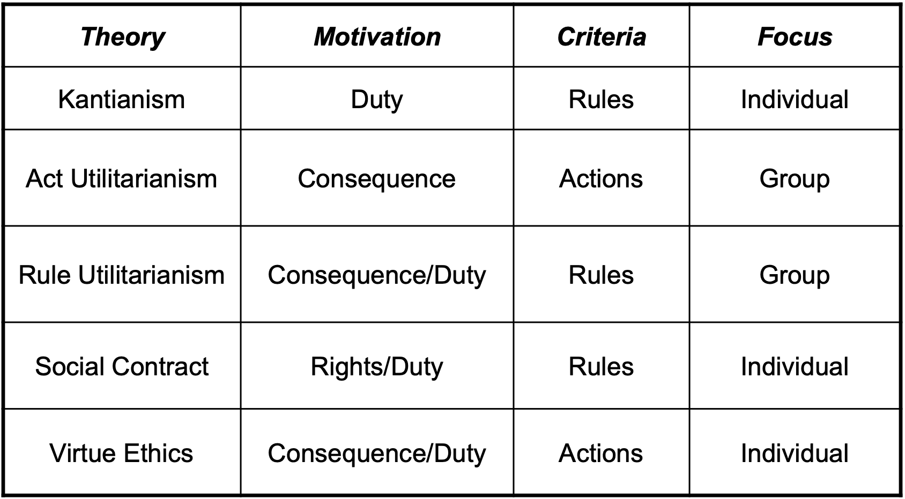
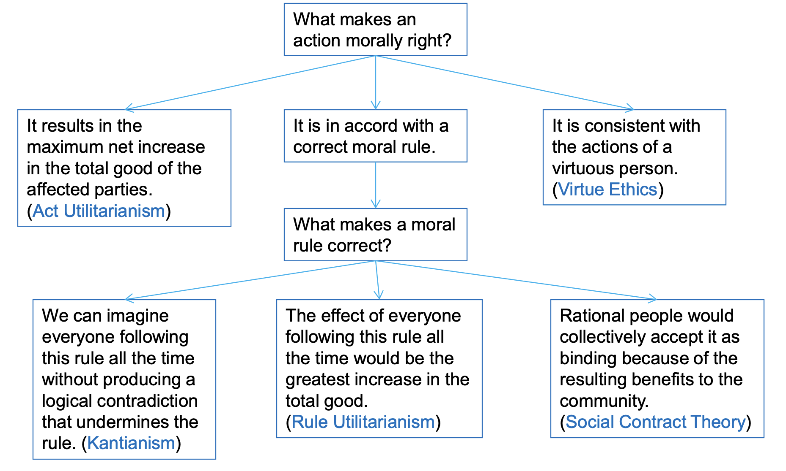

# Lecture 2: introduction to ethics

## Society, morality, and ethics

### Why ethics for software engineers?

- Regularly encounter professional, ethical, and legal issues
- Should be able to better deal with complex issues (often fall into dilemmas)
  - Dotcom boom, Y2K, financial crisis, diminishing middle class
  - COVID-19, equity gap
  - Social and political influence by social media
  - Political leaders using advanced technologies
  - Automation and human labor
- Knowledge of humanity subjects, ethical theories, laws, and professional subjects help us better understand
  - Human and social issues
  - Make better decisions
  - Be adaptive to the changing world

### Humans, society, and politics

**Why live in a society**

- It's beneficial to live in one

**What is a society**

- An association of people under a *system of rules* sharing a **common value**
- Common value is *agreed quality* regarded as **intrinsically good** in society
- People's actions in a society ensue politics

**What is politics?**

- Activities associated with *governance* of an organization
  - Governance is about who establishes the system of rules and make decision for the society
  - Political system is a system of politics and government
- International politics is international relations and players **shape the world**
  - Based on national interests
  - Nation's power (military, economic, culture) => hegemony => great game

### Common values and morality

- Common value is *agreed quality* regarded as **intrinsically good** in society
  - What is the nature of good and bad?
  - Is there anything that is 100% good or 100% bad?
  - Is there anything that is *universally* good or bad?
  - What defines common value in a society?
    - Biological human nature
    - Philosophical ideas and religious beliefs => a value system
- Morality is the *rules of conduct* describing what **ought to do** (because it's good) or **ought not to do** (because it's bad)
  - Law is a system of rules enforced by government

### Ethics and ethical theory

- Ethics is the *philosophical study of morality* of *ethical theories* for a rational examination into people's moral beliefs and behavior
- An ethical theory uses *rational* and *systematic analysis* to decide the best action
  - Nobody can do everything they want
  - Allow us to better understand issues, think rationally and independently and find community's common values
  - Sometimes **against majority decision** as "common wisdom" is NOT always adequate

### Ethical vs. non-ethical issues

**Ethical issues**

- Voluntary moral choice (for good or bad) by rational beings

**Non-ethical issues**

- Involuntary choices
- Choices with no impact on others
- Desire for health, food, safety
- Decision or behavior by non-rational beings

**Example ethical issue 1: unauthorized use of computers**

> *A gifted high school student, Alexis from a poor family used computers in a local college with other people's IDs and completed her projects and received a scholarship to attend a prestigious university.*
> Did Alexis do anything wrong?

**Example ethical issue 2: email blacklist maintained by anti-spam organization**

> *An anti-spam organization puts the addresses of those ISPs that allow spammers to send emails on its blacklist. Many ISPs in the U.S. consult the blacklist and refuse to accept email from the blacklist ISPs.*
> Did the anti-spam organization and ISPs do anything wrong?

**Example ethical issue 3: releasing incomplete software application**

> *A start-up company plans to release an application with minor bugs based on their belief from the testing team without confidence on major bugs in order to compete with a larger company since if the larger company release a similar product first, the start-up company may go out of business.*
> Should you recommend the company release of the product next week?

## Ethical theories

### Relativism

**What is it?**

- No universal norms of right or wrong
- "Subjective" relativism
  - Each person decides right or wrong for him/herself
  - What is right for you may not be right for me
- "Cultural" relativism
  - Right or wrong depends upon society's moral guidelines (culture)
  - Indirectly based on reasoning
  - Can be a starting point for a universal ethical theory

**Evaluation**

| For subjective relativism | Against subjective relativism |
| ------------------------- | ----------------------------- |
| Respect different opinions | Distinction between "doing what you thing is right" and "doing what you want to do" can be blurry |
| Ethical debates are disagreeable | Subjective relativism and tolerance should be distinguished |

| For cultural relativism | Against cultural relativism |
| ----------------------- | --------------------------- |
| Respect the cultural difference | Different social contexts demand different moral guidelines that may vary from place to place and from time to time |
| It is arrogant to judge other culture | Two societies may not find common ground (no cultural norms) |
| Societies do share certain core values | |

### Divine command theory

**What is it?**

- Holy books (God's will) are used as moral decision-making guides
  - God is all-good, all-knowing, therefore the ultimate authority
  - Good actions are aligned with God's will
  - Bad actions are contrary to God's will
- Religion vs. ethics
  - Religions are the results of enlightenment (awakening) after experiencing suffering, power of nature, fear of death, and unknown
  - Ethics are moral guidelines in society about how we ought to live
  - Possible conflicts between ethics and religions

**Evaluation**

| For divine command theory | Against divine command theory |
| ------------------------- | ----------------------------- |
| Can refer to holy books | Since it's based on obedience and faith, there is not much room left collecting and analyzing facts for logical reasoning |
| | Different holy books disagree on the same issue |
| | Not all moral problems may be addressed in scripture |

### Fatalism and determinism

**Fatalism**

- All actions are caused by forces beyond our control and we are not responsible for actions, so we have to accept the outcomes
  - All events in the universe are predetermined, by a deity who knows the future
  - Whatever happens is bound to happen
  - There is nothing we can do to change the future

**Determinism**

- All events are determined completely by previously existing causes (chaos theory)
  - Your decision contributes to the outcomes in the future, but you cannot change it
  - Future can be predicted with the universe's initial state and correct calculation based on the law of nature

**Predestination**

- All events have been willed by God for the eventual fate of the individual soul
  - Seeks to address the paradox of free will
  - Catholic rejects both fatalism and determinism; God's predestination to damnation and salvation
  - Calvin argues that damnation is caused by their sins, but the salvation is solely caused by God not by the church

### Ethical egotism

**What is it?**

- Each person should focus exclusively on his or her own self-interest
  - Everything is for thyself
  - God helps those who help themselves
- The morally right action for a person to take in a particular situation is the action that will provide the person with the maximum long-term benefit

**Evaluation**

| For ethical egotism | Against ethical egotism |
| ------------------- | ----------------------- |
| The community can benefit when individuals put their well-being first | Difficult to pass up short-term benefits in order to achieve long-term goals |
| Very practical and can be efficient | Other moral pricniples are superior to the principle of self-interest |
| Many moral principles are rooted in the principle of self-interest | |

### Care ethics

- Assumptions of the theory
  - Peoples' lives have dependence and interdependence on one other
  - Situational details determine how to safeguard and promote the interests of those involved
- Four ethical qualities of care
  - Attentiveness: care requires a recognition of others' needs in order to respond to them
  - Responsibility: in order to care, we must take it upon ourselves
  - Competence: providing care also means competency
  - Responsiveness: responsiveness of the care receiver

### Kantianism

**What is it?**

- Kant's ethical view
  - Copernican philosopher
  - Combines rationalism and empiricism, free-will
  - Is there any universally applicable moral rule
- Kant's view on "Good" and "Bad"
  - Every action should have pure intention behind it or it is meaningless
  - Good without qualification is "good will"
    - Good will is good in itself
    - Producing beneficial outcomes is not what makes it good
    - Morality of an action should be based on whether the action itself is right or wrong under a series of rules, rather than the consequences of the action
- Kant's view on rights and duty
  - All men are equal and have basic rights and duties
    - Perfect duties is a right that is guaranteed without exception
    - Imperfect duties is a right that may be restricted based on the circumstances
  - The categorical imperative can only be based on something that is an end in itself
  - The moral value of an action depends on the underlying moral rule that is universally applicable

**Categorical imperatives**

- Categorical imperative 1
  - Act only from moral rules that you can at the same time will to be universal moral laws
  - Universal law: what if everybody acted that way?
- Categorical imperative 2
  - Act so that you treat both yourself and other people as ends in themselves and never only as a means to an end

**Ethical analysis from Kantian perspective**

1) Identify the underlying moral rule in a scenario, assuming the intended action becomes a rule in a society
2) Apply both categorical imperatives 1 & 2 to the underlying moral rule (or action)
3) If the result from either imperative fails (contradicts), then conclude the action is unethical, otherwise the action is ethical from a Kantian perspective

**Evaluation**

| For Kantianism | Against Kantianism |
| -------------- | ------------------ |
| Provies universal moral guidelines by treating all persons are moral equals regardless of location or time | Sometimes no single rule adequately characterizes an action |
| | No easy way to resolve conflicts between rules |
| | Kantianism allows no exceptions to moral rules |

### Utilitarianism

- Utility
  - Tendency of an object to produce happiness or prevent happiness
  - The sum of all benefits
- Utilitarian perspective
  - Morality of an action has nothing to do with intent
  - An action is right or wrong to the extent that it increases or decreases the total happiness of the affected parties
- Two utilitarian thinking
  - Act utilitarianism: the principle of utility is applied to individual actions
  - Rule utilitarianism: the principle of utility is applied to moral rules

### Act utilitarianism

**What is it?**

- Considers both benefits and harms
- Add up the changes of happiness of all affected beings
  - A complete analysis must look beyond simple benefits and harms since not all benefits may have equal weight
- Reach a conclusion in terms of grand total of happiness
  - If sum greater than 0, action is good
  - If sum less than 0, action is bad

**Evaluation**

| For act utilitarianism | Against act utilitarianism |
| ---------------------- | -------------------------- |
| Focuses on happiness | Can be *unclear* whom to include in calculations and too much work before making a decision |
| Comprehensive analysis by taking into account all the elements of a particular situation | Uncertainty of the consequences of an action |
| Rational and practical | Ignores our innate sense of duty |

### Rule utilitarianism

**What is it?**

- Modified by John Stuart Mill to avoid problems of act utilitarianism
  - Principles of justice: equality, fairness, and access
  - Principles of distributive justice: principles of justice to all members proportionally
  - Principle of utility and principle of distributive justice are applied to moral rules, which, if everyone follows, lead to the greatest increase in total happiness
- Process of analysis using rule utilitarianism
  - Identify the underlying moral rules
  - Apply both the principle of utility and the principle of distributive justice to moral rules
  - Reach a conclusion in terms of grand total happiness

**Evaluation**

| For rule utilitarianism | Against rule utilitarianism |
| ----------------------- | --------------------------- |
| Compared to act utilitarianism, it is easier to perform the utilitarian calculus | Still difficult to measure the consequence on a single scale |
| Moral rules survive exceptional situations considering the long-term benefits | What happens when a conflict arises between the principle of utility and principle of justice |
| Avoids the problem of moral luck | |

### Social contract theory

**Rights and duties**

- All morally significant beings have certain basic rights
- Different types of rights
  - Absolute right, negative right: guaranteed without exception or a right that forbids others from acting against the right holder
  - Limited right, positive right: may be restricted based on circumstances or a right to be subjected to an action of another person or group but obligates others to act with respect to the right holder
- Rights and duty
  - Locke, Kant, and many other say "rights follow from duty"
    - If you have the right to life, others have the duty not to kill you
    - If you have the right to free health care when you are ill, others have the duty to make sure you receive it
  - Important basis for establishing a legal system

**Ideas of social contract theory**

- T. Hobbes
  - Everybody living in a civilized society has implicitly agreed to the following
    - The establishment of a set of moral rules to govern relations among citizens
    - A government capable of enforcing these rules
- Legitimacy of government and importance of law
  - J. Locke: Transferring their rights to the government to better ensure the stable and comfortable lives, liberty, and property
  - C. Montesquieu: the role of government, but the power should be separated, or it can be too powerful
  - J.J. Rousseau: everyone has rights; the community has a set of rules; everyone has obligations to obey the rules to guarantee their safety, property, and freedom (no one is above the law)
- J. Rawls: extends the idea from Hobbes and other philosopher by adding principles of justice
  - Each person may claim a fully adequate number of basic rights and liberties (consistent with everyone else)
  - Any social and economic inequalities must satisfy:
    - Everyone has a fair and equal opportunity to achieve
    - Be the greatest benefit of the least-advantaged members of society
- J. Rachels: Suggesting social contract theory as moral rules for society

**Principles of social contract theory**

- Individual rights and moral rules to protect the rights
- Contract among members in a society to follow the moral rules
  - People give up some rights to a government
  - Receive or jointly preserve social order
  - For their own or society's long-term benefits
- Moral rules are enforced by government or any authority
  - Constraints to individual rights
  - Legitimacy of government and importance of laws
  - What if there is no government or other authority to enforce the contract

**Ethical analysis using social contract theory**

- Consider rights of all participants and identify the moral rules to protect participant's rights
- Identify a social contract
- Consider the "principles of justice" by making sure all participants are given fair and equal opportunity and greatest benefits to the least-advantaged members
- Assume the social contract is enforced
- Reach a conclusion based on the overall outcome

**Evaluation**

| For social contract theory | Against social contract theory |
| -------------------------- | ------------------------------ |
| Framed in the language of rights and duties | No one signed contract |
| Explains why people act in self-interest in the absence of a common agreement | Some actions can be characterized in multiple ways |
| Explains why under certain circumstances the government may deprive some rights from people | Doesn't explain how to solve a moral problem when the analyis reveals conflicting rights |
| Explains why under certain circumstances civil disobedience can be the morally right decision | May unjustly treat people who cannot uphold the contract |

### Virtue ethics

**What is it?**

- A virtue is a character trait valued as being good
- Virtue ethics: ethical decisions are made based on virtues
  - A good person does the right thing at the right time for the right reason
  - Much older than others
- How to practice
  - Intellectual virtue are developed through education
  - Moral virtue are developed by repeating appropriate acts
  - To pursue these virtues perfectly, one would have to master them all
  - Deriving happiness from a virtuous act is a sign that the virtue has been acquired

**Evaluation**

| For virtue ethics | Against virtue ethics |
| ----------------- | --------------------- |
| Makes much more sense to focus on virtues than obligations, rights, or consequences | Different people may have quite different conceptions of human flourishing |
| Personal relationships can me morally relevant to decision making | Cannot be used to guide government policy |
| Recognizes the important role that emotion plays in living a moral life | Undermines attempts to hold people responsible for their bad actions |
| Recognizes that moral decision-making skills develop over time | |
| There are not irresolvable moral dilemmas | |

### Workable ethical theories

> Workable ethical theory produces explanations that might be persuasive to a skeptical, yet open-minded audience by examining moral problems, reach conclusions, and defend those conclusions

### Comparing workable ethical theories

## Ethics and law

### Moral rules and law

- Law
  - A system of rules that are created and enforced by government's authority
  - Generally created from the moral principles of society
- Moral rules vs. law
  - "What is moral" and "what is legal" are *not* identical
  - Is it possible that an action may be the right thing to do, even if it is illegal?
  - Natural law is a system of right or justice held to be common to all humans and derived from nature rather than from rules of society
- Legality isn't a guide to morality
  - The holocaust was legal; hiding Jews was criminalized
  - Slavery was legal; freeing slaves was criminalized
  - Segregation was legal; protesting racism was criminalized
