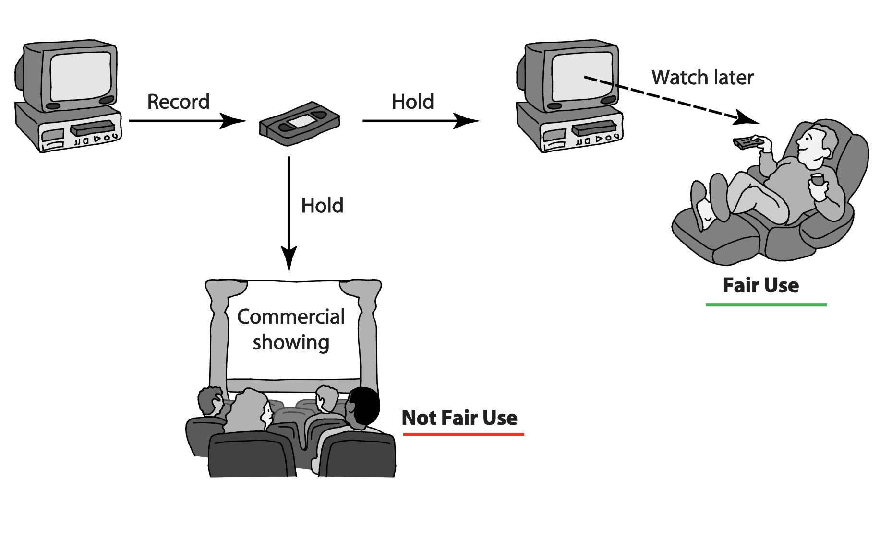
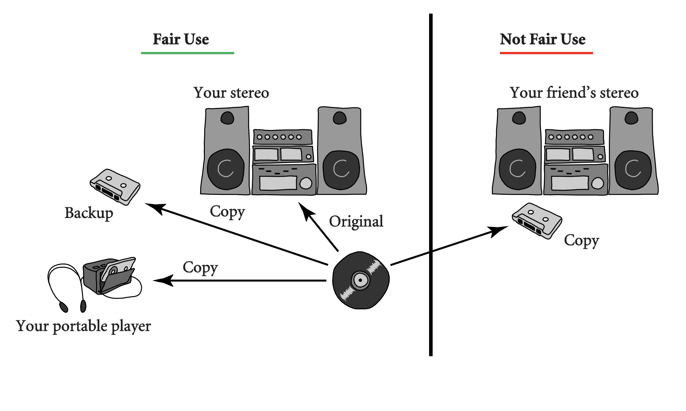

# Lecture 5: intellectual property

## Intellectual property rights

### Natural rights

- John Locke believed in natural rights to life, liberty, and *property*
- Two treatises of government
  - 1) According to God's law, every man is born equal. They are equally children of God, not governed by other people's arbitrary laws
  - 2) All men are in a state of nature bounded by law of nature. Nature is property of all people. They have obligations to protect their rights and other's rights, and punish those go against God
- His theory lays the foundation of *natural rights to property* and social contract theory in many modern countries

**Property rights**

- People have rights to their property in their own person, to their own labor, to things which they remove from nature through their labor
- Under 2 conditions
  - 1) No person claims more property than he or she can use
  - 2) After someone removes something from common state, there is plenty left over for other people
- Natural rights to property can be well applicable to ownership of **physical objects**
- What about books, movies, songs, etc.?

**Intellectual property rights**

- Intellectual property is
  - Ownership of (one-of-kind) ideas or any unique product of the human intellect that has *commercial value*
  - Not necessarily a physical object
- Problem of extending Locke's property rights to IP
  - Sometimes a physical object is not important, but the idea is
  - If a person "steals" the play from Shakespeare and both have it, who owns the property right?
  - If two people simultaneously write down *Hamlet*, who owns the property right
- Society benefits from creativity via IP protection

### Protecting intellectual property

**Trade secrets**

- A confidential piece of intellectual property that gives a company a competitive advantage
- Consists of three parts
  - 1) Information
  - 2) Reasonable measures taken to protect the information
  - 3) Derived independent economic value from not being publicly known
- Legal protections 
  - Lacks formal protection outside of signed agreement
  - NDAs and work-for-hire and non-compete clauses
    - Protective contractual measures never expire
    - Misappropriation of secret may allow for its illegal acquisition

**Patents**

- The right to **exclude** others from making, using, selling, and importing an invention for a limited period of time
  - Granted in exchange for a detailed public disclosure of the invention
  - Should include claims that meet relevant patentability requirements, such as novelty, usefulness, and non-obviousness
- Legal protections
  - Exclusive rights to owner for 20 years
  - Patent rights fall under civil law in most countries (patent holder sues someone infringing the patent)
  - Enforced on a nation-by-nation basis
- Cost
  - In US, $10k - $30k to obtain a patent
  - Associated costs in maintaining the patent

**Trademarks and service marks**

- A recognizable sign, design, or expression which identifies products or services of a particular source
  - Trademarks identify goods
  - Service marks identify services
  - Established by using a "brand name" or logo
- Legal protections
  - Most countries require legal registration
  - Must be maintained through actful use law
  - If brand name becomes a common noun, trademark may be lost
  - Otherwise, it never expires

**Copyrights**

- Started with the printing press and with the wider literacy; provides owner of an original work with five rights
  - Reproduction
  - Distribution
  - Public display
  - Public performance
  - Production of derivative works
- Applicable to a wide range of intellectual or artistic "forms" or "works"
- Does *not cover* ideas and information themselves, only the form or manner in which they are **expressed**
- Legal protections
  - Protected the moment it is created
  - Expires 50-100 years after the creator dies
  - Registration not required, but needed in case of potential law suit when ownership may be questioned

### Court cases and legislation

**Court cases**

- Gershwin Publishing v. Columbia Artists Management
  - Columbia Artists managed concert artists
  - Gershwin publishing owned copyrights to songs
- David La Macchia at MIT posted software for free
  - Charges dropped since making it available for free was a loop hole in copyright law
  - Congress passed the *No Electronic Theft Act* of 1997

**Copyright creep**

- Copyright related industries represent more than 6% of US GDP
- Copyright term extension act of 1998 extended it to 95 years
  - Some say to prevent Disney characters from entering public domain
  - Petitioners argued it exceeded Congress' constitutional power
- US supreme court ruling
  - CTEA is constitutional
  - CTEA does not create perpetual copyrights

## Fair use and new restrictions on fair use

- Limits to IP protection
  - US constitution recognizes benefits to *limited* protections
  - Giving creators rights to their inventions stimulates creativity but society benefits most when inventions are in the public domain
- What is a reasonable length of time?
  - Before CTEA, copyright would last for the **life** of the author **plus 50 years** (75 years for a work of corporate authorship)
  - CTEA extends these terms to **life** of the author **plus 70 years** (120 years after creation (95 after publication) for works of corporate authorship)
- Fair use: use that is legal to reproduce a copyrighted work without permission
- Courts consider the following 4 factors
  - Purpose and character of use (is it commercial use?)
  - Nature of work (use of nonfiction or unpublished work likely permissible)
  - Amount of work being copied (brief excerpts likely)
  - Affect on market for work
- Allowed: time shifting and space shifting by copying the original media for private use or as a backup
- Not allowed: for commercial use, distribution to someone else, copy of copy

### Time shifting

### Space shifting

### Impact of digital technology

- Copying digital media is easy and cheap
- Copy is a high quality one
- Music publishers concerned that consumers' ability to make perfect digital copies would destroy the market for audio recordings; lobbied congress to impose mandatory copy protection technology and royalties on devices and media
- Audio Home Recording Act (AHRA) of 1992
  - First government technology mandate in copyright law
  - First anti-circumvention provision in copyright law; later applied at scale in DMCA
  - First government imposed royalties

### Additional restrictions

- Digital Millennium Copyright Act (DMCA) of 1998
  - First big revision of copyright law since 1976
  - Brought US into compliance with Europe
  - Extends copyright protection to music broadcast over the internet
  - Makes it illegal to circumvent copy controls (even for fair use purposes)
- Digital rights management (DRM) actions taken by owners of IP
  - Encrypting DVDs
  - Copy- protecting CDs through SDMI
  - Online music stores protected by DRM scheme called fair play
  - Sony BMG music entertainment rootkit
  - Microsoft Xbox one
  - Advanced access content system
- Criticisms of DRM
  - Any technological "fix" is bound to fail
  - DRM undermines fair use
  - DRM should reduce competition
  - Some schemes make anonymous access impossible

### Open-source software

- Proprietary software
  - Increasingly harsh measures being taken to enforce copyrights
  - Copyrights not serving their purpose of promoting progress
- Open source software
  - No restrictions preventing others from selling or giving away software
  - No restrictions preventing others from modifying source code
  - Ne restrictions regarding how people can use software
- Benefits of open source software
  - Gives everyone the opportunity to improve program (new versions of program appear more frequently)
  - Eliminates tension between obeying law and helping others
  - Programs belong to entire community
- Critique of the open source software movement
  - No critical mass of developers
  - Quality can be poor, without an "owner", incompatible versions may arise
  - Poor mechanism for stimulating innovation

## Methods to distribute intellectual properties

- P2P networks
  - Napster
  - FastTrack
  - BitTorrent
- CyberLockers
  - PRO-IP Act (allows federal agencies to seize websites or domains)
  - Megaupload shutdown
  - Legal music services on the internet

## Protections for software

### Software patents

- Patent protections began in 1981
- Inventions and processes can be patented, but not algorithms or mathematical formula
- Patent office has a hard time determining prior art
  - Bad patents (too many of them) issued
  - General skepticism about value of software patents
  - Patent trolls

### Software copyrights

- Copyright protections began in 1964
- What gets copyrighted?
  - Expression of idea, not idea itself
  - Object program, not source program
  - Companies should treat source code as a trade secret
- Violations of software copyright
  - Copying a program to give or sell to someone
  - Preloading a program onto the hard disk of a computer being sold
  - Distributing a program over the internet

### Safe software development of copyrighted features

- Reverse engineering is OK
- Companies must protect against unconscious copying
- Solution: clean room software development strategy
  - Team 1 analyzes competitor's program and writes specification
  - Team 2 uses specification to develop software

## Creative commons

- Streamlining creative re-use
  - Under current copyright law, eligible works are copyrighted the moment they are created
  - No copyright notice does not mean it's okay to copy
  - Must contact people before using work, which slows down creative re-use of others' work
- All licenses are in 3 forms
  - Human readable
  - Lawyer readable
  - Computer readable
- Free creative commons license indicates
  - Which kinds of copying are okay
  - Which rights are being retained
- Can be used for both commercial and non-commercial purposes (permission still needed)

## Ethical evaluation

**Social contract theory**

- Programming is hard work that only few can do
- Programmers should be rewarded for their labor and they ought to be able to own their programs
- Criticisms of right-based arguments
  - Why does labor imply ownership?
  - Intellectual property is not like physical property

**Utilitarian analysis (arguments against copying)** 

- Copying software reduces software purchases
- Leads to less income for software makers
- Leads to lower production of new software
- Leads to fewer benefits to society

**Conclusions**

- Natural rights argument is weak
- Utilitarian argument not strong either
- Should understand that **software licenses** and *legal agreements*
